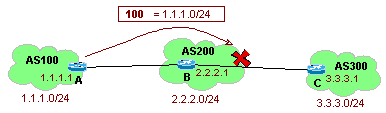
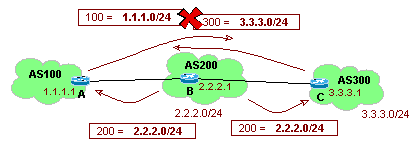
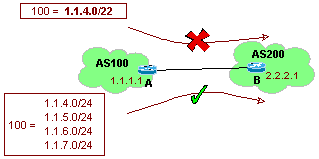
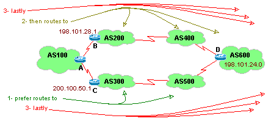
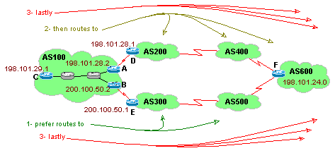
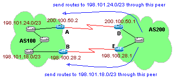
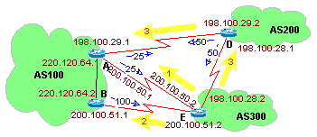
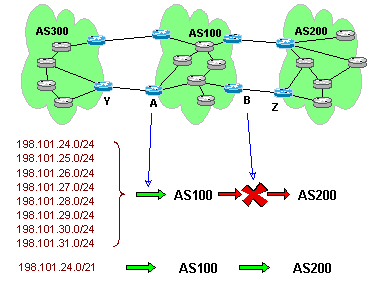

# Filters and Route Maps
In this doc, we will first discuss some of BGPs special filtering abilities; globally filtering AS path info with regular expressions, filtering via routes from specific neighbors with neighbor distribution lists, and filtering routes biased on IP's with special extended access lists. Then we will look at look at how BGP distributes routes from or to BGP to other route engines with route redistribution, and then look at how bgp can group routes with very advanced search methods and even modify routes with route maps.

- [Filters and Route Maps](#filters-and-route-maps)
  - [Special Filters](#special-filters)
    - [Common Regular Expressions](#common-regular-expressions)
    - [BGP AS Filtering (filter-list)](#bgp-as-filtering-filter-list)
    - [BGP IP Filtering (distribute-list)](#bgp-ip-filtering-distribute-list)
    - [Extended Access Lists](#extended-access-lists)
  - [Route Maps](#route-maps)
    - [Static Route Redistribution](#static-route-redistribution)
    - [Default Metrics for Redistribution](#default-metrics-for-redistribution)
    - [Route Map Command](#route-map-command)
      - [Route-map, Match Command](#route-map-match-command)
      - [Route-map, Set Command](#route-map-set-command)
    - [Route Map Syntax](#route-map-syntax)
      - [Route Map Example 1](#route-map-example-1)
      - [Route Map with Weight Attribute](#route-map-with-weight-attribute)
      - [Route Map with local pref](#route-map-with-local-pref)
    - [Multi-Exit Discriminator (MED)](#multi-exit-discriminator-med)
      - [Setting a Router to Compare MED values](#setting-a-router-to-compare-med-values)
      - [Another example of route-maps with MED's](#another-example-of-route-maps-with-meds)

## Special Filters
General Topics:
- AS Path Numbers (global filtering)
- BGP Neighbor Distribution List
- Special Extended Access Lists (specific route filtering)

Topics To Grasp:
- AS Path filter-list with Regular Expressions
- BGP Neighbor Distribution List.
- Special Extended Access List for Summarization to a specific neighbor or group of neighbors.


### Common Regular Expressions
In cisco routers, we use reg expressions for matching for matching values. In this section we are going to give examples for a few of the more common examples.

1.1 RegEx's

| Command	| Definition |
|--|--|
`.`	|matches andy single character
`*`	|matched 0 or more sequences or the pattern
`^`	|start of line
`$`	|end of line
`[a-f]`	|a "range". will match anything in that range
`[abcde]`	|a "set". will match any of the characters in the set
`_`	|will match any of the following characters: comma ",", blank space " ", left brace "{", right brace "}", left parenthesis "(", right parenthesis ")", beginning of a string, and end of a string

The following are some examples for filters in use:

1.2 Using RegEx

| Command	| Definition |
|--|--|
`.*`	|match anything
`^$`	|match only the local AS
`^100$`	|match only from AS 100
`_101[234]$`	|match originating from AS's 1012, 1013, and 1014
`^101[2-4]_`	|match receiving from AS's 1012, 1013, and 1014
`_100_`	|match routes via AS 100
`_100_101`	|match routes via AS 100 and 101 (trailing underscore is implied)

### BGP AS Filtering (filter-list)
A normal access list filters on ip address or port numbers. There are special access lists for bgp that can filter on AS information. With these access lists, you can filter on or off routes from specific AS's, ranges or AS's, or routes that went through a specific AS (or ranges of AS's). Note that with these ACL's we are not denying or permitting traffic, but instead, we are permitting or denying routing information into or out of the BGP routing table.

To configure ACLs that filters on the incoming (or leaving) BGP routing information biased on AS information, use the two following commands. The command `ip as-path access-list acl# { deny | permit } as-regular-expression `creates the ACL filter itself, and use the `neighbor ip-address filter-list acl# { in | out }` command, attaches the ACL for traffic flowing to or from a specific BGP neighbor.

In this following example, we are setting up a filter on router B that blocks all routes learned originating from AS 100 from going out to the neighbor AS 300.



1.2 BGP Route AS filtering
```
! -- (From router B) don't send routes from AS 100 to AS 300
ip as-path access-list 12 deny _100$
ip as-path access-list 12 permit .*

router bgp 200
  network 1.2.2.0 mask 255.255.255.0
  neighbor 1.1.1.1 remote-as 100
  neighbor 1.3.3.1 remote-as 300
  neighbor 1.3.3.1 filter-list 12 out
```

Going over the above commands:

- `ip as-path access-list 12 deny _100$` & `ip as-path access-list 12 permit .*` define the acl for denying or allowing routing info biased on its AS information.
- `neighbor 1.3.3.1 filter-list 12 out` binds the acl to a specific neighbor, and specifies if it is for inbound or outbound routing info.


### BGP IP Filtering (distribute-list)
BGP can also filter routing information biased on the ip information within the route updates. So rather then worry about AS information, we can deny or allow routing information biased on the IP address within it.

To filter BGP routing info biased on IP information can be done two ways, either by filtering by traffic flowing through an interface, or by filtering traffic traveling to/from a specific neighbor. Filtering routing info flowing through an interface is done using the `distribute-list acl# { in | out } [ interface-name ]` command. To filtering routing info flowing to/from a specific neighbor, use the `neighbor { ip-address | peer-group-name } distribute-list acl# { in | out }` command.

In the following example, we want to be a multi homed network, but we don't want to be a transit network, we want to be a BGP stub network. In other words, we only want traffic destined to us to travel to us, we don't want to route any traffic through our network to someone else. To do this, we will only want to send out routing information listing our own network, and no one else's, regardless of what we might know from other neighbors. This is easily done with distribution lists.



The first way we can do this is by filtering routing information biased on which neighbor the routes are going between.

1.3.1 BGP Route IP Filtering (via neighbor)
```
! -- (from router B) only advertise local routes
router bgp 20
  network 2.2.2.0 mask 255.255.255.0
  neighbor 1.1.1.1 remote-as 100
  neighbor 1.1.1.1 distribute-list 5 out
  neighbor 3.3.3.3 remote-as 300
  neighbor 3.3.3.3 distribute-list 5 out
access-list 5 permit 2.2.2.0 0.0.0.255
```

Above, the commands do:

- `neighbor 1.1.1.1 distribute-list 5 out` & `neighbor 3.3.3.3 distribute-list 5 out` bind a BGP routing filter to traffic flowing out to the two neighbors
- `access-list 5 permit 2.2.2.0 0.0.0.255` define the access lists that will filter the bgp routing information

And the second way we can do this is by filtering routing information biased on which interface the routes are going through.

1.3.2 BGP Route IP Filtering (via interface)
```
! -- (from router B) only advertise local routes
router bgp 20
  network 2.2.2.0 mask 255.255.255.0
  neighbor 1.1.1.1 remote-as 100
  neighbor 3.3.3.3 remote-as 300
distribute-list 5 out s0/0
distribute-list 5 out s0/1
access-list 5 permit 2.2.2.0 0.0.0.255
```

Above, the commands do:

- `distribute-list 5 out s0/0` & `distribute-list 5 out s0/1` bind an acl to both serial interfaces for outbound BGP routing information
- `access-list 5 permit 2.2.2.0 0.0.0.255` define the bgp acl

### Extended Access Lists
Cisco includes Extended ACL's to give us more control filtering bgp ip information. These filters are very much more complicated looking, but allow us to filter on things that a regular ACL would not.

As this example for when to use Extended Access Lists, AS100 has 4 class c networks that it needs to make sure do not get aggregated by Router A in AS200.



When AS100 sends its routes to Router B, it sends the following 5 routes:
```
	1.1.4.0/24
	1.1.5.0/24
	1.1.6.0/24
	1.1.7.0/24
	1.1.4.0/22
```

Router B needs to allow all the /24 routes, but needs to filter out and remove the /22 route. To do this, router B would have the following config:

Use of Extended Access Lists
```
! -- filter out /22 route from neighbor
router bgp 200
  neighbor 1.1.1.1 remote-as 100
  neighbor 1.1.1.1 distribute-list 100 in
access-list 100 deny ip 1.1.4.0 0.0.3.255 255.255.252.0 0.0.0.0
access-list 100 permit ip any any  
```

- From line `access-list 100 deny ip 1.1.4.0 0.0.3.255 255.255.252.0 0.0.0.0`, first lets look at the two last sets of numbers, the subnet mask and its filter:

```
the subnet mask is 255.255.252.0 = 1111 1111 . 1111 1111 . 1111 1100 . 0000 0000
and its filter is  0.0.0.0       = 0000 0000 . 0000 0000 . 0000 0000 . 0000 0000
```

Thus we are not giving any range for the different types of masks to filter. We are only going to filter on the one mask 255.255.252.0 and none other.

The first two sets of numbers in line `access-list 100 deny ip 1.1.4.0 0.0.3.255 255.255.252.0 0.0.0.0` are the ip address we want to filter for, and the range of other ips that we are willing to filter on.

```
the ip address is 1.1.4.0    = 0000 0001 . 0000 0001 . 0000 00100 . 0000 0000
and its filter is 0.0.3.255  = 0000 0000 . 0000 0000 . 0000 00011 . 1111 1111
```
thus the filter will match the ranges:
```
             from 1.1.4.0    = 0000 0001 . 0000 0001 . 0000 00100 . 0000 0000
               to 1.1.7.255  = 0000 0001 . 0000 0001 . 0000 00111 . 1111 1111
```
So what this ends up meaning, is that the filter will match on any ips in the range 1.1.4.0 - 1.1.7.255 with the mask 255.255.252.0, and it will deny these matches from passing.

## Route Maps
General Topics:
- Route Redistribution
- Route Map Configuration

Topics to Grasp:
- Redistribution
- Route Maps
- Understanding BGP community attribute
- BGP Communities

### Static Route Redistribution
The redistribute static command allows you to take routes learned via static commands, and distribute them into the bgp routing table. To control which static commands get distributed, you can create acl's and bind them to the redistribution. This is done with the `redistribute-list acl # { in | out } static` command.

In the following example, we want to distribute the real routes to bgp, but we want to filter out the 10 network routes.

Static Route Redistribute
```
! -- set static routes
ip route 10.0.0.0 255.0.0.0 20.20.20.5
ip route 2.2.1.0 255.255.255.0 20.20.20.3
ip route 2.2.20.0 255.255.255.0 20.20.20.3
! -- define bgp
router bgp 20
  network 20.20.20.0
  redistribute static
  redistribute-list 2 out static
! -- define acl
access-list 2 permit 2.2.1.0 0.0.0.255
access-list 2 permit 2.2.20.0 0.0.0.255
```

### Default Metrics for Redistribution
The `default-metric number` command specifies metrics to be used when converting routing updates from one protocol to another. This command is necessary for redistributing between two routing protocols with incompatible metrics like OSPF, RIP, EGP, and BGP. The default metric for BGP is it's multi-exit discriminator (MED) value.

Field descriptors for the default metric command are:
- bandwidth - the data carrying capacity of the link
- delay - the number in milliseconds in delay associated with that link
- reliability - integer value associated with the probability of delivery
- loading - integer representing the utilization of the link
- mtu - Maximum Transmission Unit; indicates the largest packet capable of being transmitted
- number - other values used to calculate path information; may vary depending on the routing protocol selected.

Route Redistribution Example
```
! -- redistribute routes between bgp & rip
router rip
  network 2.2.2.0
  redistribute bgp 30
  default-metric 3
router bgp 30
  network 2.2.1.0
  redistribute rip
  default-metric 40
```

In the above example:

- `redistribute bgp 30` sets routes learned from bgp AS30, to be entered into the rip route table. (kind of dumb seeing how many routes bgp normally has, but it's only an example...)
- `default-metric 3` sets all bgp routes that are entering the rip route table as having a hop count of 3
- `redistribute rip` allows bgp to advertise routes learned via rip (not great idea either, - think flapping...)
- `default-metric 40` all routes learned via rip will get the MED value of 40

### Route Map Command
Route maps are an extension to redistribution and they provide more detailed features for selectively redistributing routes. They provide a high degree of control for controlling what routes are included to, and what leave the routing table.

Some features of route maps are:
- Route Maps are filters for network advertisement
- Route Maps offer detailed control over advertisement
- Complex conditional advertisement via match command
- Change routing table parameters via set command

There are two commands commonly used when setting up route maps. The first command `redistribute protocol [process-id] route-map map-tag`, is used to redistribute routes from one routing domain to the other. Of the fields in this command, note that the "protocol" field is the source protocol from which routes are being redistributed, and the "process-id" is a field only used when the source is OSPF and it is this is the OSPF process-id.

The other command `route-map map-tag { permit | deny } [sequence#]`, is used to define the conditions for redistributing routes from one routing protocol to the other. Note here that the field "sequence#" is a number that indicates the position that line has within the route maps of the same name.

There are two sub command's within the route-map statement, the match and set commands. The set command modifies routes, and the match command permits or deny routes. These two commands work together in a find (match) then do (set) configuration. For a single route-map, you can have many match commands and also many set commands, thus giving you lots of flexibility for finding the routes your interested in, and then doing many different things to those routes.

#### Route-map, Match Command
The `match { ip | clns } {options}` command is used to specify the conditions when a route is redistributed. Note that CLNS is Connectionless network service.

Options for the match command:
- address ip-access-list - Matches those networks which pass an IP access list. This command can also be used for matching networks in policy based routing.
- route-source ip-access-list - Checks the advertising source of the BGP update as specified in an access list.
- next-hop ip-access-list - Matches networks which have next-hop addressees that are specified in the access lists. (remember how BGP treats the next-hop-address of an external neighbor when advertising to another BGP speaker.
- interface type number - Matches the interface which must be traversed to reach that network's next hop address.
- as-path AS# - This command is used to match an AS path access list which will match any routes coming from a specific AS number
- metric metric-value - This command is used to distribute networks that equal the specified metric-value. For the following routing protocols, the metric is as follows:
    - RIP = Hop Count
    - OSPF = Cost
    - IS-IS = Cost
    - IGRP = bandwidth, delay, reliability, load and mtu
    - EIGRP = bandwidth, delay, reliability, load and mtu
    - BGP = MED: multi-exit discriminator
- route-type [ external | internal | level-1 | level-2 | local ] - can be external, internal, level-1, level-2, or local
- tag tag-value - list of one or more route tag values. (0 - 4,292,967,295)

Note that these commands can be ANDed and ORed together in a string.

#### Route-map, Set Command
The `set {options}` command is used to specify the information replacement activities.

Options for the set command are:
- metric metric-value - Sets the metric for the destination routing protocol. For the following routing protocols, the metric is as follows:
  - RIP = Hop Count
  - OSPF = Cost
  - IS-IS = Cost
  - IGRP = bandwidth, delay, reliability, load and mtu
  - EIGRP = bandwidth, delay, reliability, load and mtu
  - BGP = MED: multi-exit discriminator
- metric-type [ type-1 | type-2 | internal | external ] - for multiple metric types
- tag tag-value
- level [ level-1 | level-2 | stub-area | backbone ]
- next-hop next-hop-address - Is used to change a pathway for an external network by setting the next-hop IP address for a network to be advertised.
- ip route-source ACL# - Sets the source of the BGP routing updates after it has been qualified by an access list.
- clns clns-summary-address - "save as ip" ???
- origin { igp | egp AS# | incomplete } - Sets the BGP network origin. The igp tag would make the network look as it originated from this AS, even though it could have been learned from another AS. The incomplete variable would change the origin tag to "?", letting the other bgp speakers know that the network was changed. (static routes are normally listed as incomplete). The egp tag tells other bgp speakers that the networks were derived from a neighboring egp process.
- weight bgp-weight
- local-preference bgp-path-attribute Sets local preference to be advertised to other ibgp routers. The default value for local preference is 100. An example of this would be where each ibgp router would set a local preference for routes into the AS, and thus routes would go out the router with the highest local pref.
- automatic-tag - a BGP option
- as-path prepend as-path-string - Modifies the AS path. It can be applied to both inbound and outbound BGP route maps. The most common usage is to prepend an AS# to the front of the AS path string, making that route undesirable over another path.

### Route Map Syntax
Route-map statements form a list similar to access-lists. Routes are evaluated from the first entry in the list through to the last. If a route is found to agree with the match statement, then the set statements are preformed, and the route is permitted or denied according to the route-map statement. No further searches are done once a match is found. If a specific route map does not make a match, then the next route-map is searched, and so-on, until no more route-maps are available, and then the route is not distributed.

Route Map Syntax
```
! -- example with list format
router rip
  redistribute bgp 100 route-map my_bgp
!
route-map my_bgp permit 10
  match ip address 8 9
  match next-hop 10
  set metric 5
route-map my_bgp deny 20
  match ip address 7
route-map my_bgp permit 30
  match ip address 11
  set metric 16
access-list 7 deny 10.0.0.0 255.0.0.0 
access-list 7 deny 192.168.0.0 255.255.0.0 
access-list 8 permit 128.164.0.0 255.255.0.0
access-list 9 permit 5.0.0.0 255.0.0.0
access-list 10 permit 150.30.29.1 255.255.255.255
access-list 11 permit 210.17.100.0 255.255.255.0
!  
! -- example with multiple match statements
``` 
	
(todo: draw up a diagram showing bgp route packet going through routemap and creating rip packet (or other way around))

In the above example, the redistribute command will only happen if there is any match on the route-map my_bgp. There are three different route-maps with that name, each with a different sequence number. The lowest sequence number (1c05) is run first and it's contents is searched for a match. If there is no match for it, then the next lowest sequence number with the same route-map name will be run (`route-map my_bgp permit 10`). In this example there are three route-maps that all have the same name, so all three will be run looking for a match. If there is no match with any of them, then the route is dropped.

Looking at the route map with sequence 10, lines within `route-map my_bgp permit 10` we see two match statements, and one set command. The first match command (line `match ip address 8 9`) uses an "OR" to find a match using either access-list 8 or access-list 9. The next match command (line `match next-hop 10`) is "ANDed" to the previous match. Thus for this route-map to match, lines `match ip address 8 9` AND `match next-hop 10` must BOTH match!!! (but only one match is needed per line, as mentioned above in line 1c06). Once both lines are matched, then that matched route is modified by line `set metric 5`, and that routes metric is changed to 5.

#### Route Map Example 1
In this example, we are going to look at a router that takes it's bgp routes and redistributes them into it's igp igrp routing table. The goal of this configuration is to modify only some of the routes being redistributed (? to/from ?) igrp

Route Map Example
```
! -- Configure BGP Router
router bgp 100
  redistribute igrp 200 route-map igrp2bgp
! -- Define Route-map (first match)
route-map igrp2bgp permit 10
  match ip address 3
  set local-preference 25
  set metric 127
  set weight 30000
  set next-hop 192.92.68.24
  set origin igp
! -- Define Route-map (second match)
route-map igrp2bgp permit 20
  match ip address 4
! -- Define ACL#3 
access-list 3 permit 131.108.0.0 0.0.255.255
access-list 3 permit 160.89.0.0 0.0.255.255
access-list 3 permit 198.112.0.0 0.0.127.255
! -- Define ACL#4 
access-list 4 permit any 
```

#### Route Map with Weight Attribute
In this example, we are looking at the configuration on Router-A in the diagram below. It has two eBGP peers, B and C. The idea here is to force a kind of load balancing of traffic with the use of local weights. (note that we can't use typical BGP load balancing, because it only works between a single set of BGP peers.)

Normally with weights, we would weight an entire interface, and all the routes learned from them, but in this example, we are modifying the weights of specific routes learned from both interfaces. (remember that weights are routing data that is only kept locally to a specific router, so these changes are not passed on to any other routers.



Specifically, routes flowing through AS's 200, 400, and 600 are matched in route-map weight-in 10 (`route-map weight_in permit 10`), and modified by changing their weights to 40,000 (the middle value). Routes flowing through AS's 300 and 500 are matched in route-map weight-in 20 (`route-map weight_in permit 20`), and are modified with changing their weights to 50,000 (the most preferred value). And all other traffic is matched with route-map weight-in 30 (`route-map weight_in permit 30`), and given a weight of 32,000 (the lowest preferred value).

Example of Weight Attribute
```
! -- Define BGP 
router bgp 100
  neighbor 198.101.28.1 remote-as 200
  neighbor 198.101.28.1 route-map weight_in in
  neighbor 200.100.50.1 remote-as 300
  neighbor 200.100.50.1 route-map weight_in in
! -- 1st ACL for routes across top path
ip as-path access-list 1 permit ^200$
ip as-path access-list 1 permit ^200_400$
ip as-path access-list 1 permit ^200_.*_600$
! -- 2nd ACL for routes across bottom path
ip as-path access-list 2 permit ^300$
ip as-path access-list 2 permit ^300_500$
! -- routemap for top path
route-map weight_in permit 10
  match as-path 1
  set weight 40000
! -- routemap for bottom path
route-map weight_in permit 20
  match as-path 2
  set weight 50000
! -- routemap for everything else  
route-map weight_in permit 30
  set weight 32000
```

Commenting on the specifics of this config, note the following:

- `neighbor 198.101.28.1 route-map weight_in in` & `neighbor 200.100.50.1 route-map weight_in in` in these lines, we take traffic from the two peers, and send them through the route-map labeled "weight-in".
- `! -- 1st ACL for routes across top path` in this first acl, we are filtering the AS's between 200, 400, and 600.
- `ip as-path access-list 1 permit ^200$` only accept routes from AS 200
- `ip as-path access-list 1 permit ^200_400$` only accept routes starting at AS 400, and going through AS 200.
- `ip as-path access-list 1 permit ^200_.*_600$` only accept routes starting at AS 600, and arriving from AS 200.
- `! -- routemap for top path` because of the weight of "10" this is the first version of route-map "weight-in" that will be matched.
- `set weight 40000` if the above acl makes a match, then modify all the routes with the match such that their weights are now 40,000.
- `route-map weight_in permit 20` if the route-map "weight-in" weight "10" (`! -- routemap for top path`) does not make a match, then this version of that route map will be run, because it has a weight of "20".
- `! -- routemap for everything else` if the route-maps with weights "20" (`! -- routemap for bottom path`) and "10" (`! -- routemap for top path`) don't get a match, then run this version.

#### Route Map with local pref
In this example, we are looking at controlling outbound traffic within an entire AS, rather then within just the one router like the example above.



Local Pref attributes using Route Maps

Router-A	
```
! -- BGP settings
router bgp 100
  neighbor 198.101.28.1 remote-as 200
  neighbor 198.101.28.1 route-map local_in in
  neighbor 200.100.50.2 remote-as 100
  neighbor 198.101.29.1 remote-as 100
! -- define ACL
ip as-path access-list 1 permit ^200$
ip as-path access-list 1 permit ^200_400$
ip as-path access-list 1 permit ^200_.*$_600$
! -- define first version of route-map 
route-map local_in permit 10
  match as-path 1
  set local-preference 300
! -- define second version of route-map
route-map local_in permit 20
```

Router-B
```
! -- BGP settings
router bgp 100
  neighbor 200.100.50.1 remote-as 300
  neighbor 200.100.50.1 route-map local_in in
  neighbor 198.101.28.2 remote-as 100
  neighbor 198.101.29.1 remote-as 100
! -- define ACL
ip as-path access-list 2 permit ^300$
ip as-path access-list 2 permit ^300_500$
! -- define first version of route-map 
route-map local_in permit 10
  match as-path 2
  set local-preference 400
! -- define second version of route-map
route-map local_in permit 20
```

### Multi-Exit Discriminator (MED)
Multi-Exit Discriminators (MEDs) are a way to tell a peer which path into your network you would prefer them to use. In this example, we have two peers with AS 200. We would like them to send traffic to Router-A if it is destined to the .24.0/23 network, and send traffic to Router-B if it is destined to the .18.0/23 network.

We can do this with route-maps by modifying the routes leaving routers A and B and adding to them the modified MED value.



In this example, on both routers we are defining MED values for all routes. For Router-A, we set all routes with a default MED value of 100, but for those local networks, .24.0/23, we give a lower MED value of 50. This will tell AS200 to prefer to send routes to the .24.0/23 network through the Router-A peer.

Multi-Exit Discriminator (MED)

Router-A	
```
! -- set BGP config's
router bgp 100
  neighbor 198.100.28.2 remote-as 100
  neighbor 200.100.50.1 remote-as 200
  neighbor 200.100.50.1 route-map med_out out
! -- define 1st routemap
route-map med_out permit 10
  match ip address 1
  set metric 50
! -- define 2nd routemap
route-map med_out permit 20
  set metric 100
! -- set ACL
access-list 1 permit 198.101.24.0
access-list 1 permit 198.101.25.0
```
Router-B
```
! -- set BGP config's
router bgp 100
  neighbor 200.100.50.2 remote-as 100
  neighbor 198.100.28.1 remote-as 200
  neighbor 198.100.28.1 route-map med_out out
! -- define 1st routemap
route-map med_out permit 10
  match ip address 1
  set metric 50
! -- define 2nd routemap
route-map med_out permit 20
  set metric 100
! -- set ACL
access-list 1 permit 198.101.19.0
access-list 1 permit 198.101.18.0
```  
	
#### Setting a Router to Compare MED values
To make the router compare MED values from neighbors in different AS's, you can use the bgp always-compare-med command.

While this is a simple command to set, it is important to note that is difficult to get providers to use this command with other providers.

#### Another example of route-maps with MED's
In this example, we are looking at both how to manipulate the outbound MED values, and how to acknowledge MED values entering from multiple bgp peers.

(MED values from the same AS are always compared by default. but two AS's who both are broadcasting MED values do not have their MED values compared. The "always-compare-med" option allows the routers to use meds when comparing routes from different AS's.)



In this example, AS100 has two routers, and it prefers traffic entering to it via router-A. Through MED values, it is requesting to its peers to send traffic to router-A instead of router-B. It does this by sending metric values of 25 out router A, and metric values of 100 (less preferred) out router-B.

BGP Route-Maps with MED's and always-compare-med

Router-A Config	
```
! -- 
router bgp 100
  neighbor 220.120.64.2 remote-as 100
  neighbor 200.100.50.2 remote-as 300
  neighbor 198.100.29.2 remote-as 200
  neighbor 200.100.50.2 route-map med_out out
route-map med_out permit 10
  set metric 25
```
Router-B Config
```
! -- 
router bgp 100
  neighbor 220.120.64.1 remote-as 100
  neighbor 200.100.51.2 remote-as 300
  neighbor 200.100.51.2 route-map med_out out
route-map med_out permit 10
  set metric 100
```	
Router-D Config	
```
! -- 
router bgp 200
  neighbor 198.100.29.1 remote-as 100
  neighbor 198.100.28.2 remote-as 300
  neighbor 198.100.28.2 route-map med_out out
route-map med_out permit 10
  set metric 50
```
Router-E Config
```
! -- 
router bgp 300
  neighbor 198.100.28.1 remote-as 200
  neighbor 200.100.51.1 remote-as 100
  neighbor 200.100.50.1 remote-as 100
  bgp always-compare-med
```

When AS300 needs to send traffic to AS100, it takes MED values into consideration because of the bgp always-compare-med command enabled on its routers. From AS300's router-E, traffic to AS100 will first want to go directly to router-A, because this has the least AS hops, and the lowest MED value. If this route is blocked, then traffic will prefer to get to AS100 via router-B, because it also has the least BGP hops and the second highest MED value. And finally, if the direct connections to AS100 both fail, then traffic to AS100 will travel to AS200's router-D, because it has the second lowest number of AS hops.

To be more specific, a BGP router will use the following steps to decide where to send routes depending on it acknowledging the MED values from peers:

1. ignore a route if the next hop is not known.
2. ignore iBGP routes that are not sync'ed
3. prefer the route with the largest weight
4. prefer the route with the largest local pref
5. prefer the route what was locally originated
6. prefer the route with the slowest AS Path*
7. prefer the route with the lowest origin (igp > egp > incomplete)
8. prefer the route with the lowest MED**
    - \* if your using bgp bestpath as-path ignore, skip this step. When you use the as-set option for aggregated routes, as-set counts as 1 regardless of the number of AS-path length.
    - ** if your using bgp always-compare-med, compare MEDs for all paths. If used, this command needs to be configured on every BGP router in the AS. If your using bgp bestpath med-confed, the MEDs are compared only for routes that have an AS confederation sequence in their AS-path attribute.

### BGP Communities

BGP Communities are a method to define attributes of routes for special attention. They are optional, but their tagging can stick to the routes while passing through different AS's. This is very useful in tagging specific routes and grouping them together into "communities". A community attribute associated with a route is a number between 0 and 4,000,000,000 (4 billion). There are a few community values that are given standard definitions, but most are free to use as you need.

You would set or match routes community values with route maps. Using route maps, we can group specific routes with one set of fast routers, and then allow other routes the ease of only having to filter routes based on community values and not complicated route map statements.

The well-known communities are defined below.

| Well-known community	| Action| 
|--|--|
no-export (0xFFFFFF01)|	Don't advertise this route to eBGP peers.
no-advertise (0xFFFFFF02)	|Don't advertise this route to any peers, iBGP, or eBGP
no-export-subconfed (0xFFFFFF03)	|Advertise this route to iBGP peers with the same AS number, but not other confederation members.
internet * | (*Not RFC standard, but standard in cisco.) Networks will be announced to BGP Speakers

The no-export and internet attributes are generally used to enforce aggregation. By flagging the aggregation routes on way or the other, you can control if routes should be grouped together in larger cider blocks, or kept separate, or both. The no-advertise attribute are used to prevent routes from continuing within BGP. This can be useful if you are trying to only pass the routes with other local routing protocols.

To set routes community attributes within routemap statements, use the set community {internet | no-advertise | no-export | community-number} [additive] command. If you want to pass community information to a neighbor, or a group of neighbors, use the neighbor {neighbor-ip | peer-group} send-community command.

In the following example, we are going to use the set community and neighbor send-community commands to control aggregate routes within an AS and as it leaves the AS. We will allow the aggregate route and the individual routes to travel from AS300 to AS100, but we will only allow the aggregate to travel past AS100 to AS200.





BGP Community Example
```
! -- Router A Config
router bgp 100
  neighbor 198.101.24.1 remote-as 300
  neighbor 200.100.50.1 remote-as 100
  aggregate-address 198.101.24.0 255.255.248.0
  neighbor 200.100.50.1 send-community
  neighbor 200.100.50.1 route-map comm_map
!  
route-map comm_map permit 10
  match ip address 101
  set community internet
route-map comm_map permit 20
  set community no-export
access-list 101 permit ip host 198.101.24.0 host 255.255.248.0
```	


