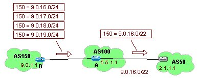
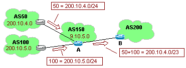
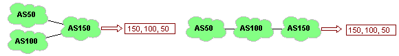
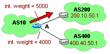
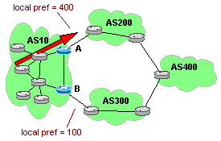
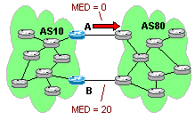
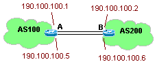

# IP and Metrics
In this doc, we will look at how we can, or prevent, summation of groups of IPs within BGP. We will also look at how BGP uses metrics to manipulate pathways from the end customer to te internet; with local preferences and weights (bigger is better), and from the internet (same AS#) to the end customer; with MED's and paths (smaller is better).


## BGP Summarization Options
As mentioned in an earlier section, the number of routes that are advertised by a bgp router is set by each `bgp network` statement. A poorly configured router that is, for example advertising 16 class C networks, could send out one route statement for each class c network, and thus send lots of unnecessary traffic to other bgp neighbors. This section will look at different ways to control the amount of BGP advertisements sent, and ways to control them.

To lower the number of routes that need to be advertised, bgp will allow us to group routes together so that we can advertise many routes with just one route statement.

There are two main bgp commands that we can use to do this. The `aggregate-address address mask [summary-only]` and `aggregate-address address mask [as-set]` commands. The first combines a neighbors specific routes into one route that is then forwarded, and the second command

### BGP Aggregate Route Configuration: (summery-only)
Examining how the Summary flag works, lets look at the example of the following three AS's.



Here, router B is sending out different route statements for each one of its class C networks. Router A sees this, and rather then passing all those separate route statements, it combines them into one aggregate route (a /22 network). Thus we spare the next router from receiving extra unnecessary route statements.

1.1.1 aggregate-address summery-only command
Router A Config	
```
! -- aggregate neighbors routes
router bgp 100
  aggregate-address 9.0.16.0 255.255.252.0 summary-only
  network 5.5.1.0
  neighbor 9.0.1.1 remote-as 150
  neighbor 2.1.1.1 remote-as 50
  ...
```
Router B Config
```
! -- router with lots of advertised routes
router bgp 150
  network 9.0.16.0
  network 9.0.17.0
  network 9.0.18.0
  network 9.0.19.0
  neighbor 5.5.1.1 remote-as 100
  ...	
```

You can view what received routes are aggregated by running a show ip bgp command.

(todo: include output from 'sh ip bgp' demonstrating this behavior)

### BGP Aggregate Address Using (as-set)
The as-set attribute is useful if you are aggregating many different AS's into one big route. This would be useful if you were a large isp who dished out many contiguous class C networks for clients. Rather then having to advertise each client (with a separate AS), you could advertise one large network, and associate many AS's for it.

In this following example, router A is going to aggregate the networks 50 and 100 into one route that it will then be passed to router B.



Aggregating routes with the as-set attribute
```
! -- combine AS's into one route
router bgp 150
  aggregate-address 200.10.4.0 255.255.254.0 as-set
  network 9.10.5.0
  neighbor 200.10.4.1 remote-as 50
  neighbor 200.10.5.1 remote-as 100
  ...
```

Without aggregating, router A would send to router B two route statements like such:
```
  200.10.4.0 100 50
  200.10.5.0 100 150
```
But instead, with the as-set aggregation, Router B gets the following information:
```
  200.10.4.0/23 100 [50 150]
```
The one caveat with this command is that Router B now, can not tell how AS's 50 and 150 are arranged to Router A's AS 100. They could be one behind the other, or side by side as in the picture below.



### Summarization with the Network Command
Originally we learned that to advertise a class C network we could use the network command. If we wanted to advertise four consecutive class C networks we would list four network statements in the BGP config. The results of this would be four separate BGP statements that are advertised out to that routers neighbor.

If you would rather send out one aggregate route for your four class C networks, you can do this by adding the mask flag to the network statement. The following

network command examples
Advertising four class C networks	
```
! -- four networks
bgp 10 
  network 195.10.16.0
  network 195.10.17.0
  network 195 10 18.0
  network 195.10.19.0
```

Advertising one /22 network
```
! -- one network
bgp 20 
  network 195.10.16.0 mask 255.255.252.0
ip route 195.10.16.0 mask 255.255.252.0 null 0
```

If you use the `network` command twice, once with masking and then again without, the bgp router will transmit both routes, even if the non masked route is a subset of the masked one. This technique could be helpful if you had a large set of networks that you wanted to advertise, but that you also needed a few parts of that network advertised on its own (maybe because it could be advertised from somewhere else in case of a fail-over).

The network statement relies on the fact that the network that it should advertise is also in the IGP routing database. If part of the network that bgp should advertise is missing, (ie a network flap), then the bgp routing table will also flap. To avoid IGP creating bgp flaps, you can use floating static routes and default metrics line in line `ip route 195.10.16.0 mask 255.255.252.0 null 0`.

## BGP Metrics
Remember that BGP tells others how to route to you, but you can also use it to tell yourself how to route out to the internet.  Some of the metrics below are for internal routing, or how you send traffic outside.  Internal metrics would be "weight" and "local preference".  There are other metrics which are used to suggest to other AS's on how they can send routes to you.  External metrics would be MED's.  The important thing to note about external metrics is that it is only a suggestion, because we are dealing with autonomous systems.  If a carrier want's to strip your routing information, MED information, or aggregate you into other routes, that it their option. 
- BGP Weight Metric
- BGP Local Preference
- BGP Multi Exit Discriminator
- How BGP Selects a Path

### BGP Weight Metric
If you have a router that has multiple neighbors you can have that router "weight" incoming routes better from one neighbor over the other using the `neighbor {ip-address|peer-group-name} weight {weight}` command. These incoming weights are specific to that router, as it does not pass the preference on to any of it's peers. The default weight is set at 32,768, and the **higher weighted route will be preferred**.

For example, this can become very useful if you have a router with multiple BGP neighbors. For example, if you had a router that had two BGP peers, one connected via a DS3 link, and a backup connected via a T1. You would want to favor the DS3 link more, and thus weight it higher then the T1.

Weight Attribute
1f01  ! -- local weights, higher better
1f02  bgp 10
1f03    neighbor 200.10.50.1 remote-as 200
1f04    neighbor 200.10.50.1 weight 50000
1f05    neighbor 400.40.50.1 remote-as 400
1f06    neighbor 400.40.50.1 weight 40000
	



Note that since this only affects the routing table on that specific router, it is a great way of controlling outbound traffic if the router has more then one interface, but (since the weight is not advertised) it is not very helpful if there are two routers, each with one interface.

### BGP Local Preference
The previous command was useful for giving preferences to routes on a single router. This command gives preference to routing information ibgp wide. It is used within an AS to find the best route to leave the AS. (in other words, when you get routes from other carriers, you can tell traffic to prefer router "A" over "B", but this routing information is local to you, and not sent out to the carriers.)

The command `bgp default local-preference {value}` specifies different ibgp routers with different weights. These weights are attached onto the ibgp route information as it's passed on to all local, ibgp routers. The default weight value is 100, the **higher number is preferred**, and the range is 0 - 4,294,967,295 = ( 2^32).

In the example below, the routers in AS10 are all ibgp neighbors. Of its two egress routers (A & B), B's link out is a smaller pipe, a T1, vs. A's link which is a DS3.

To do this, we can use the `bgp default local-preference {value}` command in both the A and B routers. By specifying A's Local Preference as a higher value, we can pass to all the other ibgp routers the fact to prefer the A router when sending outbound traffic.




We want to tell all the routers within AS10 to prefer sending outbound traffic through the A router. In this example, when traffic should be sent to the AS 400, the ibgp route table will say that it has the same number of hops to get there. But that traffic to router A is preferred. So the ibgp routers will send traffic to the A router, and then through AS 200 to get traffic to AS 400.

BGP Local Pref
Router A (preferred)	
```
! -- preferred, faster, outbound route.
router bgp 10
  neighbor 5.10.10.1 remote-as 10
  neighbor 193.200.200.1 remote-as 200
  bgp default local-preference 400
```

Router B
```
! -- backup, slower, outbound route.
router bgp 10
  neighbor 5.10.10.2 remote-as 10
  neighbor 209.300.300.1 remote-as 300
  bgp default local-preference 110
```

### BGP Multi-Exit Discriminator (MED)
BGP Local Pref modifies how traffic leaves your AS.  MED's modify how traffic arrives, but only from a single peer who you might have two links with.  (Maybe a DS3, and a backup T1 or something.) 

When two AS's have multiple links with each other, one AS can tell the other which peer point it would prefer traffic to enter through via the `bgp med value` command. This value can be utilized by the neighboring peer, but will not be propagated beyond.  (IE: MED is an optional non-transitive attribute.)




(todo: add more notes and example for MED's)

The lower MED value is preferred over the higher one. 

BGP MED
Router A (preferred)	
```
! -- preferred, faster, outbound route.
router bgp 10
  neighbor 5.10.10.1 remote-as 10
  neighbor 193.200.200.1 remote-as 80
  neighbor 193.200.200.1 route-map medout out
!
route-map medout permit 10
  set metric 0
```

Router B
```
! -- backup, slower, outbound route.
router bgp 10
  neighbor 5.10.10.2 remote-as 10
  neighbor 209.300.300.1 remote-as 300
  neighbor 209.300.300.1 route-map medout out
!
route-map medout permit 10
  set metric 20
```

to enter through via the bgp med value comm

### BGP AS Path Prepending

Still need to talk about prepending (aka: route poisoning)

```
 router bgp 10
 neighbor 192.168.1.1 remote-as 100
 neighbor 192.168.1.5 remote-as 100
 neighbor 192.168.1.5 route-map PREPEND out
 network 10.1.1.0 mask 255.255.255.0
!
route-map PREPEND permit 10
 set as-path prepend 200 200 200
!
```

## How BGP Selects a Path

1. if NextHop is unreachable, do not use that update
2. Prefer the path with the largest Weight
3. If no Weight or the same Weight, select the largest Local Preference.
4. If same Local Preference, prefer the path (if any) that was originated by BGP on this router.
5. If no route was originated, prefer the shorter AS Path.
6. If all paths are the same length, prefer the lowest origin code: ( IGP < EGP < Incomplete )
7. If origin codes are the same, prefer the path with the lowest MED.
8. If path are the same MED, prefer the External path over Internal.
9. If path are still equal, prefer the path through the closest IGP neighbor.
10. Prefer the path with the lowest BGP router ID.

### Administrative Distances for Route Selection
If a given network is learned by a different routing protocol it is assigned a default administrative distance as it is interpreted into the current routing protocol. Of all the possible routing protocols that the route is learned from, the one with the lowest administrative distance is the weight assigned.

If administrative distance is equal because a route is learned from multiple neighbors, but all neighbors use the same routing protocol, then take the lowest metric to select the best route for a given network.

Admin Distances for Route Selections

| Description | Weight |
|--|--|
Directly Connected Interface	|0
Static Route - (interface specified)	|0
Static Route - (next hop address specified)	|1
Enhanced IGRP Summary Route	|5
External Enhanced IGRP	|20
IGRP	|90
OSPF	|100
IS-IS	|115
RIP	|120
EGP	|140
Internal BGP	|200
Unknown	|255


Administrative distances are set by cisco routers by default to the above values, but these values are adjustable. For example, the following command could be used to change the administrative distance for routes being learned from RIP.

Changing the Admin. Distance for RIP
```
! -- Change RIP Admin Distance from default "120" to "99" 
router rip
  distance 99
```

All routers in an Autonomous System (AS) should use the same administrative distance matrix. If you change it in one place, you should change it on every router to allow for consistent routing across your AS. Once you change the administrative distance its new value will be automatically applied to all incoming IP routing updates.

### Load Balancing with BGP
As noted above, the BGP tie-breaker for choosing a pathway is to take the lowest router ID when everything else is equal. To allow for load balancing, the loopback address is used as the next-hop address between the two routers, for all routes out of the links to be load balanced. Since BGP will have multiple equal paths between the two loopback addresses, load balancing will occur.

To make this work we use two different commands, the `neighbor {} ebgp-multihop`, and the `neighbor {} update-source` commands.

The first, the `neighbor {ip-address | peer-group} ebgp-multihop` command, allows an external BGP neighbor to not be directly connected, but instead, allows the two to be separated by a few routers. Because of this, the remote router must be in the routers IP routing table, so there are should be static routes for that route.

The `neighbor {ip-address | peer-group} update-source [interface-type] [interface-number]` command allows a router to use a specified interface as the update source and advertise that interface to other internal BGP routers. Generally, this command is used to specify the loopback interface as the update source. You should prefer the BGP interfaces if you are load balancing, because otherwise, if the one interface that is used as the peer goes down, then all the routes are considered not valid, even if there are many other load balanced interfaces that are still up.

The following is an example configuration between two load balanced routers.




Example of load balancing
Router A	
```
! -- LB Interfaces
interface loopback0
  ip address 10.100.1.1 255.255.255.255
router bgp 100
  network 190.100.0.0 mask 255.255.252.0
  network 190.100.100.0 mask 255.255.255.252
  network 190.100.100.4 mask 255.255.255.252
  neighbor 10.100.2.1 remote-as 200
  neighbor 10.100.2.1 update-source loopback 0
  neighbor 10.100.2.1 ebgp-multihop
ip route 10.100.2.1 255.255.255.255 190.100.100.2
ip route 10.100.2.1 255.255.255.255 190.100.100.6
```
Router B
```
! -- LB Interfaces
interface loopback0
  ip address 10.100.2.1 255.255.255.255
router bgp 200
  network 57.200.200.0 mask 255.255.254.0
  network 190.100.100.0 mask 255.255.255.252
  network 190.100.100.4 mask 255.255.255.252
  neighbor 10.100.1.1 remote-as 100
  neighbor 10.100.1.1 update-source loopback 0
  neighbor 10.100.1.1 ebgp-multihop
ip route 10.100.1.1 255.255.255.255 190.100.100.1
ip route 10.100.1.1 255.255.255.255 190.100.100.5
```	


