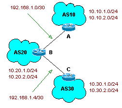

# Basic BGP Routing

Lab #1: Basic BGP Routing
In this lab we will be looking at the most basic BGP setup, showing BGP sending routing information between routers.

## Lab Goals
In this lab, you will want to do the following:

- configure the interfaces with the ip's that match the diagram
- configure bgp on all three routers, using the AS's noted in the diagram
- configure bgp such that all bgp routes are sent between routers

## Network Layout
In this lab we will be working with three routers. The routers will need to have two local /24 networks, as well as the /30 networks linking the routers together.

The easiest way to configure the router with the two local /24 networks is by creating loopback interfaces for each of the networks. This allows the /24's to be directly connected to the router, and prevents you from having to rely on a router with two extra interfaces.

For the /30 interconnect networks, I suggest using fast Ethernet subinterface's, thus allowing you to only use one interface per router.



The routers should be configured as such:

Router A
```
int fa0/1.10 192.168.1.1 255.255.255.252
int loopback0 10.10.1.1 255.255.255.0
int loopback1 10.10.2.1 255.255.255.0
BGP AS10
```
Router B
```
int fa0/1.10 192.168.1.2 255.255.255.252
int fa0/1.30 192.168.1.6 255.255.255.252
int loopback0 10.20.1.1 255.255.255.0
int loopback1 10.20.2.1 255.255.255.0
BGP AS20
```
Router C
```
int fa0/1.30 192.168.1.5 255.255.255.252
int loopback0 10.30.1.1 255.255.255.0
int loopback1 10.30.2.1 255.255.255.0
BGP AS30
```

## Lab Procedures
These are the following procedures you should complete to finish this lab.

1. Clear any configurations that might be currently on the routers.
2. First configure the routers interfaces and make sure that the routers can ping their peers local interfaces, but not their peers remote interfaces. The local interfaces should use the /30 networks.
    - Q2.1 How do you configure the local interfaces?
    - Q2.2 How do you configure interfaces with /30 networks
3. Create loopback with /24 networks. Make sure that you can ping each routers local loopback networks, but not remote loopback networks.
    - Q3.2 How do you create loopback networks?
4. Configure BGP on all three routers and advertise all loopback networks to BGP. The interface networks should only be advertised by the Stub routers (Router A and Router C). View the BGP routing tables to ensure that all routers can see all the other networks and AS's. Make sure that you can ping all the networks on all the routers.
    - Q4.1 How do you configure BGP on your router?
    - Q4.2 How do you advertise networks in BGP?
    - Q4.3 What command should you use to all the routes in the BGP route table?
    - Q4.4 What command would you use to clear all the routes in the BGP routing table?

## Solutions
These are the following configs and tests you should do to solve this lab.

### Clear Previous Configs
There are two ways to clear the config on your router. The first method is from the exec prompt, and the second is from the rmon(?) prompt.

Clearing the router configs from the exec prompt
```  
erase startup-config
reload
```

Clearing the router configs from the rmon(?) prompt
```  
o/r 0x2142
I
```

### Configure Local Interfaces
These basic steps create local subinterfaces on a single fast ethernet interface. The routers should be connected to a switch that can handle VLANing. This is how I like running a test network, if you configure the interfaces differently, it will not change anything (as long as you can ping everything).

Router A config (adding local interfaces)
```
conf t
 hostname routerA
 int fa0/1.10
  ip address 192.168.1.1 255.255.255.252
  encap dot1q 10
  no shut
  exit
exit
```

Router B config (adding local interfaces)
```
conf t
 hostname routerB
 int fa0/1.10
  ip address 192.168.2.1 255.255.255.252
  encap dot1q 10
  no shut
  exit
 int fa0/1.30
  ip address 192.168.6.1 255.255.255.252
  encap dot1q 30
  no shut
  exit	
exit
```

Router C config (adding local interfaces)
```
conf t
 hostname routerC
 int fa0/1.30
  ip address 192.168.5.1 255.255.255.252
  encap dot1q 30
  no shut
  exit
exit
```

Note that you should only be able to ping local interfaces to the router. There should not be any other routing protocols available.

Example of pinging (with only connected routes) from Router A
```  
show ip route
ping 192.168.1.1
ping 192.168.1.2
ping 192.168.1.5
```

### Configure Loopback Interfaces
Creating loopback interfaces allows us to hang many netwroks directly off the router for the purposes of this experiment. You will need to know how to create loopbacks for other situations with BGP, so this is a great way to introduce this concept.

Router A config (adding loopback networks)
```
conf t
 int loopback 0 
  ip address 10.10.1.1 255.255.255.0
  exit
 int loopback 1 
  ip address 10.10.2.1 255.255.255.0
  exit  
 exit
```	
Router B config (adding loopback networks)
```
conf t
 int loopback 0 
  ip address 10.20.1.1 255.255.255.0
  exit
 int loopback 1 
  ip address 10.20.2.1 255.255.255.0
  exit  
 exit
```

Router C config (adding loopback networks)
```
conf t
 int loopback 0 
  ip address 10.30.1.1 255.255.255.0
  exit
 int loopback 1 
  ip address 10.30.2.1 255.255.255.0
  exit  
 exit
```

And now to test connectivity, from router A, ping the two local loopback networks.

Testing loopback networks
``` 
sh ip route 
ping 10.10.1.1
ping 10.10.2.1
```

### Configure BGP
To configure BGP, we will need to enable the BGP route process, give it an AS number, define it's BGP neighors, and specify what networks to advertise.

Router A config (config bgp)
```
conf t
 router bgp 10
  network 192.168.1.0 mask 255.255.255.252
  network 10.10.1.0
  network 10.10.2.0
  neighbor 192.168.1.2 remote-as 20
  exit
exit
```

Router B config (config bgp)
```
conf t
 router bgp 20
  network 10.20.1.0
  network 10.20.2.0
  neighbor 192.168.1.1 remote-as 10
  neighbor 192.168.1.5 remote-as 30
  exit
exit
```

Router C config (config bgp)
```
conf t
 router bgp 30
  network 192.168.1.4 mask 255.255.255.252
  network 10.30.1.0
  network 10.30.2.0
  neighbor 192.168.1.6 remote-as 20
  exit
exit
```

And now to test BGP and make sure that you can recieve all the routes, we can do the following from Router A.

Testing BGP from Router A
```  
sh ip route
clear ip bgp
sh ip bgp
ping 10.10.1.1
ping 10.20.1.1
ping 10.30.1.1
```

## Final Router Configs
When it's all said and done, these are the basic configs for each of the routers.

Router A's complete config
```
hostname routerA
!
int loopback 0 
 ip address 10.10.1.1 255.255.255.0
int loopback 1 
 ip address 10.10.2.1 255.255.255.0
!
int fa0/1.10
 ip address 192.168.1.1 255.255.255.252
 encap dot1q 10
 no shut
!
router bgp 10
 network 192.168.1.0 mask 255.255.255.252
 network 10.10.1.0
 network 10.10.2.0
 neighbor 192.168.1.2 remote-as 20
```

Router B's complete config
```
hostname routerB
!
int loopback 0 
 ip address 10.20.1.1 255.255.255.0
int loopback 1 
 ip address 10.20.2.1 255.255.255.0
!
int fa0/1.10
 ip address 192.168.2.1 255.255.255.252
 encap dot1q 10
 no shut
int fa0/1.30
 ip address 192.168.6.1 255.255.255.252
 encap dot1q 30
 no shut
!
router bgp 20
 network 10.20.1.0
 network 10.20.2.0
 neighbor 192.168.1.1 remote-as 10
 neighbor 192.168.1.5 remote-as 30
```

Router C's complete config
```
hostname routerC
!
int loopback 0 
 ip address 10.30.1.1 255.255.255.0
int loopback 1 
 ip address 10.30.2.1 255.255.255.0
!
int fa0/1.30
 ip address 192.168.5.1 255.255.255.252
 encap dot1q 30
 no shut
!
router bgp 30
 network 192.168.1.4 mask 255.255.255.252
 network 10.30.1.0
 network 10.30.2.0
 neighbor 192.168.1.6 remote-as 20
```	


