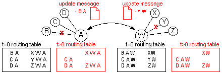
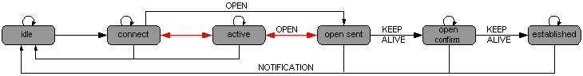
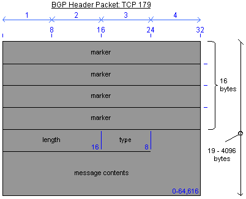
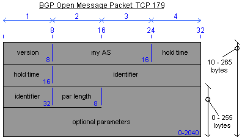
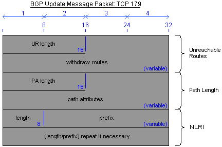
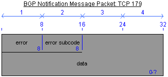
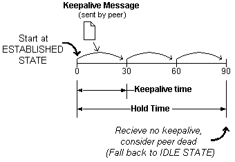
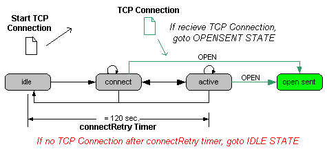
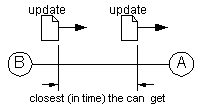
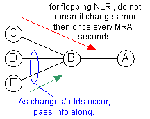

# The Finite State Machine

BGPv4 - Border Gateway Protocol v.4 - The Finite State Machine

This section discusses how the BGP router system communicates between itself and other BGP peers. We start by looking specifically at it's state machine, and the different things it does at each state. Then we look at how it sends messages between peers (types of packets) at the different states. Then finally, we look at the basic BGP timers and how they relate to the different states.

- [The Finite State Machine](#the-finite-state-machine)
  - [BGP Overview:](#bgp-overview)
  - [BGP Finite State Machine](#bgp-finite-state-machine)
  - [BGP Message Type](#bgp-message-type)
    - [BGP Message Header](#bgp-message-header)
      - [Packet Overview:](#packet-overview)
    - [Open Message](#open-message)
      - [Packet Overview:](#packet-overview-1)
    - [Update Message](#update-message)
      - [Packet Overview:](#packet-overview-2)
    - [Notification Message](#notification-message)
      - [Packet Overview:](#packet-overview-3)
      - [Possible BGP Error Codes:](#possible-bgp-error-codes)
    - [Keepalive Message](#keepalive-message)
  - [BGP Timers](#bgp-timers)
    - [Holdtime and Keepalive Timers:](#holdtime-and-keepalive-timers)
    - [Connect Retry Timer](#connect-retry-timer)
    - [Controlling Routing Traffic Overhead: MAOI and MRAI Timers Timers](#controlling-routing-traffic-overhead-maoi-and-mrai-timers-timers)
  - [Appendix A. References:](#appendix-a-references)

## BGP Overview:
Routers that run the BGP process are called BGP Speakers. BGP Speakers that talk directly with each others are called neighbors or peers.

BGP uses TCP port 179 for communication between routers. It does not by itself know how to route traffic to its peers, instead uses another routing protocol for this, like static routes or another protocol (ie OSPF).

Watching BGP peers communicate with each other, we see these following common steps:

(1) When peers first attempt to connect, they exchange open messages to determine the connection parameters.

(1.1) BGP can also gracefully close a connection with a peer, allowing all error messages to be sent between peers before the connection is closed. This prevents the peer who was disconnected, from spending cycles trying to reconnect with a router that will refuse all future connections.

(2) When the BGP peers first establish a session, all the bgp routes are exchanged via an update message.

After that point only incremental updates are sent, still with the update message. So if a new network is added or one goes down, only that specific change is sent.

(3) While the peers are not sending routing information, keepalive messages's are regularly sent between them. This keeps the BGP session up, allowing the peers to know that the routes are still valid. If the session goes down (and stays down), then the router must assume that the routes it learned from that neighbor are no longer valid. The keepalive messages are small, not causing a strain on the routers or the network.

## BGP Finite State Machine
BGP peers go through different finite states before a connection is fully made. At each state, different BGP messages are sent back and forth. Below is listed the different states, and at what states the different BGP messages are sent.

The following states are:

- Idle: BGP is waiting for a start event such as the admin enabling or resetting a BGP router. After the start event, BGP initializes its resources, resets the ConnectRetry timer, initiates a TCP connection, and listens for a connection from its peer. It then either switches to a Connect State, or falls back to the Idle State.
- Connect: BGP is waiting for the TCP session to complete. If the connection is successful, the Open message is sent, and the state switches to OpenSent. If the session is not successful, then the state switches to Active. If nothing happens within the time that the ConnectRetry timer times out, then the TCP session is restarted, and the state stays the same. Other events will set the state back to the Idle State.
- Active: BGP is still waiting for the TCP session to complete. Like the Connect State, once the connection is made, the Open message is sent, and the state switches to the OpenSent State. If ConnectRetry timer times out without a TCP session being made, the timer is reset and the state is switched to Connect (BGP still listens for a connection from the peer). Other events (such as the Stop event) will bring the state back to the Idle State. If the state is switching between Connect and Active, then it is a sign that there are reachability issues.
- OpenSent: BGP has sent an Open message, and is waiting for one from the peer. When the peers Open Message is received, if it is ok it sends a Keepalive message, and resets the keepalive counter, and goes to the OpenConfirm state. If a TCP transport disconnect is received, the state will fall back to the Active state. If there are problems with the senders Open message, (bad BGP version, or bad AS), or the Holddown timer expires, or any other errors, then the system sends out an error notification, and resets to the Idle State. BGP figures out a bunch of things by comparing the two valid Open messages. First it looks at each holdtime fields, to come up with the value for the keepalive timer. If the values are not the same, the lowest of the two is chosen for both. It also looks at the two messages "My AS" field. If the values are the same, then the peer is an iBGP peer, and if they are different, it's a eBGP peer.
- OpenConfirm: BGP has just sent a Keepalive message, and is waiting for one back from its peer. Once the message arrives, the HoldTimer is reset, and Keepalives are sent as per the Keepalive timer. If a notification message, TCP transport disconnect message, or any other error is received, the state is switched to Idle, and sends a Notification message if necessary. (All other error messages produce a Notification message with the error code as "finite state machine error").
- Established: The state is switched to established as soon as a Update message is sent or received. The HoldTimer is reset after each Update message or Keepalive message. The state will change to Idle if the system receives a Notification message. It will also switch to idle, and send out a Notification message, if any errors are found in a received Update message, the Holddown time expires, or the router receives any other errors.

## BGP Message Type

### BGP Message Header
All BGP messages are encapsulated within the BGP Message Header.

#### Packet Overview:
- Marker: Used to either authenticate incoming BGP messages, or detect loss of synchronization. If type=open, then the marker has no authentication and it is all ones. If not, then the marker uses an MD5 sig to authenticate the bgp packets.
- Length: length of the bgp message. min 19 bytes (header with no message), and max of 4,096 bytes.
- Type: messages purpose, (See RFC 1771)
    - 1: open
    - 2: update
    - 3: notification
    - 4: keepalive
- Message Contents: One of the messages outlined in the following sections. Note that the keepalive has no message size, so when it is sent there is no message content.

### Open Message

#### Packet Overview:
- Version: [1-byte] This should be 4. All other versions of bgp (1-3) are considered obsolete and not used. Though this is currently set statically to 4, the standard says that the two peers will decide which is the highest version that they can both do, and then set to that version automatically.
- My AS #: [2-byte] The Senders AS number.
- Hold Time: [2-byte] The max number of seconds the session can be idle before it is torn down. If the bgp peers do not have the same hold time, then the lowest is used between the two of them. The minimum time is 3 seconds, the max is ???. A hold time of zero means the session will never time out. New incoming keepalive or update messages are what reset the holddown timer, which counts from 0 to the holddown time.
- Identifier: [4-byte] aka: BGP Identifier, BGP ID, and Router ID (RID). The highest IP address for the router, or it's highest loopback address.
- Par Length: [1-byte] aka: Optional Parameter Length, Opt Parm Len. Length of the optional parameters field. A zero value indicates no optional parameters.
- Optional Parameters: [variable length] Used in the BGP negotiation, and other extended capabilities like multiprotocol extensions and route refresh. An example would be the Authentication Information Parameter (type 1) which is used to authenticate the session with a BGP peer. It is made up of the Parameter Type, Parameter Length, and Parameter Value fields.

### Update Message
The update message adds and/or removes routes.

There are three sections to the Update message; the unreachable routes, the path attributes, and the NLRI (network layer reachability information).

The first is the unreachable routes section. It sends information about routes that have become unreachable or withdrawn. The second section lists the path attributes of new or known routes. An example to a path attribute would be for a specific path . The last section is the network layer reachability information (NLRI) which lists the networks being advertised.

#### Packet Overview:
- Unreachable Routes: This is the list of routes (which have been advertised earlier) that are no longer available. The first field in this group states how large the group is, and the following repeated fields specify what prefix (with mask) should be removed. The format of the repeating fields are as such:
    - UR Length (2 bytes): Unfeasible Route Length specifies how much space (in BYTES) the repeating length/prefix fields will take up (but it also includes its own two bytes???). A zero value means that there is no routes to withdraw.
    - Withdraw Routes (variable): The list of routes to be removed. It is comprised of two repeating fields; length and prefix. 
        - Length (1 byte): The masking of the network being advertised.
        - Prefix (variable): The network that is being advertised.
- Path Attributes: This used by BGP to keep track of route specific information (ie: route path). Every update message has a variable length sequence of path attributes and NRLIs. The path attribute is a repeated set of frames that describe the attribute type, its length, and its value. The type info is further broken down into two parts; the attribute flag and type codes. These path attributes are used to find the best route for each advertised network. 
    - PA Length (2 bytes): Defines the length of the Path Attribute section, and the NRLI section
    - Attribute flags (1 byte): Define the importance of the following attribute value. The first 4 bits are defined as follows, and the final 4 bits are unused and reserved.
        - a (bit 0): Well-known (0=well-known, 1=optional). A well-known attribute is one that is understood by all BGP routers, and must be included for update message to be understood. Examples would be next hop, or as-path information.
        - b (bit 1): Transitive (0=non-transitive, 1= transitive). Transitive attributes are ones that should be passed to the next BGP router, where non-transitive ones can be dropped. (Well-known attributes are always transitive.)
        - c (bit 2): Transitive Completness (0=complete, 1=partial). Explains how complete the transitive or non-transitive information is.
        - d (bit 3): Attribute Length (0=1byte, 1=2bytes). Defines how long the following Attribute length field is.
        - e (bits 4-7): Unused with value 0000
    - Attribute type codes (1 byte): Explains what type of information is described within the attribute value. The codes are defined as noted below.
    - Attribute length (1-2 bytes): Length of the attribute value. It's size is specified by the fourth bit in the attribute flag.
    - Attribute value (?): The data that keeps track of route specific info such as path information, degree of preference of a route, or the NEXT_HOP value to name a few.
- NLRI: Network Layer Reachability Information. This group contains two repeating fields. They specify the Prefix and its mask that is being advertised. The repeating field is in the same format as the repeating withdrawn routes above: 
    - Length (1 byte): The masking of the network being advertised.
    - Prefix (variable): The network that is being advertised. For an example of this, say we are advertising the entire Class B network 128.164.0.0. This would have a subnet of 255.255.0.0, or in CIDR speak, it could be writen as 128.164.0.0/16. Thus the Length would be "16", and the Prefix would be "128.164.0.0".

Attribute type codes: 

| num	| Attribute Name	| Catagory/Type Code	| Related RFC |
|--|--|--|--|
1	| ORIGIN	|Well-known mandatory, Type code 1|	RFC 1771
2	| AS_PATH	|Well-known mandatory, Type code 2|	RFC 1771
3	| NEXT_HOP	|Well-known mandatory, Type code 3|	RFC 1771
4	| MULTI_EXIT_DIST	|Optional nontransitive, Type code 4	|RFC 1771
5	| LOCAL_PREF	|Well-known discretionry, Type code 5	|RFC 1771
6	| ATOMIC_AGGREGATE	|Well-known discretionry, Type code 6	|RFC 1771
7	| AGGREGATOR	|Optional transitive, Type code 7	|RFC 1771
8	| COMMUNITY	|Optional transitive, Type code 8	|RFC 1997
9	| ORIGINATOR_ID	|Optional nontransitive, Type code 9	|RFC 1966
10	| Cluster List	|Optional nontransitive, Type code 10	|RFC 1966
11	| DPA	|Destination Point Attribute for BGP	|Expired Internet Draft
12	| Advertiser	|BGP/IDRP Route Server	|RFC 1863
13	| RCID_PATH/CLUSTER_ID	|BGP/IDRP Route Server	|RFC 1863
14	| Multiprotocol Reachable NRLI	|Optional nontransitive, Type code 14	|RFC 2283
15	| Multiprotocol Unreachable NRLI	|Optional nontransitive, Type code 15	|RFC 2283
16	| Extended communities	 |	|work in progress
255| Reserved for development| |

### Notification Message
A notification message is always sent when an error is detected, and these errors switch the BGP state to idle. Monitoring these messages is a good way to troubleshoot problems between your bgp peers.

#### Packet Overview:
- Error: Code of what kind of error occurred.
- Error Subcode: Code to more specific details of that error.
- Data: Data relevant to the error, like bad AS numbers, or bad header.

#### Possible BGP Error Codes:

<table border="1" width="75%">
<tbody>
<tr>
	
<th bgcolor="silver" width="40%">Error Code</th>
	
<th bgcolor="silver" width="60%">Error Subcode</th>
</tr>
<tr>
	
<td rowspan="3" valign="top">1- Message Header Error</td>
	
<td>1- Connection Not Synchronized</td>
</tr>
<tr>
<td>2- Bad Message Length</td>
</tr>
<tr>
<td>3- Bad Message Type</td>
</tr>
<tr>
	
<td rowspan="7" valign="top">2- Open Message Error</td>
	
<td>1- Unsupported Version Number</td>
</tr>
<tr>
<td>2- Bad Peer AS</td>
</tr>
<tr>
<td>3- Bad BGP Identifier</td>
</tr>
<tr>
<td>4- Unsupported Optional Parameter</td>
</tr>
<tr>
<td>5- Authentication Failure</td>
</tr>
<tr>
<td>6- Unacceptable Hold Timer</td>
</tr>
<tr>
<td>7- Unsupported Capability</td>
</tr>
<tr>
	
<td rowspan="11" valign="top">3- Update Message Error</td>
	
<td>1- Malformed Attribute List</td>
</tr>
<tr>
<td>2- Unrecognized Well-Known Attribute</td>
</tr>
<tr>
<td>3- Missing Well-Known Attirbute</td>
</tr>
<tr>
<td>4- Attribute Flags Error</td>
</tr>
<tr>
<td>5- Attribute Length Error</td>
</tr>
<tr>
<td>6- Invalid Origin Attribute</td>
</tr>
<tr>
<td>7- AS Routing Loop</td>
</tr>
<tr>
<td>8- Invalid NEXT_HOP Attribute</td>
</tr>
<tr>
<td>9- Optional Attribute Error</td>
</tr>
<tr>
<td>10- Invalid Network Field</td>
</tr>
<tr>
<td>11- Malformed AS_PATH</td>
</tr>
<tr>
	
<td>4- Hold Timer Expired</td>
	
<td>N/A</td>
</tr>
<tr>
	
<td>5- Finite State Machine Error (for errors detected by the FSM)</td>
	
<td>N/A</td>
</tr>
<tr>
	
<td>6- Cease (for fatal errors besides the ones already listed)</td>
	
<td>N/A</td>
</tr>
</tbody>
</table>

### Keepalive Message
Keepalive messages are sent between peers regularly to ensure that the peer is reachable. The Hold timer counts the maximum amount or time allowed between Keepalive Messages (or Update messages). BGP peers normally send Keepalive messages 1/3 the amount of time as the Hold time value. If the holdtime is set to 0 (infinite uptime), then keepalives are not sent.

The Keepalive message has no body, thus it is comprised of only the BGP Header (with no body).

##  BGP Timers
BGP employs five timers. An implementation of BGP MUST allow these timers to be configurable. see:RFC 1771, section 6.4.

The timers are:

- Holdtime Timer
- Keepalive Timer
- Connect Retry Timer
- MinASOriginationInterval Timer
- MinRouteAdvertisementInterval Timer

### Holdtime and Keepalive Timers:
These timers are used during the established state to ensure that the state should stay established. The BGP router expects to receive a keepalive message (or update message) within the Hold timer. If none are received, then the state is considered dead.

- KeepAlive Timer (def: 30s) How much time between sending keepalive packets to the hosts bgp peer. It does this to let the neighbor that it is alive and well.
- Hold Time Timer (def: 90s) The number of seconds this BGP speaker waits for a keepalive, update, or notification message before deciding that the peer is dead, and terminating its connection. This is normaly set to 3 times the keepalive time, so that the peer is given three chances to recieve a keepalive message before assuming the peer is dead.

### Connect Retry Timer
When the state first switches to connect, a tcp connect with the peer is attempted. If the connection is not created by the connectRetry timer, then the state is switched back to idle. If the connection is made, then the state is switched to opensent.

- ConnectRetry Timer (120s) Only after this time passes will the BGP process check to see if the passive TCP session is established. If the passive TCP session is not established, then the BGP process starts a new active TCP attempt to connect to the remote BGP speaker. During this idle 120 seconds of the ConnectRetry timer, the remote BGP peer can establish a BGP session to it. Presently the Cisco IOS ConnectRetry timer cannot be changed from its default of 120 seconds.

### Controlling Routing Traffic Overhead: MAOI and MRAI Timers Timers
Both of these timers are designed to keep a bgp routers overhead low, and to keep unneccessary traffic on the line.

| MinASOriginationInterval Timer (MAOI) | MinRouteAdvertisementInterval Timer (MRAI) |
|--|--|
 | 

- MinASOriginationInterval Timer {MAOI} (def: 15s) The parameter MinASOriginationInterval is the minimum time between consecutive advertisements of UPDATE messages by an AS border router that reports changes in its AS.
- MinRouteAdvertisementInterval Timer {MRAI} (def: 30s) Prevent a flapping network from sending repeated route advertisements within a specified amount of time. In other words, if Crazy Joe's ISP is flapping every few seconds a few AS's away you should only send/receive an update message for their NLRI every MinRouteAdvertisementInterval seconds instead of every few seconds if you did not have damping already setup. This is a good thing, because it keeps traffic on the line lower, but the router does have to keep track of each NLRI route update, thus adding a higher load on it's memory.

## Appendix A. References:
- Internet Routing Architectures, Second Edition. Sam Halabi, Cisco Press ©2001
- Cisco BGP-4 Command and Configuration Handbook. William R. Parkhurst © 2001
- BGP. Iljitsch van Beijnum, O'Reilly & Associates, Inc. ©2002
- [RFC 1771, A Border Gateway Protocol 4 (BGP-4)](http://www.faqs.org/rfcs/rfc1771.html)