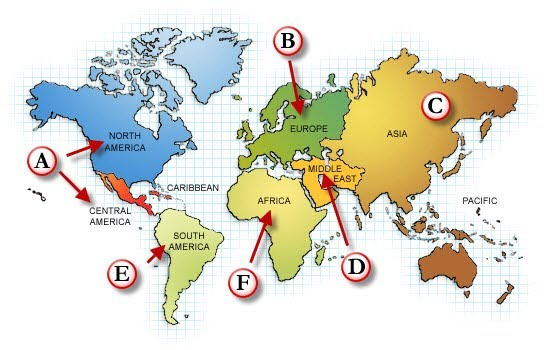

# Choosing private IP space for your business

## Overview:

This document covers how we will reserve our IP space for the entire company as we grow.  It helps us understand what IPs are located where, and as we build out new sites, what IPs to use for them.  It also will help define our switched VLAN reservations so that we can better understand the what VLAN numbers are used where

## Global IP Layout:
All internal IPs are using the reserved 10. class A network.  From within that, the following explains how that will be broken out into multiple class B networks.  

### Continent Routes:
Not exactly continents, but we're breaking out the IP space into the following regions.

### IPv4 IP Space

Splitting out IP's in an organized way allows us to have a better understanding on where an IP is physically located, and lets us control routes more cleanly.  To do this we are defining 6 "zones" to the globe, and providing IP ranges for each of the zones.
Not exactly continents, but we're breaking out the IP space into the following regions.

For IPv4, the private IP ranges are as follows: 

| Note | Continent | Network | IP Range| 
|--|--|--|--|
 &nbsp; | Reserved	| 10.0.0.0/11	 | (10.0.0.0 - 10.31.0.0)
 (A)	| North/Central America:	| 10.32.0.0/11	| (10.32.0.0 - 10.63.0.0)
 (E)	| South America:	| 10.64.0.0/11|	 (10.64.0.0 - 10.95.0.0)
 (B)	| Europe:	| 10.96.0.0/11	| (10.96.0.0 -10.127.0.0)
 (D)	| Middle East:	| 10.128.0.0/11	| (10.128.0.0 - 10.159.0.0)
 (C)	| Asia:	| 10.160.0.0/11	| (10.160.0.0 - 10.191.0.0)
 (F)	| Africa:	| 10.192.0.0/11	| (10.192.0.0 - 10.223.0.0)
 &nbsp; | Reserved	| 10.224.0.0/11	| (10.224.0.0 - 10.255.0.0)

All IP ranges would fit this model, regardless if it was for production or for corporate LANs.  

