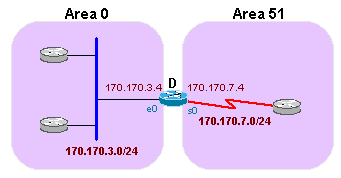
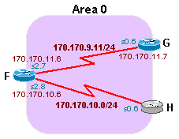
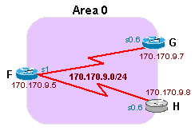
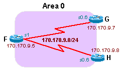
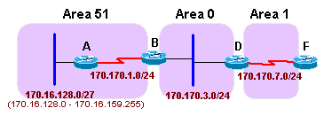
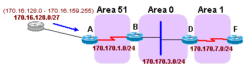
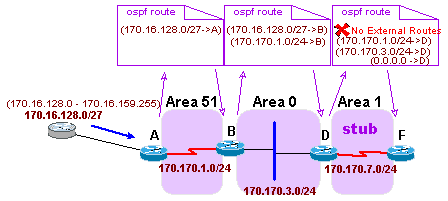
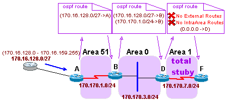
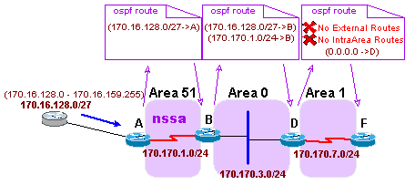
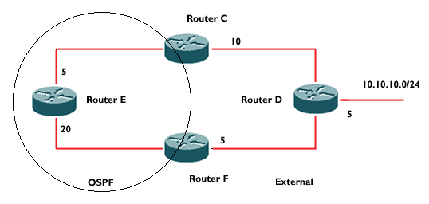

# Configuring OSPF

- [Configuring OSPF](#configuring-ospf)
  - [Introduction](#introduction)
  - [Configuring OSPF](#configuring-ospf-1)
    - [Enabling OSPF](#enabling-ospf)
    - [Configuring OSPF Interface Parameters](#configuring-ospf-interface-parameters)
    - [Configuring OSPF over Different Physical Networks](#configuring-ospf-over-different-physical-networks)
    - [Point-to-Point Subinterfaces](#point-to-point-subinterfaces)
    - [Selecting Interface Network Types](#selecting-interface-network-types)
    - [Point-to-Multipoint Interfaces](#point-to-multipoint-interfaces)
    - [Broadcast Interfaces](#broadcast-interfaces)
    - [Configuring Route Summarization](#configuring-route-summarization)
    - [Configuring Stub Areas and Totally Stubby Areas](#configuring-stub-areas-and-totally-stubby-areas)
    - [Configuring OSPF On-Demand Circuits](#configuring-ospf-on-demand-circuits)
  - [External Routes](#external-routes)
    - [Originating Default Routes](#originating-default-routes)
  - [Summary](#summary)
  - [What's Next](#whats-next)

## Introduction
In this section, you'll be presented with the steps involved in configuring OSPF over various physical network types. In addition, you will learn the commands to verify OSPF configurations. After you have learned the material in this section, the following labs will allow you to get some hands-on practice using these concepts.

## Configuring OSPF

### Enabling OSPF
As with other routing protocols, enabling OSPF requires that you:

1. Create an OSPF routing process.
2. Specify the range of IP addresses to be associated with the routing process, and assign area IDs to be associated with that range of IP addresses.

Use the following commands, starting in global configuration mode:

| Step	| Command	| Purpose |
|--|--|--|
1	| `router ospf process-id`	| Enable OSPF routing, placing you in router configuration mode.
2	| `network address wildcard-mask area area-id`	| Define an interface on which OSPF runs and define the area ID for that interface.

The OSPF process ID is a numerical value that is local to the router. It does not have to match any process IDs that might be running on other routers. It is possible to run more than one process on the same router. However, this will create multiple databases and cause more overhead on the router.

The wildcard mask in the network command allows a user to configure multiple interfaces into the same area with a single configuration line. The wildcard mask is an inverse mask and is used the same as an inverse mask with access lists.

The area ID is the area in which the interface(s) will be configured. It can be an integer 0 to 4294967295 or it can take the form of a dotted decimal number such as 0.0.0.0.



Router_D Config: 

```
! -- conf interfaces
interface ethernet 0
  ip address 170.170.3.4 255.255.255.0
interface serial 0
  ip address 170.170.7.4 255.255.255.0
! 
! -- enable ospf on router D
router ospf 7
  network 170.170.3.0 0.0.0.255 area 0
  network 170.170.7.0 0.0.0.255 area 51
```

In above example, the router ospf 7 command enables OSPF on Router_D. The first network command enables OSPF on interface Ethernet 0 and puts it in area 0. The second network statement enables OSPF on interface serial 0 and puts it in area 51.

Note that network area commands are executed consecutively. The second network area command affects only interfaces that do not match the first command. For example:

Masking Example: Area2 will not be used

```
2B01  ! -- one network that stomps on the other
2B02  router ospf 7
2B03    network 100.100.0.0 0.0.255.255 area 0
2B04    network 100.100.10.0 0.0.0.255 area 2
```

All interfaces with an IP address of 100.100.x.x will be placed into area 0; therefore, the second network area command is never applied.

### Configuring OSPF Interface Parameters
As mentioned before, OSPF exchanges Hello packets on each OSPF-enabled segment. This is a form of keepalives as well as a method for neighbor discovery and DR/BDR election. The rate at which OSPF sends the hello packets out is called the "Hello Interval." The amount of time an OSPF router will wait for a hello packet before declaring the neighbor down is called the "Dead Interval." OSPF requires that these intervals be the same between two neighbors; otherwise the two routers will not become OSPF neighbors.

Use the following commands to modify these parameters on an interface basis:

| Command	| Purpose | 
|--|--| 
`ip ospf hello-interval seconds`	| Specify the length of time between the hello packets that the Cisco IOS® software sends on an OSPF interface.
`ip ospf dead-interval seconds`	| Set the number of seconds that a device's hello packets must not have been seen before its neighbors declare the OSPF router down.

An OSPF interface parameter that plays a very important role in the election of the DR and BDR is the OSPF priority. On a given segment the router with the highest priority will become the DR. If the priorities are the same, the DR will be the router with the highest router ID. To reiterate, the router ID is defined as the highest numerical ip address of the router's interfaces or the highest loopback ip address if it exists at the time that OSPF was configured on the router. If a user wishes a particular router to become the DR or if the user wishes that a particular router not be eligible as a DR/BDR, the following command can be used to modify the OSPF interface priority:

| Command | Purpose | 
|--|--|
`ip ospf priority number`	| Set priority to help determine the OSPF-designated router for a network.

If the ospf priority on the interface is set to 0, then the router can never become the DR or BDR for that network segment.

The metric that OSPF uses to determine shortest path is called the OSPF cost. This interface parameter can also be modified in order to manipulate routing decisions. The command follows:

|Command | Purpose| 
|--|--|
`ip ospf cost cost`	| Explicitly specify the cost of sending a packet on an OSPF interface.

OSPF interface parameters can be viewed with the command show ip ospf interface, as seen in the following example:

Viewing the OSPF interface parameters
```
! -- at the command prompt
Router_D# show ip ospf interface ethernet 0
Ethernet0 is up, line protocol is up
 Internet Address 170.170.3.4/24, Area 0
 Process ID 7, Router ID 170.170.8.4, Network Type BROADCAST, Cost: 10
 Transmit Delay is 1 sec, State BDR, Priority 1
 Designated Router (ID) 170.170.13.3, Interface address 170.170.3.3
 Backup Designated router (ID) 170.170.8.4, Interface address 170.170.3.4
 Timer intervals configured, Hello 10, Dead 40, Wait 40, Retransmit 5
 Hello due in 00:00:08
 Index 1/1, flood queue length 0
 Next 0x0(0)/0x0(0)
 Last flood scan length is 0, maximum is 3
 Last flood scan time is 0 msec, maximum is 0 msec
 Neighbor Count is 2, Adjacent neighbor count is 2
 Adjacent with neighbor 170.170.3.2
 Adjacent with neighbor 170.170.13.3 (Designated Router)
 Suppress hello for 0 neighbor(s)
Router_D#
```

### Configuring OSPF over Different Physical Networks
As mentioned above, OSPF classifies networks as being broadcast, NBMA, or point-to-point.

When configuring OSPF over NBMA networks, special care should be taken. Most NBMA networks, such as Frame Relay, are partially meshed networks and the physical topology does not provide the multi-access connectivity that OSPF assumes is there. The selection of DR becomes a very important issue because the DR and BDR have to have physical connectivity to all the neighboring routers. The neighbor command is used to give the DR/BDR a static list of all other routers attached to the network. This is needed because of the lack of broadcast capabilities.

The command follows:

| Command | Purpose |
|--|--|
`neighbor ip-address [priority number] [poll-interval seconds]` | Configure a router interconnecting to nonbroadcast networks.


In the above command, the IP address and priority are values given to the neighbor. The poll interval is the amount of time a NBMA interface will wait before sending a hello to a presumably dead neighbor.

Note that after the release of Cisco IOS 10.0, the neighbor command is not necessary. There are other ways of running OSPF over NBMA networks that are much more efficient.

### Point-to-Point Subinterfaces
The use of subinterfaces is a way to split a physical interface into multiple logical interfaces. Each subinterface can be defined as point-to-point. A point-to-point subinterface has the properties of any physical point-to-point interface. As far as OSPF is concerned, an adjacency is always formed over a point-to-point network without electing a DR or BDR.

One drawback of point-to-point subinterfaces is that each point-to-point segment requires its own subnet.

The following is an example of configuring point-to-point subinterfaces with OSPF.

In the topology below, the serial 2 interface of Router_F can be logically split into two point-to-point subinterfaces. Each subinterface is assigned an address out of a unique subnet. Router_G and Router_H also have a subinterface configured.



Excerpts from the configurations for Router_F and Router_G follow:

Point to Point Config: Router_F	
```
! -- define the primary interface 
interface Serial2
 no ip address
 encapsulation frame-relay
 frame-relay lmi-type ansi
! 
! -- define the 1st subinterface
interface Serial2.7 point-to-point
 ip address 170.170.11.6 255.255.255.0
 frame-relay interface-dlci 101
! 
! -- define the 2nd subinterface
interface Serial2.8 point-to-point
 ip address 170.170.10.6 255.255.255.0
 frame-relay interface-dlci 103
! 
! -- Set the ospf areas
router ospf 7
 network 170.170.11.0 0.0.0.255 area 0
 network 170.170.10.0 0.0.0.255 area 0
```

Point to Point Config: Router_G:
```
! -- define the primary interface 
interface Serial0
 no ip address
 encapsulation frame-relay
 frame-relay lmi-type ANSI
! 
! -- define the subinterface
interface Serial0.6 point-to-point
 ip address 170.170.11.7 255.255.255.0
 frame-relay interface-dlci 110
! 
! -- Set the ospf areas
router ospf 7
 network 170.170.11.0 0.0.0.255 area 0	
```

### Selecting Interface Network Types
The following command can be used to define the network type of an OSPF interface:

| Command	| Purpose |
|--|--|
`ip ospf network {broadcast / non-broadcast / {point-to-multipoint [non-broadcast] }}` | Configure the OSPF network type for a specified interface.

Each network type that can be configured with the above command will be explained below.

### Point-to-Multipoint Interfaces
A point-to-multipoint interface is defined as a numbered point-to-point interface that has multiple neighbors. Users do not have to worry about having a subnet for each point-to-point link, and the "NBMA cloud" could be configured as one subnet. Since the links are still considered point-to-point, the user would not have to worry about the election of DR and BDR. Point-to-multipoint exchanges additional link-state updates that contain descriptions of the connectivity to the neighboring routers, resulting in host routes for all the neighbors.

An example of how point-to-multipoint is configured follows:



Following are excerpts from the configurations of Router_F and Router_G in the above topology.

Point to Multipoint Config: Router_F	

```
! -- define the serial interface
interface Serial1
 ip address 170.170.9.5 255.255.255.0
 no ip mroute-cache
 encapsulation frame-relay
! 
! -- define the ospf point to multipoint
ip ospf network point-to-multipoint
 frame-relay map ip 170.170.9.7 121 broadcast
 frame-relay map ip 170.170.9.8 123 broadcast
! 
! -- define the ospf router
router ospf 7
 network 170.170.9.0 0.0.0.255 area 0
```

Point to Multipoint Config: Router_G

```	
! -- define the serial interface
interface Serial0
 no ip address
 encapsulation frame-relay
 frame-relay lmi-type ANSI
! 
! - define the subinterface
interface Serial0.5 multipoint
 ip address 170.170.9.7 255.255.255.0
! 
! -- define the ospf point to multipoint
ip ospf network point-to-multipoint
 frame-relay map ip 170.170.9.5 112 broadcast
! 
! -- define the ospf router
router ospf 7
 network 170.170.9.0 0.0.0.255 area 0
```

As mentioned earlier, when point-to-multipoint interfaces are configured, host routes are generated for all the neighbors. This can be seen in the output from a show ip route on

Showing the Host Routes on Router_E
```
! -- notice the host routes (/32)
Router_E# show ip route
Codes: C - connected, S - static, I - IGRP, R - RIP, M - mobile, B - BGP
 D - EIGRP, EX - EIGRP external, O - OSPF, IA - OSPF inter area
 N1 - OSPF NSSA external type 1, N2 - OSPF NSSA external type 2
 E1 - OSPF external type 1, E2 - OSPF external type 2, E - EGP
 i - IS-IS, L1 - IS-IS level-1, L2 - IS-IS level-2, * - candidate default
 U - per-user static route, o - ODR

Gateway of last resort is not set
 170.170.0.0/16 is variably subnetted, 5 subnets, 2 masks
O 170.170.9.8/32 [110/64] via 170.170.9.8, 00:07:01, Serial1
C 170.170.9.0/24 is directly connected, Serial1
O 170.170.9.7/32 [110/64] via 170.170.9.7, 00:07:01, Serial1
Router_E#
```

Because of these host routes, Router_G will not need a Frame Relay map statement for Router_H, and Router_H will not need one for Router_G.

Also note there is not a DR or BDR elected on a point-to-multipoint interface:

No DR on point to multipoint interface: Router_E
```
! -- no DR or BDR
Router_E# show ip ospf interface serial 1
Serial1 is up, line protocol is up
 Internet Address 170.170.9.5/24, Area 0
 Process ID 7, Router ID 170.170.9.5, Network Type POINT_TO_MULTIPOINT, Cost: 64
 Transmit Delay is 1 sec, State POINT_TO_MULTIPOINT,
 Timer intervals configured, Hello 30, Dead 120, Wait 120, Retransmit 5
 Hello due in 00:00:04
 Neighbor Count is 2, Adjacent neighbor count is 2
 Adjacent with neighbor 170.170.12.8
 Adjacent with neighbor 170.170.12.7
 Suppress hello for 0 neighbor(s)
Router_E#
```

### Broadcast Interfaces
Setting the interface type to broadcast will logically set the interface to be a broadcast interface, and it will behave as if the router were connected to a LAN or broadcast network. DR and BDR election will take place, so if there is not a full mesh topology, care must be taken about which router will become the DR. Use of the OSPF priority command should be considered if necessary.

The following is an example configuration for broadcast interfaces:



Router_F configuration:
```
! -- set network as a broadcast & set as DR 
interface Serial1
 ip address 170.170.9.5 255.255.255.0
 no ip mroute-cache
 encapsulation frame-relay
 ip ospf network broadcast
 ip ospf priority 5
 frame-relay map ip 170.170.9.7 121 broadcast
 frame-relay map ip 170.170.9.8 123 broadcast
!
router ospf 7
 network 170.170.9.0 0.0.0.255 area 0
```

Router_G configuration:
```
! -- set network as a broadcast
interface Serial0
 no ip address
 encapsulation frame-relay
 frame-relay lmi-type ANSI
!
interface Serial0.5 multipoint
 ip address 170.170.9.7 255.255.255.0
 ip ospf network broadcast
 frame-relay map ip 170.170.9.5 112 broadcast
!
router ospf 7
 network 170.170.9.0 0.0.0.255 area 0
```

Router_H configuration:
```
! -- set network as a broadcast
interface Serial0
 no ip address
 encapsulation frame-relay
 frame-relay lmi-type ANSI
!
interface Serial0.5 multipoint
 ip address 170.170.9.8 255.255.255.0
 ip ospf network broadcast
 frame-relay map ip 170.170.9.5 132 broadcast
!
router ospf 7
 network 170.170.9.0 0.0.0.255 area 0
```

Note that in the configuration of Router_F, the interface OSPF priority was set to 5 (default is 1). This was because Router_F is the common router in the network; therefore, this should be the DR. Setting the priority to 5 while the others stayed at default 1 results in Router_F becoming the DR, as can be seen with the show ip ospf interface serial 1 command:

View Router_F as the DR
```
! -- Notice the DR status
Router_F# sh ip ospf interface serial 1
Serial1 is up, line protocol is up
 Internet Address 170.170.9.5/24, Area 0
 Process ID 7, Router ID 170.170.9.5, Network Type BROADCAST, Cost: 64
 Transmit Delay is 1 sec, State DR, Priority 5
 Designated Router (ID) 170.170.9.5, Interface address 170.170.9.5
 Backup Designated router (ID) 170.170.12.8, Interface address 170.170.9.8
 Timer intervals configured, Hello 10, Dead 40, Wait 40, Retransmit 5
 Hello due in 00:00:05
 Neighbor Count is 2, Adjacent neighbor count is 2
 Adjacent with neighbor 170.170.12.8 (Backup Designated Router)
 Adjacent with neighbor 170.170.12.7
 Suppress hello for 0 neighbor(s)
Router_F#
```

It can also be seen that Router_H is the BDR from the output above. This may not be desirable since Router_H and Router_G do not have Frame Relay link between them. Router_G and Router_H could be prevented from becoming either DR or BDR by setting their interface priority to zero.

### Configuring Route Summarization
Address summarization can help to conserve resources within the backbone area. Summarizing is the consolidation of multiple routes into one single advertisement. This is done at the ABRs or ASBRs summarizing into the direction of the backbone. This way, the backbone will receive the aggregate addresses and will inject the summarized route into other areas. Two types of summarization can be configured for OSPF:

Inter-area route summarization
External route summarization
Inter-area route summarization is done on ABRs and accounts for only routes within the OSPF domain. It does not account for external routes.

The router subcommand for inter-area summarization follows:

| Command | Purpose |
|--|--|
`area area-id range address mask`	| Specify an address range for which a single route will be advertised.

In the above command, area-id is the area containing the networks to be summarized.



In the above topology, Area 51 contains networks 172.16.128.0/24 through 172.16.159.0/24.

Router_B can summarize these subnets into a single route with the area range command as follows:

Summarize Intra Area OSPF Routes
```
! -- summarize Intra Area Routes
router ospf 7
 network 170.170.1.0 0.0.0.255 area 51
 network 170.170.3.0 0.0.0.255 area 0
 area 1 range 172.16.128.0 255.255.224.0
```

External route summarization is done on the ASBRs that are injecting the external routes. The router subcommand for external route summarization follows:

| Command | Purpose |
|--|--| 
`summary-address address mask`	| Specify an address and mask that covers redistributed routes, so only one summary route is advertised.



In the above topology, Router_A is redistributing several routes into OSPF: routes 172.16.128.0/24 – 172.16.159.0/24. Since these are external OSPF routes, they cannot be summarized with the area range command. To summarize external routes, use the summary-address command as shown in the example below. The summarization should take place in the ASBR; in this case, Router_A will do the summarization:

Summarize External OSPF Routes
```
! -- summarize External Routes
router ospf 7
 summary-address 172.16.128.0 255.255.224.0
 redistribute static subnets
 network 170.170.1.0 0.0.0.255 area 51
```


### Configuring Stub Areas and Totally Stubby Areas
As mentioned previously, stub areas are areas into which external LSAs are not flooded. Routing to these areas to the external networks is done based on the default route. An extension to stub areas is totally stubby areas. A totally stubby area is an area that blocks external routes and summary routes (inter-area routes) from being flooded. Only intra-area routes and the default route are injected into the area.

The router subcommand that configures an area as a stub follows:

| Command | Purpose |
|--|--|
`area area-id stub [no-summary]` | Define an area to be a stub area.

The keyword no-summary in the above command defines the area as a totally stubby area. If the keyword is not used, the area is just a stub area.



In the topology above, Router_A is redistributing routes 172.16.128.0/24–172.16.159.0/24 into OSPF. If we configured area 1 as a stub area, routers in area 1 would not learn about these networks. Instead, routers in area 1 would get a default route.

The configurations of Router_D and Router_F, for the topology above, are shown below:

The following is a show ip route from Router_F; note that a default route has been injected, but the external routes are not in the routing table.

Router_D:	
```
! -- define area 1 as stub
router ospf 7
 network 170.170.3.0 0.0.0.255 area 0
 network 170.170.7.0 0.0.0.255 area 1
 area 1 stub
```

Router_F:
```
! -- define area 1 as stub
router ospf 7
 network 170.170.7.0 0.0.0.255 area 1
 area 1 stub
```

view from stub network
```
! -- stub areas don't see external routes
Router_F# sh ip route
Codes: C - connected, S - static, I - IGRP, R - RIP, M - mobile, B - BGP
 D - EIGRP, EX - EIGRP external, O - OSPF, IA - OSPF inter area
 N1 - OSPF NSSA external type 1, N2 - OSPF NSSA external type 2
 E1 - OSPF external type 1, E2 - OSPF external type 2, E - EGP
 i - IS-IS, L1 - IS-IS level-1, L2 - IS-IS level-2, * - candidate default
 U - per-user static route, o - ODR

Gateway of last resort is 170.170.7.4 to network 0.0.0.0
 170.170.0.0/24 is subnetted, 3 subnets
O IA 170.170.1.0 [110/138] via 170.170.7.4, 00:02:42, Serial0
O IA 170.170.3.0 [110/74] via 170.170.7.4, 00:02:42, Serial0
C 170.170.7.0 is directly connected, Serial0
O*IA 0.0.0.0/0 [110/65] via 170.170.7.4, 00:02:42, Serial0
Router_F#
```	



To make area 1 totally stubby, add the no-summary keyword to the area stub command as follows:

Router_D:	
```
! -- define area 1 as totally stubby
 router ospf 7
 network 170.170.3.0 0.0.0.255 area 0
 network 170.170.7.0 0.0.0.255 area 1
 area 1 stub no-summary
```

Router_F:
```
! -- define area 1 as totally stubby
router ospf 7
 network 170.170.7.0 0.0.0.255 area 1
 area 1 stub no-summary
```

This results in the following routing table for Router_F:

view from within a totally stubby network
```
! -- totally stubby areas don't see any routes from outside their area.
Router_F# sh ip route
Codes: C - connected, S - static, I - IGRP, R - RIP, M - mobile, B - BGP
 D - EIGRP, EX - EIGRP external, O - OSPF, IA - OSPF inter area
 N1 - OSPF NSSA external type 1, N2 - OSPF NSSA external type 2
 E1 - OSPF external type 1, E2 - OSPF external type 2, E - EGP
 i - IS-IS, L1 - IS-IS level-1, L2 - IS-IS level-2, * - candidate default
 U - per-user static route, o - ODR

Gateway of last resort is 170.170.7.4 to network 0.0.0.0
 170.170.0.0/24 is subnetted, 1 subnets
C 170.170.7.0 is directly connected, Serial0
O*IA 0.0.0.0/0 [110/65] via 170.170.7.4, 00:00:00, Serial0
Router_F#
```

### Configuring Not-So Stubby Areas
As mentioned before, it is sometimes necessary to redistribute external information into a stub area. This is possible with the NSSA. To configure NSSA, the following router subcommand is used:

| Command | Purpose |
|--|--|
`area area-id nssa [no-redistribution] [default-information-originate]` |	Define an area to be NSSA.



In the above topology, area 51 is an NSSA area. Router_A is redistributing static routes into area 51. Router_A should send them to Router_B as type 7 LSAs (NSSA external LSA) and Router_B should translate the type 7 LSAs (NSSA external LSA) into type 5 LSAs (AS external LSA) and flood them to the rest of the network.

The configurations for Router_A and Router_B are as follows:

Router_A:	
```
! -- define area 51 as a nssa
router ospf 7
 redistribute static subnets
 network 170.170.1.0 0.0.0.255 area 51
 area 51 nssa
!
ip route 172.16.128.0 255.255.255.0 Serial1
ip route 172.16.129.0 255.255.255.0 Serial1
ip route 172.16.130.0 255.255.255.0 Serial1
```

Router_B:
```
! -- define area 51 as a nssa
router ospf 7
 network 170.170.1.0 0.0.0.255 area 51
 network 170.170.3.0 0.0.0.255 area 0
 area 51 nssa
```


If we take a look at the routing table of Router_B, we will see the type 7 NSSA (NSSA external LSA) routes:

view within an nssa area
```
! -- note the nssa routes
Router_B# sh ip route
Codes: C - connected, S - static, I - IGRP, R - RIP, M - mobile, B - BGP
 D - EIGRP, EX - EIGRP external, O - OSPF, IA - OSPF inter area
 N1 - OSPF NSSA external type 1, N2 - OSPF NSSA external type 2
 E1 - OSPF external type 1, E2 - OSPF external type 2, E - EGP
 i - IS-IS, L1 - IS-IS level-1, L2 - IS-IS level-2, * - candidate default
 U - per-user static route, o - ODR, P - periodic downloaded static route
 T - traffic engineered route

Gateway of last resort is not set
 170.170.0.0/24 is subnetted, 3 subnets
C 170.170.1.0 is directly connected, Serial0
C 170.170.3.0 is directly connected, Ethernet0
O IA 170.170.7.0 [110/74] via 170.170.3.4, Ethernet0
 172.16.0.0/24 is subnetted, 3 subnets
O N2 172.16.128.0 [110/20] via 170.170.1.1, Serial0
O N2 172.16.129.0 [110/20] via 170.170.1.1, Serial0
O N2 172.16.130.0 [110/20] via 170.170.1.1, Serial0
Router_B#
```

The OSPF database of Router_B shows that there are also type 5 LSAs (AS external LSA).

nssa's ospf database
```
! -- the ospf db with both types of routes
Router_B# show ip ospf database
 OSPF Router with ID (170.170.3.2) (Process ID 7)

 Router Link States (Area 0)
Link ID ADV Router Age Seq# Checksum Link count
170.170.3.2 170.170.3.2 1395 0x8000002A 0xB6DD 1
170.170.8.4 170.170.8.4 973 0x80000029 0x5433 1
 Net Link States (Area 0)
Link ID ADV Router Age Seq# Checksum
170.170.3.2 170.170.3.2 1773 0x80000027 0x2281
 Summary Net Link States (Area 0)
Link ID ADV Router Age Seq# Checksum
170.170.1.0 170.170.3.2 1773 0x80000027 0x9392
170.170.7.0 170.170.8.4 974 0x80000027 0x22F6
 Router Link States (Area 51)
Link ID ADV Router Age Seq# Checksum Link count
170.170.3.2 170.170.3.2 1378 0x8000002A 0x5F4C 2
170.170.13.1 170.170.13.1 1381 0x80000038 0x3D59 2
 Summary Net Link States (Area 51)
Link ID ADV Router Age Seq# Checksum
170.170.3.0 170.170.3.2 1398 0x8000002A 0xFE52
170.170.7.0 170.170.3.2 1398 0x80000028 0x59B5
 Type-7 AS External Link States (Area 51)
Link ID ADV Router Age Seq# Checksum Tag
172.16.128.0 170.170.13.1 124 0x80000002 0xFF9D 0
172.16.129.0 170.170.13.1 125 0x80000002 0xF4A7 0
172.16.130.0 170.170.13.1 125 0x80000002 0xE9B1 0
 Type-5 AS External Link States
Link ID ADV Router Age Seq# Checksum Tag
172.16.128.0 170.170.3.2 1367 0x80000001 0xD6DA 0
172.16.129.0 170.170.3.2 1367 0x80000001 0xCBE4 0
172.16.130.0 170.170.3.2 1367 0x80000001 0xC0EE 0
Router_B#
```

Router_D and Router_F would see only the type 5 LSAs (AS external LSA).

### Configuring OSPF On-Demand Circuits
To allow efficient operation of OSPF over on-demand circuits such as ISDN or dial-up lines, OSPF can be configured for on-demand circuits. The following interface subcommand is used for this:

| Command | Purpose | 
|--|--|
`ip ospf demand-circuit` | Configure OSPF on an on-demand circuit.


## External Routes
External routes are to destinations outside of the OSPF AS. When an external route is redistributed into OSPF, it must be assigned a metric that is compatible with OSPF. This is the responsibility of the ASBR, which can assign an OSPF metric to the external route. The ASBR is also responsible for categorizing the external route as either external type 1 (E1) or external type 2 (E2). The difference between the two is the way the metric of the route is calculated when determining shortest path. The cost of a an E2 route is always the external cost, irrespective of the internal cost. The cost of an E1 route is the sum of the internal and external costs. E1 routes are always preferred over E2 routes.



In the above topology, if the two ASBRs (Router_F and Router_C) are injecting external route 10.10.10.0/24 as E1 routes, Router_E would see the cost to 10.10.10.0/24 as 20 (5 + 10 + 5) through Router_C. The E1 cost through Router_F, as seen by Router_E, would be 30 (20 + 5 + 5). Therefore, the path through Router_C would be preferred. If the ASBRs were injecting the route as E2 routes, the Router_E cost to the network through Router_C would be 15 (10 + 5). The Router_E cost to the network through Router_F would be 10 (5 + 5). Therefore, the path through Router_F would be preferred.


If the external costs to the destination network are equal as in the above topology, and the external routes are injected as E2 routes, then the path selected as the best path would be the path with the lowest cost to the ASBR.

In the above topology the external costs are equal (10), so Router_E will select the path through Router_C because its cost through Router_C is 5, versus the cost to Router_F, which is 20.

The command for redistributing external routes into OSPF is as follows:

| Command | Purpose| 
|--|--|
`redistribute protocol [process-id] [metric metric-value] [metric-type type-value] [subnets]` |This command redistributes routes from one routing domain into OSPF.
 
### Originating Default Routes
An ASBR does not, by default, advertise a default route into an OSPF domain. It can be forced to with the following command:

| Command | Purpose| 
|--|--|
`default-information originate [always] [metric metric-value] [metric-type type-value] [route-map map-name]` | Force the AS boundary router to generate a default route into the OSPF routing domain.

The "always" keyword will force the ASBR to advertise a default route, whether or not it has a default route in its routing table. Without the "always" keyword the ASBR will advertise a default route only if it has one. The "metric" and "metric-type" are the cost and type (E1/E2) assigned to the default route. The "route-map" can specify a set of conditions that need to be met before the default route will be advertised.

## Summary
You have now learned the fundamentals of configuring OSPF. Now, you can gain hands-on experience by configuring OSPF in the OSPF Configuration Labs and use your troubleshooting knowledge in the OSPF Challenge Labs.

## What's Next
Now proceed with the [OSPF Lab Project](http://www.cisco.com/E-Learning/bulk/subscribed/tac/cim/iprouting/ospf/ospf_lab_intro.htm).