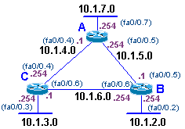

# Experiments in RIP showing how DVRP prevents routing loops

showing how DVRP prevents routing loops

## Lab Setup
In this lab, we will assume that you have three routers with trunking ios, and each having a fast ethernet 0/0 interface. The switch is assumed to be running catios (a 4K, 5K or 6K Cat).

### Block Diagram


### Equipment Configuration
These are the general configs that you will need to run on the routers for this experiment. Note the steps to clear the router if you need them.
```
hostname Router_A
!
int fa0/0.7
 encap dot1q 7
 ip address 10.1.7.254 255.255.255.0
int fa0/0.4
 encap dot1q 4
 ip address 10.1.4.1 255.255.255.0
int fa0/0.5
 encap dot1q 5 
 ip address 10.1.5.254 255.255.255.0
!
router rip
 network 10.0.0.0
```

```
hostname Router_B
!
int fa0/0.2
 encap dot1q 2
 ip address 10.1.2.254 255.255.255.0
int fa0/0.5
 encap dot1q 5
 ip address 10.1.5.1 255.255.255.0
int fa0/0.6
 encap dot1q 6 
 ip address 10.1.6.254 255.255.255.0
! 
router rip
 network 10.0.0.0
```	
```
hostname Router_C
!
int fa0/0.3
 encap dot1q 3
 ip address 10.1.3.254 255.255.255.0
int fa0/0.4
 encap dot1q 4
 ip address 10.1.4.254 255.255.255.0
int fa0/0.6
 encap dot1q 6 
 ip address 10.1.6.1 255.255.255.0
!
router rip
 network 10.0.0.0
```

The following is the config for our specific switch in our specific lab. You can use this as a logic check, or you can make sure that your switch is wired exactly the same as ours. (completely not necessary)

```
set vlan 2 name lab_vlan_2	
set vlan 3 name lab_vlan_3	
set vlan 4 name lab_vlan_4	
set vlan 5 name lab_vlan_5	
set vlan 6 name lab_vlan_6	
set vlan 7 name lab_vlan_7
!
set trunk 2/01 on dot1q
set trunk 2/03 on dot1q
set trunk 2/05 on dot1q
```

Specific note on our current setup and how to access the net gear.

 Console access and switch port wiring: 
 - router a ssh 10.100.99.105, fa0/0 port: c5505-1:2/01
 - router b ssh 10.100.99.104, fa0/0 port: c5505-1:2/03
 - router c ssh 10.100.99.103, fa0/0 port: c5505-1:2/05
 - switch   ssh 10.100.99.109


## Experiment 1: Example of Split Horizon
In this section we will see that the router will not receive back route info that it sent out an interface. In other words, if you and Steve are both routers, if you send route info to Steve, when he tells you route info, he will make sure that he doesn't send the info you sent to him, back to you.


(duplicating the block diagram for reference)
In this example, we will connect to Router_C and we will watch the rip routing info travel into and out of the router via the command `#debug ip rip`.

The following is the output of that command (retrieved from the logs). The teal numbering to the left is added for readability.
```
01 RIP: received v1 update from 10.1.6.254 on FastEthernet0/0.6
02       10.1.2.0 in 1 hops
03       10.1.5.0 in 1 hops
04       10.1.7.0 in 2 hops
05  RIP: received v1 update from 10.1.4.1 on FastEthernet0/0.4
06       10.1.2.0 in 2 hops
07       10.1.5.0 in 1 hops
08       10.1.7.0 in 1 hops
09  RIP: sending v1 update to 255.255.255.255 via FastEthernet0/0.3 (10.1.3.254)
10  RIP: build update entries
11   subnet 10.1.2.0 metric 2
12   subnet 10.1.4.0 metric 1
13   subnet 10.1.5.0 metric 2
14   subnet 10.1.6.0 metric 1
15   subnet 10.1.7.0 metric 2
16  RIP: sending v1 update to 255.255.255.255 via FastEthernet0/0.4 (10.1.4.254)
17  RIP: build update entries
18   subnet 10.1.2.0 metric 2
19   subnet 10.1.3.0 metric 1
20   subnet 10.1.6.0 metric 1
21  RIP: sending v1 update to 255.255.255.255 via FastEthernet0/0.6 (10.1.6.1)
22  RIP: build update entries
23   subnet 10.1.3.0 metric 1
24   subnet 10.1.4.0 metric 1
25   subnet 10.1.7.0 metric 2
```

Remember that this is from router_C.

Lines 01-04, and 05-08 are the incoming route updates from router_B and router_A, respectfully.
- Notice how they send routes showing that they can see each other. (the 2 hop routes; lines 04 & 06.)
- Notice that they do not advertise routes about the 3 network. (this is because our router sent out routes for this network, and because of split horizon, they will not advertise it.)

Our router sends out its route table out its interfaces in lines 09-25. In lines 09-15 it sends routing info to the stub 3 net. In lines 16-20 it sends routes to router_A. And in lines 21-25 it sends route info to router_B.
- notice that the stub 3 net gets all routes from router_A and router_B
- notice that Router_A only gets our routers direct connected networks (minus the net that they are connected with) and the routes our router learned from router_B (except, it did not send routes for net 4 & 7 that it learned from Router_B, because it had closer route info for those networks from Router_A). This is another example of split horizon.

## Experiment 2: Example of Poison Reverse and Flash Updates
In this experiment we will show how the router sends poisoned routes and flash updates when a route is no longer available.


(duplicating the block diagram for reference)
We will have two consoles open, the first is still the router_C running `debug ip rip`, and the second is on router_A, where we will shutdown the interface connected to the 7 net with the command `int 0/0.7` and `shut`.

The following is the `debug ip rip` output from router_C
```
01 RIP: received v1 update from 10.1.6.254 on FastEthernet0/0.6
02      10.1.2.0 in 1 hops
03      10.1.5.0 in 1 hops
04      10.1.7.0 in 2 hops
05 RIP: received v1 update from 10.1.4.1 on FastEthernet0/0.4                         
06      10.1.2.0 in 2 hops                                                            
07      10.1.5.0 in 1 hops                                                            
08      10.1.7.0 in 1 hops                                                            
09 RIP: received v1 update from 10.1.4.1 on FastEthernet0/0.4                         
10      10.1.7.0 in 16 hops (inaccessible)                                            
11 RIP: received v1 update from 10.1.6.254 on FastEthernet0/0.6                          
12      10.1.7.0 in 16 hops (inaccessible)                                               
13 RIP: sending v1 flash update to 255.255.255.255 via FastEthernet0/0.3 (10.1.3.254)                     
14 RIP: build flash update entries                                                   
15  subnet 10.1.7.0 metric 16                                                         
16 RIP: sending v1 flash update to 255.255.255.255 via FastEthernet0/0.4 (10.1.4.254) 
17 RIP: build flash update entries                                                    
18  subnet 10.1.7.0 metric 16                                                         
19 RIP: sending v1 flash update to 255.255.255.255 via FastEthernet0/0.6 (10.1.6.1)   
20 RIP: build flash update entries                                                    
21  subnet 10.1.7.0 metric 16                                                         
22 RIP: received v1 update from 10.1.6.254 on FastEthernet0/0.6   
23      10.1.2.0 in 1 hops                                        
24      10.1.5.0 in 1 hops                                                         
25      10.1.7.0 in 16 hops (inaccessible)    
```                                     
Lines 01-08 are normal incoming route statements

Lines 09-12 is router_A and router_Bs Flash Updates stating that net 7 is down (by poisoning its route - setting it to 16 hops)
- It sends out this update as soon as the interface goes down.

Lines 13-21 is our router sending out a Flash Update to stub net 3, router_A and router_B respectfully
- It sends a Flash Update only noting net 7, and poisons it's route.

Lines 22-25 is router Bs sending a full route update
- notice how it still notes a downed (poisoned) route to net 7

The lines after 25 are normal route updates not including network 7