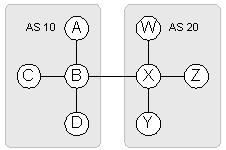
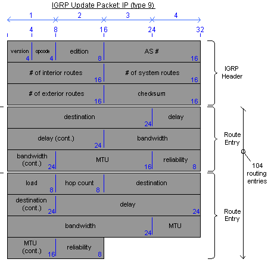
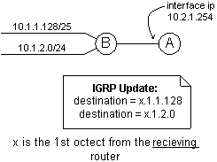
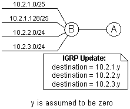
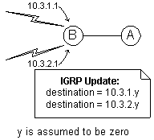

# IGRP
 
 (an unfinished document)

## IGRP Examples

## IGRP Specifics
Note that IGRP is based on the [Distance Vector Routing Protocol (DVRP)](dvrp-distance-vector-routing-protocol.md).

### IGRP Autonomous System Number
IGRP is setup with Autonomous System Numbers (AS's). IGRP routers will only listen to route updates from other routers with the same AS.



In this example, we have two sets of routers. The first set has an IGRP AS set as 10, and the second as 20. While all the routers in this example speak IGRP, only the routers with like AS's will get each others route updates. Traffic going between AS's will need to be routed by other means (static, etc.).

This can be helpful in keeping overall route update traffic smaller, which can be very usefull if there are smaller links involved. As in this example, say that the two different AS's are linked by a small serial link. Route updates for each AS will not travel over the small link, thus saving bandwidth costs.

The following cisco global command sets up a router to run igrp, and specifies its AS number:

```
router igrp 10
```

### IGRP Metric
A route metric is the way routing protocols decide how "far" each network is. RIP's metric was very simple, it only looked at how may routers were in between the network it wanted to get to and itself.
IGRP uses 5 different variables combined, to come up with a metric for it's route table. These variables are bandwidth, delay, reliability, load, and MTU. These variables can be manually or automatically set, and the formula that computes them together to come up with one metric can be modified as well.

note the difference between interface metrics and path metrics

#### Interface bandwidth, delay, reliability, load, and MTU
The variables used to create the IGRP metric are; bandwidth, delay, reliability, load and MTU. They are defined as follows:
- Bandwidth: The bandwidth for an interface in kilobytes per sec. (standard Ethernet, running at 10mb, has a bandwidth value of 10,000 Kbit. This is not a dynamic value.
- Delay: The delay is the assumed time to traverse the unloaded link (taking in to consideration propagation time for the media). Ethernet has an assumed delay of 1ms, thus it's default value is 1000 usec. This is not a dynamic value.
- Reliability: The router dynamically measures the reliability of the link and sets this variable. The variable can have a value between 1 and 255, where 255 is a 100% reliable link.
- Load: The router also measures the load on an interface and dynamically sets this variable. This variable also is within the range of 1 to 255, where 255 is an interface under 100% load.
- MTU: The Maximum Transmission Unit is the largest Ethernet frame (in bits) that can travel through this interface. It is measured in bytes, and is a static variable.

The reliability and load variables are dynamically computed by the router as 5-minute exponentially weighted averages. The MTU, bandwidth, and delay variables are statically assigned by the router, getting its values from the media type. The list below shows the different types of media and their default bandwidth and delays.

Media Type	| Default Bandwidth	| Default Delay
|--|--|--|
Ethernet	|10 Mbps	|1,000 ms
Fast Ethernet	|100 Mbps	|100 ms
FDDI	|100 Mbps	|100 ms
T-1 (& all serial interfaces)	|1,544 kbps	|20,000ms
HSSI	|45,045 kbs	|20,000 ms

From a cisco router, we can use the "show interface" command to see the bandwidth, delay, load and MTU variables for a specific interface.

(to do: show the output of sh eth0 to show the igrp metrics. Bold the line that shows these variables. (and change the text below) ) 

For the above example, the variables are:

- MTU = 1500
- Bandwidth = 10000 Kbit (10mb)
- Delay = 1000 usec
- Reliability = 255/255
- Load = 1/255

#### Modifying interface bandwidth, delay, and MTU
- Bandwidth is in kilobits, thus a 10 meg Ethernet link would be 10,000 (10 Mbps = 10,000 Kbps).
- Delay is in "tens-of-microseconds", thus a delay with a one second = (1 sec = 1000 ms = 100)

For the command: 
```
interface Serial0
 bandwidth 56
 delay 1000
 mtu 1000
```

We get the following:  
- bandwidth kilobits
- delay tens-of-microseconds
- mtu bytes

Note that modifying the MTU DOES NOT affect route selection. It is used for properly sizing the packets for a specific destination.

#### IGRP routing update
The IGRP packet is not transferred in TCP (IP type x), or UDP (IP type y), but instead, it's own IP protocol, IP type 9. Like RIP, its routers to not only send out route updates, but they can also request updates (helpful when a router comes on line).
All IGRP packets are sent to the broadcast ip, 255.255.255.255. The source ip address is the device sending the packet, and that address is used when deciphering the igrp packet. (see below.)




Packet Definitions:

Packet section | Description
|--|--|
Version (4 bit) |=1: current version is 1
Opcode (4 bit)	|=1: IGRP request packet<br>=2: IGRP update packet
edition (8 bit)	| a sequence number maintained by the sender
AS number (16 bits)	| the as number defined by the router igrp command
number of interior routes (16 bits)	| "contains subnet info for the major network number associated with the address of the interface to which the update is being sent." - what the hell does this mean, and where in the packet is the mask info stored?
number of system routes (16 bits)	| contains the major net numbers that may have been summarized.
number of external routes (16 bits)	| aka; default routes. IGRP can have multiple default routes, and this frame says how many of the last route entry are default routes.
checksum (16 bits) | number to check the validity of the IGRP header
Destination (24 bits)	| the network route being advertised. (See below)

##### IGRP's way of dealing with three octet ip info in the route tables:

You might have noticed that the IGRP update packet only holds 24 bits for the destination addresses. That would only hold three octets, instead of IP's standard four octets. To make this work, they remove one of the octets from the original network and the receiving device assumes what octet it is, and what's its value by what kind of update it is.

Interior Route	



System Route	



Exterior Route



#### Path bandwidth, delay reliability, load and MTU
Where the interface metrics were specific to what each interface sent out as its routing variables, the path metrics are the worst case metrics for the path between the network and the router trying to route traffic to it. It is the combined metrics or all the interfaces along the way. The variables are the same, but the way they are all combined together is a little different for each. So to go over:

- Bandwidth: The minimum bandwidth within the path to the destination network. Thus, if the the path is through all gigE links except for one that goes through a full t1, then the bandwidth would be 1544 (the bandwidth for a T1). (in kbps.)
- Delay: The sum of all the delay values within the path to the destination network. The max delay allowed is 16777215, (~167 sec.). If the value is the max, the destination is considered unreachable.
- Reliability: Is the value of the least reachable link within the path.
- Load: Is the value of the highest loaded link along the path.
- MTU: Is the smallest MTU along the path. It is currently not used in computing the metric.

##### Hopcount:
Including these values, the update packets also include the hop-count to the destination. A hopcount of 100 is considered an unreachable network (with default configs).
You can change the maximum value of the hopcount with the following cisco command:

```
metric maximum-hops hops
```

The maximum hopcount is 255.
The following is the output from a "show ip route" command, showing the IGRP metrics for a route

(to do : show the output of sh ip route to show the igrp metrics. Bold the line that shows these variables. (and change the text below) )

#### IGRP composite metric
The IGRP metric can be comprised of bandwidth, delay, reliability, load, and MTU. The default behavior of cisco routers is to only consider bandwidth and delay when computing the IGRP metric.

Metric = BandW + Delay

#### Modifying IGRP metrics
#### Processing IGRP updates
### Parallel Paths
### Steady State - Trouble shooting
## Speeding Up Convergence
### Setting Timers
### Disabling IGRP Hold-Downs
## Route Summation
## Default, and Multiple Default Routes
## Classful Route Lookups


