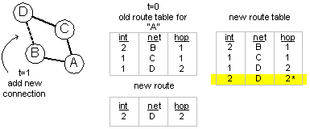

# RIP v1

## RIP Examples
The following examples are listed on another page for ease of readability.
- [A Basic Rip Network](rip-network-layout-1.md): Includes network diagram and configs for all the routers.

## How RIP finds the Shortest Path
RIP is a Distance Vector (DV) Routing Protocol, thus it follows the following logic:
- router collects directly connected routing info
- router sends it's route info to it's neighbors through regularly scheduled updates.
    - this route info includes the network and how many hops it is away from the router.
- the routes it learns from one router is interpolated and sent to the next router.
- if a local route is lost, the router sends out a route down alert, which changes all routers route tables

To explain it better, there are the following subsections within this chapter:

- RIP Update Packet
- RIP Metric
- Processing RIP Updates
- Steady State
- Parallel Paths

### RIP Update Packet:

#### Comments on Updates
- The UDP packet does not need to say were the route info came from. Because the source of the route update is within the IP frame packet (the IP from field).
- The UDP packet can carry up to 25 routing entries at once. (max size of 512 octets.)


#### Packet Definitions:

| Part of Packet | Description |
|--|--|
Command: | "1" = RIP Request - Request routing info<br>"2" = RIP Response - Respond to a request or for regularly scheduled route update.
AFI: | Address Family Identifier. "2" = IP Packet
Version: | "1" = RIP v.1<br>"2" = RIP v.2
IP Address: |The route advertising. Note this is class-full routing. so it only advertises full networks (10.0.0.0, 128.164.0.0, 215.5.3.0) so there is no mask info.
Metric: | The number of hops to that network.

## RIP Metric
The RIP metric is simply the number of hops, or number of routers to pass, to get to a specific network.
The following output from the router shows the number of hops to a specific network.

(to do: show the output of a 'sh ip route' command from the main example network. show the hop counts in bold.)

Note that not only is the hop count listed but also the default administrative distance for the RIP protocol, which is 120.

## Processing RIP Updates:
These are the rules the router uses to decide if a new incoming route should be added to the route table, or if it should be discarded.
- Unknown Route: Add to Table
- Known Network, Smaller Hop count: Replace old route with new
- Known Network, Larger Hop count: Ignore new route
- Known Network, Larger Metric, Same Source Interface: Add to Table
- Known Network, Same Hop count, Different Source: (standard = Ignore route), (cisco = add up to 4 routes for load balancing)

### Unknown Route
- Add to Table


### Known Network, Smaller Hop count
- Replace old route with new


### Known Network, Larger Hop count
- Ignore new route


### Known Network, Larger Metric, Same Source Interface
- Add to table


### Known Network, Same Hop count, Different Source
- Standard: Ignore Route
- Cisco: Will allow up to 4 parallel paths for load balancing. - the highlighted route is an example of one that cisco would keep, but the standard would not.



## Steady State
RIP sends out its route updates at specific intervals. By keeping track of when it has last received an update, the route can decided if a specific route is valid or not. The specifics on all the timers, and what they are can be found in the convergence section. A network in steady state would be one where all the routes are being received on time and none are being timed out.
A healthy network should have convergence (should be in a steady state). The following command shows the timers used in RIP. Note that the next due update is not over due. If it were, the network would not be in steady state.

(to add: show the output of a 'sh ip protocol' command from the main example network.)

We can also look at specific routes and see if their updates are past due or not.

(to add: show the output of a 'sh ip route' command from the main example network. show one line in bold.)

## Parallel Paths
- Cisco will allow up to 4 identical routes to a net.
- by allowing this, it can load balance traffic across these four interfaces
- There are two ways to configure how the cisco routers will balance traffic across multiple interfaces.


### Process Switching:
Packet by packet load balancing.
The router looks at each packet and decides which interface it should go through.
- better load balancing (the interfaces are more equally balanced)
- higher load on router (each packet checks route table)

Cisco config to enable packet load balancing on a interface
```
int e0
  no ip route-cashe
```

### Fast Switching:
Session Load balancing.
The router takes a single session, with all the following packets for that session, and assigns it through a specific interface.
- only 1st packet in session is looked up, and chosen an interface. All following packet sessions follows.
- less load on router
- less well balanced interfaces

Cisco config to enable fast switching on a interface
```
int e0
  ip route-cashe
```

## Convergence
Changes in networks, like added networks, downed interfaces, or power outages on a router, are easily handled by routing protocols. Keeping the network "converged" means having all the routers know the same thing. This can become tricky in larger networks.

### Convergence Timers
RIP deals with convergence with 4 timers. They are listed and explained below. The diagram shows how the timers relate to each other in a timeline.

- Update Timer (60 seconds): How long between sending (or expecting) route updates
- Invalid Timer (180 seconds): How long to regard a route valid if not getting any updates on it
- Hold-down Timer (180 seconds): During this time ignore all route updates for the network that is in question. A route will be in hold-down either because a route down alert was received, or a invalid timer had run out.
- Flush Timer (240 seconds): How long, after not receiving a valid route update, till the route is erased from the table.


- The above timeline assumes at t=0 it doesn't receive any new routes.<br>-or-
- starting at t=180, it received a route

### Speeding up Convergence
RIP speeds up convergence, and prevents routing loops with these five basic concepts (see : [DVRP - Distance Vector Routing Protocol](dvrp-distance-vector-routing-protocol.md))
- Split Horizon: don't repeat to a source the routes that it told you.
- Infinite Routes: the idea that there is a maximum number of routers a packet can traverse. With RIP, traffic can not traverse a network passing more then 15 routers. A hopcount of 16 is considered an infinite hop count, and thus an unreachable network.
- Flash Updates or Trigger Updates: when a router sees a change in a routes hopcount, immediately announce this to all routers.
- Route Poisoning: when a network goes down, announce an infinite route to that net
- Convergence Timers: as mentioned above, these timers help keep all routers synced up.  You can change the timers on cisco routes but all RIP routers should have the same timers.

## Subnet Masks
RIP v.1 does not know how to handle VLSM routes. But it does have a sudo way of dealing with them.

### Interface on same Natural Network
In this example, the routers interface is on the same natural class C network of 192.168.1.0, as two of the incoming routes.


So for those networks, it assumes that they share the same masking as it has [255.255.255.240]. As far as the 10.5.0.1 route, since the router doesn't have an interface on that class A network, It just assumes a mask of [255.0.0.0].

### No Interface on Natural Network
Here the router has no interface on the 192.168.1.0 network.


It assumes that they are the same network (both sharing the mask of [255.255.255.0]. And of course, the 10 net, is assumed to have a mask of [255.0.0.0].

# Route Summation
RIP aggregates its routes when it sends them out. In this example, the router "A" has five interface, three on the 192.168.1.0 natural C network, including the connection to the router "B".


When router A sends it's route update to router B, it will aggregate all of the networks on it's Class A 10 network to one route; 10.0.0.0, but since the link to router B shares the 192.168.1.0 network, it will send out a route for the lowest network (presumably the largest), which is in this case 192.168.1.48. -Note how this really doesn't work.

## Default Route
RIP allows a default route feature. The default route is where a router will send traffic destined to networks it does not know about.
To configure a default route to the ip address 10.5.1.10 on a cisco router, the command would be:

```
ip route 0.0.0.0 0.0.0.0 10.5.1.10
```

If you have a router that you want to be the def route for all the other RIP routers, you would use the command:

```
ip route 0.0.0.0 0.0.0.0 null0
```

The default route would look as follows on the router:

(to do: show the output of a sh route to see what a def route looks like.)

## Fine Tuning
There are a few ways to modify how RIP work, and how to get your RIP network to behave the best.

### Modifying Convergence Timers:
With Cisco, you can adjust the convergence timers to tweak your network (and probably mess things up). To change the routers timers to the following:
- RIP Update = 10
- Invalid Timer = 25
- Hold-down Timer = 30
- Flush Timer = 40

You would enter the command:
```
# router rip 
# timers basic 10 25 30 40
```

It's important to note that all RIP routers should be configured with the same timer values. If not, the network will probably have problems with converging.

### Offset Lists
You can use offset lists to disfavor routes. You might have three routers interlinked, with two links being 10mb Ethernet, and one a T1, as in the diagram below. The routers, A and C, linked via the T1, will always choose to send traffic across the one hop T1, even though the two hop Ethernet link, thorough router B would be faster.


For router A, we can modify all routes received or sent from the serial0 interface. We can specify how many hops to add to those routes, and more specifically, which networks to add those hops to. The following global statement applied to router A:

```
offset-list 15 in 2 serial0
access-list 15 permit 10.0.0.0 0.0.0.0
```

Creates an offset list modifying all routes received (in) from interface serial0, adding 2 hops to them. But the access list makes sure that only routes within the 10 network are modified.

Offset lists can be used for both modifying incoming routes, and altering outbound route statements. They are also useful with default routes, allowing the use of multiple default routes, each differently weighted.

## Troubleshooting

### Cisco Commands:
```
sh ip protocol
```
(rip updates are every 30 seconds) -- show a cli example

```
sh ip route
```
-- see how old update is
