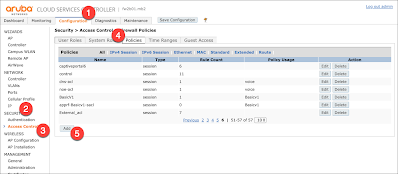
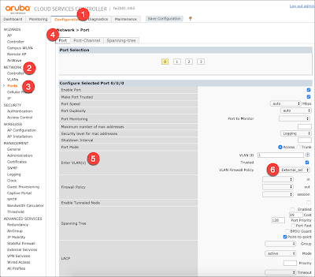
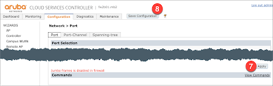

# Adding ACLs on the external Interface


## Overview
If you have an out of the box controller, and put it's outside interface on the internet, you will see that the external interface has a lot of opened ports listening: 

```Shell
$ nmap 3.11.225.244

Starting Nmap 7.60 ( https://nmap.org ) at 2019-01-23 10:58 EST
Nmap scan report for 3.11.225.244
Host is up (0.030s latency).
Not shown: 983 filtered ports
PORT     STATE  SERVICE
17/tcp   open   qotd
21/tcp   open   ftp
22/tcp   open   ssh
80/tcp   open   http
389/tcp  closed ldap
443/tcp  open   https
636/tcp  closed ldapssl
1723/tcp open   pptp
2323/tcp closed 3d-nfsd
4343/tcp open   unicall
5080/tcp closed onscreen
8080/tcp open   http-proxy
8081/tcp open   blackice-icecap
8082/tcp open   blackice-alerts
8083/tcp closed us-srv
8088/tcp open   radan-http
8888/tcp closed sun-answerbook

Nmap done: 1 IP address (1 host up) scanned in 5.07 seconds
```

If you are just serving up VIA clients from the internet, you can block all but the following ports: 
For Windows client:
- TCP: Port 443
- UDP: Port 4500

For MAC OS client:
- UDP: Ports 500, 1701, and 4500
- TCP: 1723, 443
(In my case I also want 22 and 4343 opened for administration access)

## Changes

### Create the ACL
To create the ACL, go to the Configuration (1) top menu, and in the left menu select Security (2) and then Access Control (3).  In the Firewall Policies window, select the upper menu's Policies (4) option, and press the Add (5) button to create a new ACL



In the Add New Policy window, enter in the Policy Name (6), and select `Session` (7) for the Policy Type.   For each line in the ACL, select the Add (8) button to create a new ACL line. For each line keep the source/destination as any (9), set the service (10) as TCP, and enter min and max ports (11) as the port you want to allow in.  For Action (12), select `permit`, and then set the rule with the Add (13) button


Continue creating ACL lines until you have allowed all flows required, and created an any-deny block as the last rule.  


### Apply the ACL on the interface
In the top menu, select Configuration (1).  Then in the left menu bar, select Network (2) and Ports (3).  In the top of the Network::Port Subpage, select the Port (4) menu, and then go down to the Enter VLAN(s) (5) entry, and for the VLAN Firewall Policy (6) select the name of the ACL you created above.  



Then at the bottom of the page, select Apply (7), and then at the top of the page, select Save Configuration (8)




## Confirm
After you have saved the configurations, check one more time to confirm that the external port is only listening over the required ports

```Shell
$ nmap 3.11.225.244

Starting Nmap 7.60 ( https://nmap.org ) at 2019-01-23 12:05 EST
Nmap scan report for 3.11.225.244
Host is up (0.026s latency).
Not shown: 996 filtered ports
PORT     STATE SERVICE
22/tcp   open  ssh
443/tcp  open  https
1723/tcp open  pptp
4343/tcp open  unicall

Nmap done: 1 IP address (1 host up) scanned in 5.16 seconds
```


## References: 
- [Configuring Ports](https://www.arubanetworks.com/techdocs/ArubaOS_64_Web_Help/Content/ArubaFrameStyles/Network_Parameters/Configuring_Ports_.htm): Aruba Tech Docs