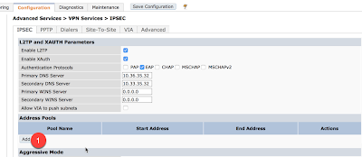

# Basic VPN Client Setup

**Table of Contents**
- [Basic VPN Client Setup](#basic-vpn-client-setup)
  - [Set Auth Method](#set-auth-method)
    - [Address Pool](#address-pool)
    - [Source NAT/Split Tunneling](#source-natsplit-tunneling)
    - [IKE Policies](#ike-policies)
  - [References](#references)

## Set Auth Method
First enable clients to be able to connect to the concentrator by enabling the layer 2 tunneling protocol, and then defining the encryption method.  
Under Configuration (1) Advanced Services (2) and VPN Services (3), select the IPSec (4) tab.  

Then make sure L2TP(1) is enabled, and that the Auth protocol is EAP(2). Also add the DNS servers(3) that the clients should point to.  

### Address Pool
When a client establishes a VPN to the concentrator, the user will be assigned an inside IP address.  Define the range of IPs that the clients can use by selecting the Add (1) button within the Address Pools Section.  

You then are presented a new window where you can define a name for the pool (1), the start and stop of the IP range (2), and then save the pool with the pp(3) button.  

### Source NAT/Split Tunneling
TBD

### IKE Policies
TBD

## References
- [Configuring a Basic VPN for L2TP/IPsec in the WebUI](https://www.arubanetworks.com/techdocs/ArubaOS_63_Web_Help/Content/ArubaFrameStyles/VPNs/Configuring_a_Basic_VPN_.htm): Aruba Support. AribaOS 6.5