# Configure Controller for VIA clients (basic)

**Contents**
- [Configure Controller for VIA clients (basic)](#configure-controller-for-via-clients-basic)
  - [Overview](#overview)
    - [Initial Encryption Key Exchange](#initial-encryption-key-exchange)
  - [Pre Steps](#pre-steps)
    - [Ports](#ports)
    - [Install PEFV License](#install-pefv-license)
  - [Client Connectivity over IKEv1](#client-connectivity-over-ikev1)
    - [L2TP and XAUTH Parameters](#l2tp-and-xauth-parameters)
    - [Route-able Address Pool](#route-able-address-pool)
    - [IKE Aggressive Mode](#ike-aggressive-mode)
    - [IKE Shared Secret](#ike-shared-secret)
  - [VIA Policies](#via-policies)
    - [User Roles](#user-roles)
    - [Server Group for User Auth](#server-group-for-user-auth)
    - [Authentication Profile](#authentication-profile)
  - [Create VIA User Roles](#create-via-user-roles)
    - [Security Access Control: User Roles](#security-access-control-user-roles)
    - [Security Authentication: Auth Profile](#security-authentication-auth-profile)
    - [Security Authentication: VIA Connection Profile](#security-authentication-via-connection-profile)
    - [Security Authentication: VIA WebAuth](#security-authentication-via-webauth)
    - [Security Access Control:](#security-access-control)
  - [References](#references)

## Overview

### Initial Encryption Key Exchange 
When a IPSec tunnel is created, the two sides first need to securely pass encryption keys to each other.  The keys are then used to encrypt all the traffic between the two end points.  

The trick is to get the keys to the remote site without someone in the middle getting them and then being able to decrypt the following secure messages.  There are a couple of methods for securely sending these keys between the two sites.  For IPSec, this is done with different versions of the IKE protocol.  

The following section "Client Connectivity over IKEv1" goes over how to enable IKEv1 key exchange between a VPN client and the controller using phase 2 authentication, which is implemented using XAUTH, and requires a username and password to already be known between the user and the controller.

## Pre Steps

### Ports
Clients need to talk to the following ports of the controller.  If the controller is behind a firewall, you will need to open up the following ports.

| | | 
|--|--|
| tcp 443 | During the initializing phase, VIA uses HTTPS connections to perform trusted network and captive portal checks against the controller. It is mandatory that you enable port 443 on your network to allow VIA to perform these checks. |
| udp 4500 | Required for IPSec transport |
| udp 500 | Required for VIA 1.0 on Mac OS |

### Install PEFV License
Aruba controllers can do many things.  If you want them to terminate client VPNs, you need to pay for a license and install that license on the controller.  When you order the client, you will get an email which will confirm the order and provide a link to download the license number.  Do that before continuing.  

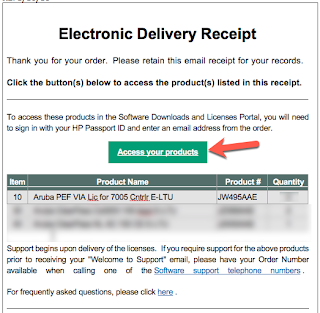

Once you have the license, go to the controller and enter it by doing the following: 

Under Configuration (1), select Network (2) and Controller (3).  Then select the Licenses menu(4)

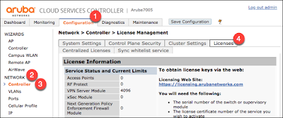

At the bottom of the page, enter in your new license key (5) in the field, and press Add (6) to save. 

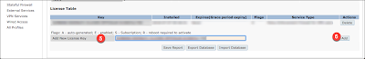

## Client Connectivity over IKEv1
The Aruba controller can work over IKEv1 or 2.  In this basic example, we will go over the simple v1 setup.  

### L2TP and XAUTH Parameters
Under Configuration(1), Advanced Services(2), VPN Services(3), select the IPSec(4) tab.

Under L2TP and XAUTH Parameters, 
enable L2TP(5) for the Mac laptops, and enable Xauth(5) for windows hosts.  For Authentication Protocols, select EAP(6) which supports MAC and Windows systems, and then define your local DNS Servers (6)

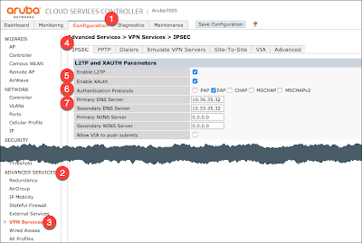

### Route-able Address Pool
When a client establishes a VPN to the concentrator, the user will be assigned an inside IP address.  A little farther down the page, go to the Address Pool (1) section, and define the range of IPs that the clients can use by selecting the Add (1) button.  

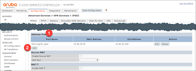

You then are presented a new window where you can define a name for the pool (1), the start and stop of the IP range (2), and then save the pool with the Done(3) button.  

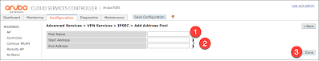

You can define multiple pools for different users and groups.  

Once you configure this address pool, make sure that the inner network point routes to this newly defined network to the controller!  

### IKE Aggressive Mode
Just enter in something, and ignore: 

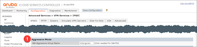

> The IKE aggressive group name is a feature used by certain legacy VPN clients that require an aggressive mode group name. This parameter is not used by VIA. However, this field cannot be empty and requires a value. The default value is “changeme”.
`- Aruba Virtual Internet Access - Application Note`

### IKE Shared Secret
Further down the page is the IKE Shared Secrets (1) section.  For IKEv1 with PSK, add a shared secret by pressing on the Add (2) button.

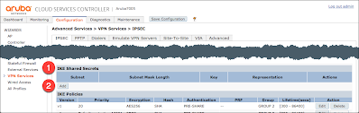

Then for the subnet and mask (1) enter `0.0.0.0`, enter in the IKE Shared Secret(2), and press done(3) to save. 

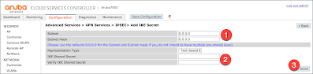

"From a security perspective, it is very important to make sure that the IKE pre-shared key is long and complex. Aruba recommends no fewer than 16 characters."

## VIA Policies
You can write very complex policies within the aruba controller.  The policies are just fancy access control lists that can be applied to users and guests, and for what can be done and how.  For more info on policies, acl's and roles see: ([ArubaOS User Guide: Roles and Policies](https://www.arubanetworks.com/techdocs/ArubaOS_651x_Web_Help/Web_Help_Index.htm#ArubaFrameStyles/Firewall_Roles/Firewall_Roles.htm%3FTocPath%3DArubaOS%2520User%2520Guide%2520Topics%7CRoles%2520and%2520Policies%7C_____0))

### User Roles
When a user first connects in, their access rights are controlled by user roles.  By default, the basic "allow all" role is already set and you don't need to change anything.  You could define different roles for different groups of people and control what they can and can't do when they log in, but this wont' be covered in this basic example.  

Just for reference, defining user roles can be found under Configuration (1), Security (2), Access Controls (3), and then within the User Roles (4) tab.  

As a discussion point (we wont actually do anything), note the user role default-vpn-role (5).  To the right of it, select the edit (6) button.

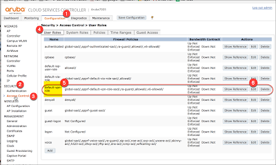

The firewall policies (7) for that role are listed, and note how this policy uses the allowall (8) rule to allow any traffic.  Under the Misc. Configuration section, note the L2TP Pool(9) field.  Here you can define what IP range to give users who authenticate with this user role.  

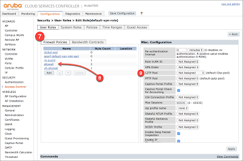

### Server Group for User Auth
There needs to be somewhere that stores all the folks that can log in to the VPN.  This can be kept locally on the controller, or centrally on some server somewhere else.  In this example, we will configure the controller to store the users "locally", on the controller.  For other options, see ([ArubaOS User Guide: Authentication Servers](https://www.arubanetworks.com/techdocs/ArubaOS_651x_Web_Help/Web_Help_Index.htm#ArubaFrameStyles/AAA_Servers/AAA_Servers.htm%3FTocPath%3DArubaOS%2520User%2520Guide%2520Topics%7CAuthentication%2520Servers%7C_____0))

Select the Configuration(1) tab, and then Security (2) and Authentication (3).  Then under Servers, select Internal DB (4), and press the Add Users (5) button to add a new user.  

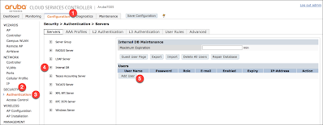

For each user, enter in their User Name (6), and a Password (7) for them. You don't need to enter in a Role (8), but enter in an email (9), and make sure that the user is Enabled (10), and that the user doesn't expire (11) (or does and when), and then press the Add(12) button. 

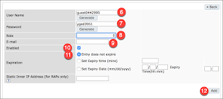

When your done adding users, make sure that you press the Apply (13) button to save all the changes. 

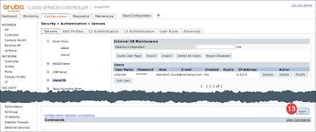

### Authentication Profile
The Auth profile links the user role with the auth server group (the two previous steps).

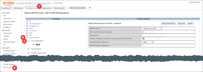

## Create VIA User Roles
### Security Access Control: User Roles

Under Configuration (1), select Security(2) and Access Control (3).  Then select the menu User Roles(4), and go to the bottom of the page and select Add(5) to add a new rule

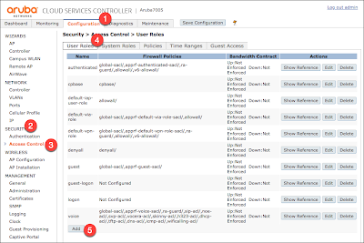

Add a new rule, and then for the Rule, allow the source and destination(7) as `any`, and the Service/Application(8) also as `any`, and the Action(9) as `permit`.

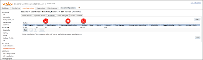

Add (7) a new rule, in this case we're naming it `BasicV1`.  When configuring it, set the L2TP Pool(8) to the previously configured `mb2-mgmt1-pool`, and the VIA Connection Profile (9) to `Basicv1`.

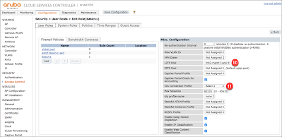

### Security Authentication: Auth Profile
Under Configuration(1) Security(2), Authentication(3), select the L3 Authentication(4) tab, and then within that, the VIA Authentication(5) , and then create a new(6) Auth Profile

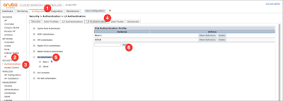

For the Auth Profile, select the Default Role(7) as `Basicv1`, deselect Check certificate common name against AAA server(8), and for Auth protocol(9) select `pap`.

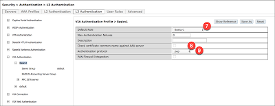

Then under the Basicv1 Auth Profile, select Server Group(10), and make sure that you authorize to the Internal(11) server 

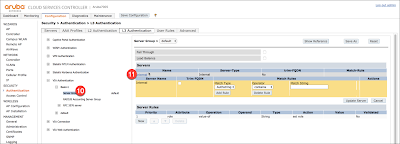

### Security Authentication: VIA Connection Profile
Under Configuration(1) Security(2), Authentication(3), select the L3 Authentication(4) tab, and then within that, the VIA Connection(5), and then the new(6) button to create a new connection profile.

Make sure that you define the outside interface of the controller(7), and then the routes that clients should use(8) when sending traffic though the tunnel.

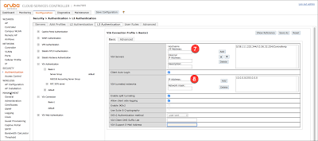

### Security Authentication: VIA WebAuth
Under Configuration(1) Security(2), Authentication(3), select the L3 Authentication(4) tab, and then within that, the VIA Web Authentication(5).  For the Default(6) setting, make sure to add(7) the `Basicv1` Auth Profile

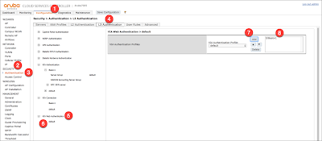

### Security Access Control: 
TBD

## References 
- [Aruba Virtual Intranet Access (VIA)](http://community.arubanetworks.com/t5/Validated-Reference-Design/Virtual-Intranet-Access-VIA/ta-p/155614): Aruba, Nov 2015
- [Configuring the VIA Controller](https://www.arubanetworks.com/techdocs/ArubaOS_62_Web_Help/Content/ArubaFrameStyles/VIA/Configuring_the_VIA_.htm): Aruba Tech Doc, Aruba OS 6.2
- [Campus Wireless Networks (6.x) Validated Reference Design](https://www.arubanetworks.com/assets/vrd/2018_01_02_Campus_6_x_Whole_VRD.pdf): Aruba, Dec 2017
- [ArubaOS 6.5.1 User Guide](https://www.arubanetworks.com/techdocs/ArubaOS_651x_Web_Help/Web_Help_Index.htm): Aruba, Nov 2017