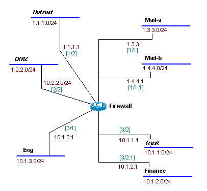
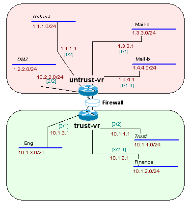

# Basic Config of a Netscreen
To start this discussion, lets review what the network will be that surrounds the firewall, and what it will be securing. 




We have three security zones setup on the firewall out of the box; the trust, untrust, and dmz.  We will also be creating three other security zones, mail, finance, and eng.

## Create the Zones:
To create the three new zones, we would use the set zone command.
```
!-- Define New Zones
set zone name finance
set zone name eng
set zone name mail
```

## Configure the Virtual Routers:
Netscreens have virtual routers within the firewall that allow us to setup different routers with different route tables in different security zones.  (think if hacked, the outside router would only know about the outside networks, and not the inside.)

By default, all newly created zones are connected to the trusted router, so we should reconfirm what zones should be bound to the untrusted router.



We enable the virtual router on the outside of the firewall called untrust-vr and we bind it to the DMZ, untrusted and Mail zones.
```
!-- Set zones to untrusted virtual router
set zone mail vrouter untrust-vr
set zone untrust vrouter untrust-vr
set zone dmz vrouter untrust-vr
```

## Configure Interfaces with IPs and Zones:
The next step is to configure the interfaces.  In doing this, we will bind the zones to the interfaces, give them IP addresses and masks, and enable what services are allowed on them.

A few items to point out on this would be:
- For eth3/2, we will allow a users to connect to the firewall via ssh, telnet, and webui.
- For eth3/2.1 we will enable as a subinterface of eth 3/2 and have it us the .1q tag of "1".
- make sure that duplex/port speeds are hard coded to 100/Full

```
!-- Interface ethernet3/2
set interface ethernet3/2 zone trust
set interface ethernet3/2 ip 10.1.1.1/24
set interface ethernet3/2 phy full 100mb
set interface ethernet3/2 manage ping
set interface ethernet3/2 manage webui
set interface ethernet3/2 manage telnet
set interface ethernet3/2 manage snmp
set interface ethernet3/2 manage ssh

!-- Interface ethernet3/2.1
set interface ethernet3/2.1 tag 1 zone finance
set interface ethernet3/2.1 ip 10.1.2.1/24
set interface ethernet3/2.1 manage ping

!-- Interface ethernet3/1
set interface ethernet3/1 zone eng
set interface ethernet3/1 ip 10.1.3.1/24
set interface ethernet3/1 phy full 100mb
set interface ethernet3/1 manage ping

!-- Interface ethernet1/1
set interface ethernet1/1 zone mail
set interface ethernet1/1 ip 1.3.3.1/24
set interface ethernet1/1 phy full 100mb

!-- Interface ethernet1/1.2
set interface ethernet1/1.2 tag 2 zone mail
set interface ethernet1/1.2 ip 1.4.4.1/24

!-- Interface ethernet1/2
set interface ethernet1/2 zone untrust
set interface ethernet1/2 ip 1.1.1.1/24
set interface ethernet1/2 phy full 100mb
set interface ethernet1/2 manage snmp

!-- Interface ethernet2/2
set interface ethernet2/2 zone dmz
set interface ethernet2/2 ip 1.2.2.1/24
set interface ethernet2/2 phy full 100mb
```

## Enable Routing:
All the basic routing is already taken care of with the virtual routing. In this step, we need to tell the trusted router to default traffic to the untrusted one, and then to tell the untrusted router to default to the device 1.1.1.254 on the `[1/2]` interface.
``` 
!-- Enable the two default routes
set vrouter trust-vr route 0.0.0.0/0 vrouter untrust-vr
set vrouter untrust-vr route 0.0.0.0/0 interface eth1/2 gateway 1.1.1.254
```

## Set the Policies or Service Groups:
Next we need to create groups which are collections of services or ports that are allowed, and then include these in ACL statements which are called "polices".  

We will first create two groups, one allowing mail and pop traffic to pass, and the other to allow web and ftp traffic:
- First we will create a service called "mail-pop3" and enable mail and pop3 services to it
- Next we will create a group called "http-ftpget" and allow http and ftp-get flows through it.

```
!-- Define the two groups
set group service mail-pop3 add mail
set group service mail-pop3 add pop3
set group service http-ftpget add http
set group service http-ftpget add ftp-get
```

Next we will define the ACL's, or the policy's, and to make them more condense, we will use groups to collect multiple services together.  (in other words, rather then needing to make a policy for mail, and one for pop3, I can just use the group mail-pop3 in a policy, and they will both be included.)
```
!-- Allow access to the mail domain
set policy from finance to mail any any mail-pop3 permit
set policy from trust to mail any any mail-pop3 permit
set policy from eng to mail any any mail-pop3 permit
set policy from untrust to mail any any mail permit

!-- Define where the finance domain can go
set policy from finance to untrust any any http-ftpget permit
set policy from finance to dmz any any http-ftpget permit

!-- Define where the trust domain can go
set policy from trust to untrust any any http-ftpget permit
set policy from trust to dmz any any http-ftpget permit

!-- Define where the eng domain can go
set policy from eng to untrust any any http-ftpget permit
set policy from eng to dmz any any http-ftpget permit
set policy from eng to dmz any any ftp-put permit

!--Define where the untrust domain can go
set policy from untrust to dmz any any http-ftpget permit
```

## Extra Configuration Settings
There are a few other items that probably should be included in a default setup, and in this section we will note them.

Define the firewall's host name, and how the console will output (for serial or ssh access)
```
!-- Set hostname and console display
set hostname ns50-1 
set console page 0
set console timeout 0

! --  timeout ssh/console access
set admin auth timeout 10
```

Have the firewall send all syslog data to a remote syslog server
```
! --  enable syslog
set syslog config 10.100.100.20 local5 local5
set syslog enable
set log module system level notification destination syslog
```

Allow snmp access to the firewall.
```
! --  enable snmp
set snmp community easytosniff read-only trap-off
set snmp host easytosniff 10.100.100.20
set snmp host easytosniff 172.16.40.15
```

Define the admin accounts and password
```
! --  change admin name and pass
set admin name netadmin       
set admin password dudeletmein
```

Create a login banner to tell others to go away.
```
! --  set banner
set admin auth banner console login "property of Me, Inc. Unauthorized access is strictly prohibited"
set admin auth banner telnet login "property of Me, Inc. Unauthorized access is strictly prohibited"
```

Set what the IP's are who can ssh or connect to the firewall management interface
```
! --  control access
set admin manager-ip 10.0.0.0 255.0.0.0
set admin manager-ip 192.168.2.0 255.255.254.0
set admin manager-ip 192.168.108.0 255.255.255.0
```

Enable NTP time syncing
``` 
! --  setup time
set clock ntp
set ntp timezone -8 0
set ntp server 10.109.110.77
set ntp interval 5
```