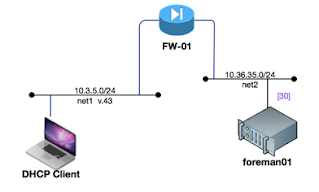
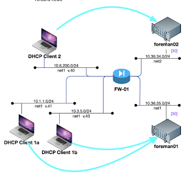
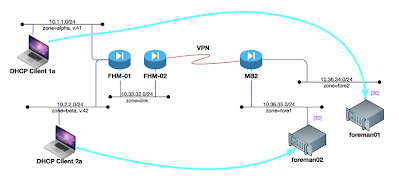

# DHCP

- [DHCP](#dhcp)
  - [DHCP Server:](#dhcp-server)
    - [Define the DHCP service](#define-the-dhcp-service)
    - [Set Leases to MACs](#set-leases-to-macs)
    - [Confirming DHCP Leases:](#confirming-dhcp-leases)
  - [DHCP Relays](#dhcp-relays)
    - [DHCP Relay (old):](#dhcp-relay-old)
    - [DHCP Relay (new)](#dhcp-relay-new)
    - [DHCP Relay (multiple)](#dhcp-relay-multiple)
    - [DHCP Relay (multiple + multiple Hops)](#dhcp-relay-multiple--multiple-hops)
      - [From firewall "FHM-01"](#from-firewall-fhm-01)
      - [From firewall "FHM-02"](#from-firewall-fhm-02)
      - [From firewall "MB2"](#from-firewall-mb2)
  - [SRX as a DHCP Client:](#srx-as-a-dhcp-client)
  - [Troubleshooting:](#troubleshooting)
    - [View Stats for dhcp relay:](#view-stats-for-dhcp-relay)
    - [View stats for DHCP Service](#view-stats-for-dhcp-service)
    - [View DHCP leases](#view-dhcp-leases)
    - [Clearing up duplicate leases](#clearing-up-duplicate-leases)
    - [Trace Options:](#trace-options)
  - [References:](#references)

## DHCP Server:
Have the JunOS device serve out DHCP leases to client systems.  

###  Define the DHCP service
```
! define the range (in this case between 128-159)
set system services dhcp pool 10.120.35.0/24 address-range low  10.120.35.128
set system services dhcp pool 10.120.35.0/24 address-range high 10.120.35.159
! list dns info
set system services dhcp pool 10.120.35.0/24 domain-name cmed.us
set system services dhcp pool 10.120.35.0/24 name-server 8.8.4.4
set system services dhcp pool 10.120.35.0/24 name-server 8.8.8.8
! def gateway and lease
set system services dhcp pool 10.120.35.0/24 router 10.120.35.1
set system services dhcp pool 10.120.35.0/24 default-lease-time 3600
```

then allow dhcp over the zone: 
```
set security zones  security-zone untrust interfaces fe-0/0/0.0 host-inbound-traffic systems-services dhcp
```

then make sure that interface fe-0/0/0.0 has the IP range 10.120.35.0/24

### Set Leases to MACs
Set the static bindings for the Mac addresses as the following
```
set system services dhcp static-binding 8c:85:90:58:03:0f fixed-address 198.18.2.138
set system services dhcp static-binding 8c:85:90:58:03:0f host-name Dads_Mac
set system services dhcp static-binding f0:98:9d:e2:16:99 fixed-address 198.18.2.139
set system services dhcp static-binding f0:98:9d:e2:16:99 host-name Dads_phone
```

### Confirming DHCP Leases: 
View the bindings already on the firewall:
```bash
cmercier@srx100-a# run show system services dhcp binding
IP address       Hardware address   Type     Lease expires at
198.18.2.106     00:02:fd:04:71:40  dynamic  never
198.18.2.146     18:81:0e:1a:7e:44  static   never
198.18.2.102     18:b4:30:0a:5e:4c  dynamic  2019-06-29 03:49:13 UTC
198.18.2.118     1c:1a:c0:ac:34:65  dynamic  2019-06-29 03:48:08 UTC
198.18.2.120     20:df:b9:5e:30:bf  dynamic  2019-06-29 04:10:46 UTC
198.18.2.144     34:7c:25:32:8f:f7  static   never
198.18.2.109     50:32:37:ce:33:c2  dynamic  2019-06-29 04:11:16 UTC
198.18.2.125     5c:cf:7f:47:6c:38  dynamic  2019-06-29 04:10:28 UTC
198.18.2.105     60:01:94:a0:84:0c  dynamic  2019-06-29 03:47:40 UTC
198.18.2.145     74:9e:af:34:43:f3  static   never
198.18.2.126     74:e2:f5:be:d6:1c  dynamic  2019-06-29 04:05:04 UTC
198.18.2.143     74:e5:0b:32:54:0c  static   never
198.18.2.116     8c:85:90:58:03:0f  dynamic  2019-06-29 03:46:58 UTC
198.18.2.138     8c:85:90:58:03:0f  static   never
198.18.2.117     90:2e:1c:d0:6e:de  dynamic  2019-06-29 04:08:03 UTC
198.18.2.141     b4:ae:2b:f6:98:c6  static   never
198.18.2.140     b4:ae:2b:f6:98:c8  static   never
198.18.2.110     c4:b3:01:a2:5a:ba  dynamic  2019-06-29 03:51:21 UTC
198.18.2.103     dc:4f:22:3a:ef:01  dynamic  2019-06-29 04:13:02 UTC
198.18.2.113     f0:98:9d:e2:16:99  dynamic  2019-06-29 03:48:00 UTC
198.18.2.139     f0:98:9d:e2:16:99  static   never
198.18.2.142     f0:de:f1:81:09:4d  static   never
198.18.2.112     f8:95:ea:0c:55:86  dynamic  2019-06-29 04:08:23 UTC

[edit]
cmercier@srx100-a#
```


## DHCP Relays

### DHCP Relay (old): 
If you have a central dhcp server, and you need all dhcp requests forwarded to it, then setup a dhcp helper.  
```
set forwarding-options helpers bootp description "Global DHCP relay service"
set forwarding-options helpers bootp server 10.120.34.30
set forwarding-options helpers bootp maximum-hop-count 5
set forwarding-options helpers bootp interface fe-0/0/0.0
```

### DHCP Relay (new)
DHCP client needs requests sent to the dhcp server "foreman01".



Where to send it: 
```
set forwarding-options dhcp-relay server-group forman01 10.36.35.30
```

how to collect it: 
```
set forwarding-options dhcp-relay group admin active-server-group forman01
set forwarding-options dhcp-relay group admin interface irb.43
```

And you can add multiple "vlan" lines to have a bunch of vlans all send to the "active-server-group", but you can also have multiple servers.  

### DHCP Relay (multiple)
DHCP client "1a" and "1b" should have their dhcp traffic go to "forman01", where DHCP client "2" should go to "forman02"



For clients "1"
```
set forwarding-options dhcp-relay server-group forman01 10.36.35.30
set forwarding-options dhcp-relay group admin active-server-group forman01
set forwarding-options dhcp-relay group admin interface irb.41
set forwarding-options dhcp-relay group admin interface irb.43
```

For clients "2"
```
set forwarding-options dhcp-relay server-group forman02 10.36.34.30
set forwarding-options dhcp-relay group admin active-server-group forman02
set forwarding-options dhcp-relay group admin interface irb.40
```

### DHCP Relay (multiple + multiple Hops)
This example is kind of crazy.  We've got THREE srx firewalls, and we need to send the dhcp packets though all of them and back.  This gets tricky because you need to setup the normal forwarding, and the policies, and then you also need to add some weirdness.  



#### From firewall "FHM-01"
 Note that when you're forwarding the packets to another firewall, then the receiving firewall will listen to traffic on "vlan.x".  But if the messages are all on the same firewall then the firewall will listen to traffic over a specific vlan interface "irb.x".  


DHCP forwarding for Clients "1"
```
set forwarding-options dhcp-relay server-group forman01 10.36.34.30
set forwarding-options dhcp-relay group admin active-server-group forman01
set forwarding-options dhcp-relay group admin interface vlan.41
```

DHCP forwarding for Clients "2"
```
set forwarding-options dhcp-relay server-group forman02 10.36.35.30
set forwarding-options dhcp-relay group admin active-server-group forman02
set forwarding-options dhcp-relay group admin interface vlan.42
```

Allow dhcp messages on the 41 vlan interface
```
set security zones security-zone mgmt4 interfaces vlan.43 host-inbound-traffic system-services dhcp
```

Policy from client to server: 
```
set security policies from-zone alpha to-zone link policy one match source-address 10.1.1.0/24
set security policies from-zone alpha to-zone link policy one match destination-address 10.36.34.30/32
set security policies from-zone alpha to-zone link policy one match application [ junos-bootps junos-bootpc ]
set security policies from-zone alpha to-zone link policy one then permit

set security policies from-zone beta to-zone link policy two match source-address 10.2.2.0/24
set security policies from-zone beta to-zone link policy two match destination-address 10.36.35.30/32
set security policies from-zone beta to-zone link policy two match application [ junos-bootps junos-bootpc ]
set security policies from-zone beta to-zone link policy two then permit
```

Policy from server to client: 
```
set security policies from-zone link to-zone alpha policy one match source-address 10.36.34.30/32
set security policies from-zone link to-zone alpha policy one match destination-address 10.1.1.0/24
set security policies from-zone link to-zone alpha policy one match application [ junos-bootps junos-bootpc ]
set security policies from-zone link to-zone alpha policy one then permit

set security policies from-zone link to-zone beta policy two match source-address 10.36.35.30/32
set security policies from-zone link to-zone beta policy two match destination-address 10.2.2.0/24
set security policies from-zone link to-zone beta policy two match application [ junos-bootps junos-bootpc ]
set security policies from-zone link to-zone beta policy two then permit
```

#### From firewall "FHM-02"
Setup the forwarding:

This part is really weird...  The FHM-02 firewall DOES NOT have an interface on vlan 41 or 42, but we add the forwarding statements anyway.  It looks for packets with the vlan tags in them, and then forwards them onward to the forman servers.  

DHCP forwarding for Clients "1"
```
set forwarding-options dhcp-relay server-group forman01 10.36.34.30
set forwarding-options dhcp-relay group admin active-server-group forman01
set forwarding-options dhcp-relay group admin interface vlan.41
```

DHCP forwarding for Clients "2"
```
set forwarding-options dhcp-relay server-group forman02 10.36.35.30
set forwarding-options dhcp-relay group admin active-server-group forman02
set forwarding-options dhcp-relay group admin interface vlan.42
```

Policy from client to server: 
```
set security policies from-zone alpha to-zone link policy one match source-address 10.1.1.0/24
set security policies from-zone alpha to-zone link policy one match destination-address 10.36.34.30/32
set security policies from-zone alpha to-zone link policy one match application [ junos-bootps junos-bootpc ]
set security policies from-zone alpha to-zone link policy one then permit
```

Policy from server to client: 
```
set security policies from-zone link to-zone alpha policy one match source-address 10.36.34.30/32
set security policies from-zone link to-zone alpha policy one match destination-address 10.1.1.0/24
set security policies from-zone link to-zone alpha policy one match application [ junos-bootps junos-bootpc ]
set security policies from-zone link to-zone alpha policy one then permit
```

#### From firewall "MB2"
Setup the forwarding: 

This part is really weird...  The FHM-02 firewall DOES NOT have an interface on vlan 41 or 42, but we add the forwarding statements anyway.  It looks for packets with the vlan tags in them, and then forwards them onward to the forman servers.  

DHCP forwarding for Clients "1"
```
set forwarding-options dhcp-relay server-group forman01 10.36.34.30
set forwarding-options dhcp-relay group admin active-server-group forman01
set forwarding-options dhcp-relay group admin interface vlan.41
```

DHCP forwarding for Clients "2"
```
set forwarding-options dhcp-relay server-group forman02 10.36.35.30
set forwarding-options dhcp-relay group admin active-server-group forman02
set forwarding-options dhcp-relay group admin interface vlan.42
```

## SRX as a DHCP Client:
You might need to put your firewall in a location where its interface is not static and instead it gets its IP from DHCP.  

Change the interface from static IP to dhcp: 
```
   set interfaces fe-0/0/1 unit 10 family inet dhcp
delete interfaces fe-0/0/1 unit 10 family inet address 198.18.0.254/24
```

Allow DHCP messages on the interface: 
```
set security zones security-zone dmz interfaces fe-0/0/1.10 host-inbound-traffic system-services dhcp
```

Save and quit: 
```
show | display set | match "fe-0/0/1 unit 10"
show | display set | match "fe-0/0/1.10"
commit check

commit confirmed 5 
```

Then confirm that the interface is Up, and if not force it up: 
```
run show interface terse 
run request system services dhcp renew fe-0/0/1.10
run show interface terse 
```

once it's up and working, save and quit
```
commit comment "dhcp on ext interface" and-quit
show configuration | no-more
```

## Troubleshooting: 


### View Stats for dhcp relay: 

```bash
user@host> show system services dhcp relay—statistics
  Received Packets:                           4  
  Forwarded Packets                           4 
  Dropped Packets                             4     
  Due to missing interface in relay database: 4    	
  Due to missing matching routing instance:   0     
  Due to an error during packet read:         0     
  Due to an error during packet send:         0     
  Due to invalid server address:              0     
  Due to missing valid local address:         0     
  Due to missing route to server/client:      0
```

### View stats for DHCP Service

for dhcp services: (see what the configuration does)
```bash
user@host> show system services dhcp global
Global settings:
    	BOOTP lease length     	   infinite
  	DHCP lease times:
    	Default lease time         1 day
    	Minimum lease time         1 minute
    	Maximum lease time         infinite

	DHCP options:
    	Name: domain-name, Value: englab.juniper.net
    	Name: name-server, Value: [ 192.168.5.68, 172.17.28.101, 172.17.28.100 ]
```

### View DHCP leases

view all the dhcp leases 
```bash
user@host> show system services dhcp binding
IP Address   Hardware Address   Type          Lease expires at
30.1.1.20  00:12:1e:a9:7b:81  dynamic       2007-05-11 11:14:43 PDT
```

### Clearing up duplicate leases

You might have the device bound to the dynamic lease, and not accepting the static lease:
```
cmercier@srx100-a# run show system services dhcp binding | match 16:99
198.18.2.113     f0:98:9d:e2:16:99  dynamic  2019-06-29 04:16:16 UTC
198.18.2.139     f0:98:9d:e2:16:99  static   never

[edit]
cmercier@srx100-a#
```

You can clear this out by clearing the lease on the DHCP server
```
cmercier@srx100-a# run clear system services dhcp binding 198.18.2.113

[edit]
cmercier@srx100-a#
```

and then renewing the IP (or rebooting) on the client system.

### Trace Options:

send debug data to log files:
```
edit
set system services dhcp traceoptions file dhcp.dbg
set system services dhcp traceoptions flag all
commit
run show log dhcp.dbg
```


## References: 
- [SRX Getting Started - Configure DHCP Server](http://kb.juniper.net/InfoCenter/index?page=content&id=KB15754): kb1574, Dec 19, 2012
- [[SRX] Getting Started - Configure Global DHCP Relay Service](http://kb.juniper.net/InfoCenter/index?page=content&id=KB15755): kb15755, Nov 13, 2013
- [Verifying a DHCP Configuration](http://www.juniper.net/techpubs/software/junos-security/junos-security10.4/junos-security-admin-guide/index.html?dhcp-verify-section.html): 
- [Example: DHCP Relay Agent Configuration with Multiple Clients and Servers](https://www.juniper.net/documentation/en_US/junos/topics/example/dhcp-subscriber-access-dhcp-relay-multiple-client-configuration.html): Juniper Aug, 2017
- [How to Obtain a DHCP Client IP address on the SRX firewall?](https://kb.juniper.net/InfoCenter/index?page=content&id=KB16124): Juniper KB16124, Mar 2017
