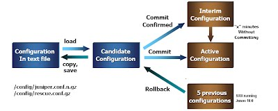

# JunOS CLI

- [JunOS CLI](#junos-cli)
  - [Help](#help)
    - [Info about a command:](#info-about-a-command)
    - [How to use a command:](#how-to-use-a-command)
    - [Find a command:](#find-a-command)
  - [Basic CLI:](#basic-cli)
    - [EMACs-style editing:](#emacs-style-editing)
    - [no pagination](#no-pagination)
    - [Grep and Count](#grep-and-count)
  - [Making Changes:](#making-changes)
    - [SU/Enable Mode: Configure](#suenable-mode-configure)
    - [Making changes to the config:](#making-changes-to-the-config)
    - [Issues with the Active Config File:](#issues-with-the-active-config-file)
    - [C+ Formatting vs CLI](#c-formatting-vs-cli)
  - [Quick Fixes:](#quick-fixes)
    - [Rename:](#rename)
    - [Replace:](#replace)
    - [Copy:](#copy)
    - [Making sure change has good syntax, and deploying cautiously:](#making-sure-change-has-good-syntax-and-deploying-cautiously)

## Help

### Info about a command:
Use the "?" to see the possible commands, then complete the statement and see a mini man page 
```bash
lab@srxA-2> help topic vpls mac-table-size ?
Possible completions:
  <[Enter]>            Execute this command
  |                    Pipe through a command
[...]
lab@srxA-2> help topic vpls mac-table-size
               Configuring the Size of the VPLS MAC Address Table

   You can modify the size of the VPLS media access control (MAC) address
   table. The default table size is 512 MAC addresses, the minimum is 16
   addresses, and the maximum is 65,536 addresses.

   If the MAC table limit is reached, new MAC addresses can no longer be
   added to the table. Eventually the oldest MAC addresses are removed from
   the MAC address table automatically. This frees space in the table,
   allowing new entries to be added. However, as long as the table is full,
   new MAC addresses are dropped.

   To change the VPLS MAC table size for each VPLS or VPN routing instance,
   include the mac-table-size statement:

   mac-table-size size;

   You can include the mac-table-size statement at the following hierarchy
   levels:

     * [edit routing-instances routing-instance-name protocols vpls]
     * [edit logical-routers logical-router-name routing-instances
       routing-instance-name protocols vpls]
[...]
```

### How to use a command:
The "reference" help option provides more details on how the command should be used
```bash
lab@srxA-2> help reference vpls vpls-id
                                    vpls-id

    Syntax

   vpls-id vpls-id;

    Hierarchy Level

   [edit logical-systems logical-system-name routing-instances
   routing-instance-name protocols vpls],

   [edit routing-instances routing-instance-name protocols vpls]

    Release Information

   Statement introduced in JUNOS Release 8.4.

    Description

   Identify the virtual circuit identifier used for the VPLS routing
   instance. This statement is a part of the configuration to enable LDP
   signaling for VPLS.
[...]
```

### Find a command:
The "apropos" help option helps you find all the commands you can use related to the searched word.
```bash
lab@srxA-2> help apropos vrp
clear gvrp
    Clears Generic VLAN Registration Protocol information
clear gvrp statistics
    Clear GVRP statistics
clear mvrp
    Clear MVRP information
clear mvrp statistics
    Clear MVRP statistics on an interface
clear mvrp statistics interface
    Clear MVRP statistics on this interface
show gvrp
    Show Generic VLAN Registration Protocol information
[...]
```

## Basic CLI:

### EMACs-style editing:
(yea, not VI... the bastards!)
- left = `[Ctrl]`+`[b]`
- right = `[Ctrl]`+`[f]`
- start of line = `[Ctrl`]+`[a]`
- end of line = `[Ctrl]`+`[e]`
- delete right of line = `[Ctrl]`+`[k]`

### no pagination
Will scroll out all of the results, and not page it every 40 lines.
```bash
lab@srxA-2> show configuration interfaces | no-more
ge-0/0/0 {
    description "MGMT Interface - DO NOT DELETE";
    unit 0 {
        family inet {
            address 10.210.11.132/24;
        }
    }
}
ge-0/0/1 {
    unit 0 {
        family inet {
            address 172.20.77.2/30;
        }
    }
}
[...]
```

### Grep and Count
You can use the "match" command for grepping, and rather then seeing the output, you can also count the results.
```bash
lab@srxA-2> show interfaces | match down | match Physical
Physical interface: ge-0/0/6, Enabled, Physical link is Down
Physical interface: ge-0/0/7, Enabled, Physical link is Down
Physical interface: ge-0/0/8, Enabled, Physical link is Down
Physical interface: ge-0/0/9, Enabled, Physical link is Down
Physical interface: ge-0/0/10, Enabled, Physical link is Down
Physical interface: ge-0/0/11, Enabled, Physical link is Down
Physical interface: ge-0/0/12, Enabled, Physical link is Down
Physical interface: ge-0/0/13, Enabled, Physical link is Down

lab@srxA-2> show interfaces | match down | match Physical | count
Count: 8 lines
```

## Making Changes:

### SU/Enable Mode: Configure
You use the "configure" command to go to enable mode.  In the prompt, you get breadcrumbs for where you are in the conf file (see blue text).  Note that when you are in a specific section, running "show" only shows you that part of the config.  (nice!)  The "top" command brings you back out of the config to the root, and if you do a "show" there you get all of the config.
```bash
lab@srxA-2>

lab@srxA-2> configure
Entering configuration mode

[edit]
lab@srxA-2# edit interfaces ge-0/0/0

[edit interfaces ge-0/0/0]
lab@srxA-2#
lab@srxA-2# show
description "MGMT Interface - DO NOT DELETE";
unit 0 {
    family inet {
        address 10.210.11.132/24;
    }
}

[edit interfaces ge-0/0/0]
lab@srxA-2# top

[edit]
lab@srxA-2# show
## Last changed: 2010-03-23 00:11:52 UTC
version 10.3R1.9;
system {
    host-name srxA-2;
    time-zone pst;
    root-authentication {
        encrypted-password "$1$KI99zGk6$MbYFuBbpLffu9tn2.sI7l1"; ## SECRET-DATA
        ssh-dsa "ssh-dss AAAAB3NzaC1kc3MAAACBAMQrfP2bZyBXJ6PC7XXZ+MzErI8Jl6jah5L4/O8BsfP2hC7EvRfNoX7MqbrtCX/9gUH9gChVuBCB+ERULMdgRvM5uGhC/gs4UX+4dBbfBgKYYwgmisM8EoT25m7qI8ybpl2YZvHNznvO8h7kr4kpYuQEpKvgsTdH/Jle4Uqnjv7DAAAAFQDZaqA6QAgbW3O/zveaLCIDj6p0dwAAAIB1iL+krWrXiD8NPpY+w4dWXEqaV3bnobzPC4eyxQKBUCOr80Q5YBlWXVBHx9elwBWZwj0SF4hLKHznExnLerVsMuTMA846RbQmSz62vM6kGM13HFonWeQvWia0TDr78+rOEgWF2KHBSIxL51lmIDW8Gql9hJfD/Dr/NKP97w3L0wAAAIEAr3FkWU8XbYytQYEKxsIN9P1UQ1ERXB3G40YwqFO484SlyKyYCfaz+yNsaAJu2C8UebDIR3GieyNcOAKf3inCG8jQwjLvZskuZwrvlsz/xtcxSoAh9axJcdUfSJYMW/g+mD26JK1Cliw5rwp2nH9kUrJxeI7IReDp4egNkM4i15o= configurator@server1.he"; ## SECRET-DATA
    }
    name-server {
        208.67.222.222;
        208.67.220.220;
    }
    login {
        user lab {
---(more)---
```

### Making changes to the config:
Thing SVN.  Very similar ideas. 
- Unlike Cisco, changes don't happen when you enter them, instead they get stored in a "file" (called a change candidate) and get implemented when you enter the "commit" command
- You can undo the changes you just submitted with the "rollback 1" command, which is asking to undo 1 change
- You can clear out your change candidate with the "rollback 0" command.
- You can see the delta between the running command and the candidate with the "show | compare rollback 0" command



In this example, were gong to
1. add a description to the interface ge-0/0/1,
2. see the diff between the candidate file and the active,
3. then submit the change. 
4. then go up one section in the active config and view to see the new description
5. then go up to the top of the config, and rollback the changes made
6. finally show the interfaces section of the config to see that the undo worked.

```bash
lab@srxA-2# edit interfaces ge-0/0/1

[edit interfaces ge-0/0/1]
lab@srxA-2# set description "this is the gig 0/0/1 interface"


[edit interfaces ge-0/0/1]
lab@srxA-2# show | compare
[edit interfaces ge-0/0/1]
+ description "this is the gig 0/0/1 interface";

[edit interfaces ge-0/0/1]
lab@srxA-2# up

[edit interfaces]
lab@srxA-2# show
ge-0/0/0 {
    description "MGMT Interface - DO NOT DELETE";
    unit 0 {
        family inet {
            address 10.210.11.132/24;
        }
    }
}
ge-0/0/1 {
    description "this is the gig 0/0/1 interface";
    unit 0 {
        family inet {
            address 172.20.77.2/30;
        }
    }
}
ge-0/0/2 {
    unit 0 {
        family inet {
            address 172.20.66.2/30;
        }
[...]
[edit interfaces]
lab@srxA-2# top

[edit]
lab@srxA-2# rollback 1
load complete

[edit]
lab@srxA-2# show interfaces
ge-0/0/0 {
    description "MGMT Interface - DO NOT DELETE";
    unit 0 {
        family inet {
            address 10.210.11.132/24;
        }
    }
}
ge-0/0/1 {
    unit 0 {
        family inet {
            address 172.20.77.2/30;
        }
    }
}
ge-0/0/2 {
    unit 0 {
        family inet {
[...]
```

### Issues with the Active Config File:
By default, there is only one active config file, and if you have 2 netengs making changes, they all go to the same file.  This can be a problem, as when you are done with your changes, you can commit the changes, getting all your changes in, but also pushing maybe half of your coworkers, and breaking stuff. 

Solution:
1. "**configure exclusive**": You lock the config file from being edited by anyone but you.  (Note: if you log out before submitting the changes, they will be lost.)
2. "**configure private**": the changes you make are the only changes you submit.  The only thing to watch out for is that there could be merging problems, where both you and your fellow neteng make different changes to the same thing, and the second guy to submit gets errors. 

### C+ Formatting vs CLI
You can write the configs changes you want to implement into a file, and upload them.  These changes can be formatted two different ways, either with the C+ formatting (with all the curly brackets) or using the set or delete commands. 

An example of the set commands would be:
```bash
lab@srxA-2# set interfaces lo0 unit 0 family inet filter input protect-host
lab@srxA-2# set interfaces lo0 unit 0 family inet address 192.168.2.1/32
```

The exact same thing with the C+ formatting would be:
```
lo0 {
    unit 0 {
        family inet {
            filter {
                input protect-host;
            }
            address 192.168.2.1/32;
        }
    }
}
```

You'd then use the load command to import the change, or you can paste them on the cli with the "`load merge terminal`" command
```bash
lab@srxA-2# load merge terminal
[Type ^D at a new line to end input]
interfaces {
  ge-0/0/12 {
      unit 0 {
          family inet {
              address 198.18.11.1/24;
         }
     }
  }
}
load complete

[edit]
lab@srxA-2# show | compare
[edit interfaces]
+   ge-0/0/12 {
+       unit 0 {
+           family inet {
+               address 198.18.11.1/24;
+           }
+       }
+   }

[edit]
lab@srxA-2#
```


## Quick Fixes:
Need to fix a line in your active config file?  Here are some ideas:

### Rename:
```bash
lab@srxA-2# set interfaces ge-0/0/10 unit 0 family inet address 198.18.11.1/24

[edit]
lab@srxA-2# show interfaces ge-0/0/10
unit 0 {
    family inet {
        address 198.18.11.1/24;
    }
}

[edit]
lab@srxA-2# rename interfaces ge-0/0/10 to ge-0/0/11

[edit]
lab@srxA-2# show interfaces ge-0/0/10

[edit]
lab@srxA-2# show interfaces ge-0/0/11
unit 0 {
    family inet {
        address 198.18.11.1/24;
    }
}

[edit]
lab@srxA-2#
```

### Replace: 
dont' delete and redo commands if you need to make a change.  Just use the replace command!
```bash
fw1b02# edit vlans mgmt1
fw1b02# show
description "vpn users";
vlan-id 32;
l3-interface irb.32;

[edit vlans mgmt1]
fw1b02# replace pattern 32 with 40

[edit vlans mgmt1]
fw1b02# show
description "vpn users";
vlan-id 40;
l3-interface irb.40;

[edit vlans mgmt1]
fw1b02#
```


### Copy:
```bash
lab@srxA-2# copy interfaces ge-0/0/10 to ge-0/0/11

[edit]
lab@srxA-2# show interfaces ge-0/0/10
unit 0 {
    family inet {
        address 198.18.11.1/24;
    }
}

[edit]
lab@srxA-2# show interfaces ge-0/0/11
unit 0 {
    family inet {
        address 198.18.11.1/24;
    }
}

[edit]
lab@srxA-2#
```


### Making sure change has good syntax, and deploying cautiously:
Use the "`commit check`" to make sure that the basic context is correct in the active config file.  Then commit using the "`confirmed command`" to automatically roll back the change if you get disconnected, and then when you feel safe, commit the change permanently with another "commit" command.
```bash
ab@srxA-2# commit check
configuration check succeeds

[edit]
lab@srxA-2#

[edit]
lab@srxA-2# commit confirmed

commit confirmed will be automatically rolled back in 10 minutes unless confirmed
commit complete

# commit confirmed will be rolled back in 10 minutes
[edit]

lab@srxA-2# commit and-quit
commit complete
Exiting configuration mode

lab@srxA-2>
```
