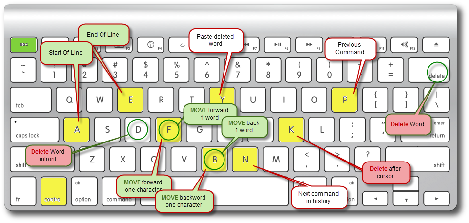

# JunOS

## Starting Off: 
- [Initial Login](initial-login.md): How to login, get to cli, and save the configs
- [Virginising the device](virginising-the-device.md): How to clear the configs and make the box clean.  
- [Password Reset](password-reset.md): How to bust in, when you don't remember the password.  
- [Upgrading the Box](upgrading-the-box.md): How to upgrade the device to the newest or your favorite version of OS.  
- [walk through of initial config](walkthrough-of-initial-config.md): What the initial config of a srx is, and what it all means.
- [Firewall Stats](firewall-stats.md): Serial numbers, os version, etc. 
- [Flow vs. Packet Mode](flow-vs-packet-mode.md): Do you want a firewall or router? 
- [JunOS CLI](junos-cli.md): What's so cool about the CLI?
- [JUNOS Cheat Sheet](junos-cheat-sheet.md): List of commands, what they do and some examples.

## Making it work: 
- [User Account](user-account.md): how to log in as something other then root
- [Interfaces and Static Routes](interfaces-and-static-routes.md): Just get the link up
- [switched interfaces](switched-interfaces.md): link more then one interface into the same security zone (vlans, interfaces, and security zones)
- [Allowing connections though and to the router](allowing-connections-though-and-to-the-router.md): allowing interfaces to ping, or ssh to the box.  
- [Zones, Policies, and ACL's](zones-policies-and-acls.md): How to do a base firewall config.
- [Junos default application groups](junos-default-application-groups.md) (juniper tech library)
- [NAT](nat.md): how to nat traffic

## Working with the box: 
- [Pasting Configs](pasting-configs.md): when you plan out your changes
- [confirmed commits](confirmed-commits.md): make a change and then confirm it works, else the device backs out the change
- [commented commits](commented-commits.md): comment on a commit and view the commits
- [deleting entries](deleting-entries.md): what's other then the "set" command? 
- [debugging](debugging.md): ways to see what's going on
- [Viewing alarms](viewing-alarms.md): if the lights say something is bad

## VPNs
- [Client VPNs](client-vpns.md): How to enable client to firewall vpn connections (aka: dynamic vpn)
- Site to site vpns: Setting up vpn's between firewalls.  
- [QoS over VPNs](qos-over-vpns.md): How to throttle bandwidth over the VPNs to prevent the CPU from overloading
- [Troubleshooting VPNs](troubleshooting-vpns.md): Making sure they are up and passing traffic
- [Dealing with Fragmentation](dealing-with-fragmentation.md): How to troubleshoot if fragmentation over the VPN is bogging down the firewall. 

## Fancier stuff: 
- [ntp](ntp.md): setting the time
- [dhcp](dhcp.md): Both as a forwarder, and as a server
- Login Banner: What folks see before they login
- Groups: same configs for all devices
- [tty-access](tty-access.md): controlling who can access (ssh to) the device
- [snmp](snmp.md): being able to poll
- [syslogging](syslogging.md): setting up, and sending to a remote server
- [BGP](bgp.md): how to setup and confirm bgp is working

## Other Examples: 
- [Minecraft Server](minecraftserver.md): shows how to add inbound and outbound policies and NATs to enable a server inside an SRX

## Troubleshooting
- [Watching Flows](watching-flows.md): how to view flows on a SRX
- [creating pcaps](creating-pcaps.md): How to capture traffic and offload it for post analysis
- [bypassing the firewall](bypassing-the-firewall.md): How to set a flow to packet-mode, and bypass any firewall filtering

## References: 

Keyboard Navigation:  
