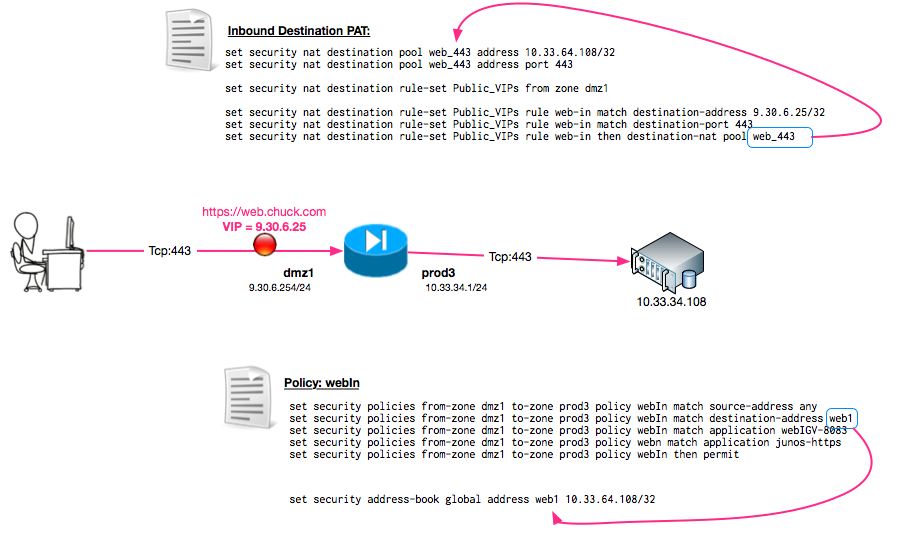

# NAT

## Overview: 
How to setup NATing on a JunOS firewall. 

## Outbound PAT (source nat): 
PAT everyone's internal IPs to one public IP address. 

 

### Zone To-From match: 
Define what the source and destination zones will be: 
```
set security nat source rule-set source-nat from zone inside
set security nat source rule-set source-nat to zone dmz
```
Where "inside" and "outside" are zones that are previously defined.  

### rule #1 - do not match for internal routes
Create a rule that does not nat traffic that is staying internal
```
set security nat source rule-set source-nat rule nat-off match source-address 10.100.0.0/16
set security nat source rule-set source-nat rule nat-off match destination-address-name rfc3330
set security nat source rule-set source-nat rule nat-off then source-nat off
```
note that "rfc3330" would be a address book name that defines all non-routable IPs.  (see below for an example of this)

### rule #2 - match everything else
Create a rule that matches any other traffic, and applys the nat to it.  
```
set security nat source rule-set source-nat rule patOut match source-address-name internalIp
set security nat source rule-set source-nat rule patOut then source-nat pool patIp1
```
Here "internalIP" would be another address book name that equated to the internal IPs behind the "inside" interface.  With this example it would be the same as "10.100.0.0/16".  

### use this NAT IP for match: 
Define the IP that will be used for the PATting: 
```
set security nat source pool patIp1 address 1.1.1.100/32
```

### 3-4: rule #2 -match everything else and NAT to external interface: 
If you want the NAT to simply use the external interface for the NAT IP, then you can use the "interface" variable instead of defining a different IP for the NAT.  
```
set security nat source rule-set source-nat rule patOut match source-address-name internalIp
set security nat source rule-set source-nat rule patOut then source-nat interface
```

## Inbound NAT (destination nat): 
NAT one public IP to a server behind the firewall. 



Define the policy that will allow traffic to flow to the server from the outside: 
```
set security policies from-zone dmz1 to-zone prod3 policy webIn match source-address any
set security policies from-zone dmz1 to-zone prod3 policy webIn match destination-address web1
set security policies from-zone dmz1 to-zone prod3 policy webIn match application webIGV-8083
set security policies from-zone dmz1 to-zone prod3 policy webn match application junos-https
set security policies from-zone dmz1 to-zone prod3 policy webIn then permit
!
set security address-book global address web1 10.33.64.108/32
```

Define the VIP (and port it's listening on)
```
set security nat destination rule-set Public_VIPs rule web-in match destination-address 9.30.6.25/32
set security nat destination rule-set Public_VIPs rule web-in match destination-port 443
set security nat destination rule-set Public_VIPs rule web-in then destination-nat pool web_443
```

Define the Server (and port its listening on)
```
set security nat destination pool web_443 address 10.33.64.108/32
set security nat destination pool web_443 address port 443
```

And listen from the outside interface
```
set security nat destination rule-set Public_VIPs from zone dmz1
```

And do a proxy arp so that it listens to traffic to that IP
```
set security nat proxy-arp interface ge-0/0/0 address 9.30.6.254/32
```

## References: 

### RFC3330 example: 
Just an easy way to define all non-routable IPs: 
```
set security address-book global address-set rfc3330 address this
set security address-book global address-set rfc3330 address 1918a
set security address-book global address-set rfc3330 address loopback
set security address-book global address-set rfc3330 address linklocal
set security address-book global address-set rfc3330 address 1918b
set security address-book global address-set rfc3330 address testnet
set security address-book global address-set rfc3330 address 6to4anycast
set security address-book global address-set rfc3330 address 1918c
set security address-book global address-set rfc3330 address benchmark
set security address-book global address-set rfc3330 address classd
set security address-book global address-set rfc3330 address classe

set security address-book global address this 0.0.0.0/8
set security address-book global address 1918a 10.0.0.0/8
set security address-book global address loopback 127.0.0.0/8
set security address-book global address linklocal 169.254.0.0/16
set security address-book global address 1918b 172.16.0.0/12
set security address-book global address testnet 192.0.2.0/24
set security address-book global address 6to4anycast 192.88.99.0/24
set security address-book global address 1918c 192.168.0.0/16
set security address-book global address benchmark 198.18.0.0/15
set security address-book global address classd 224.0.0.0/4
set security address-book global address classe 240.0.0.0/4
```

### Other Links: 
- [Configuring NAT in Juniper SRX Platforms Using JunOS](http://www.tunnelsup.com/configuring-nat-in-juniper-srx-platforms-using-junos): Richee 7/1/2013
- [[SRX] Configuration Example](https://kb.juniper.net/InfoCenter/index?page=content&id=KB27819): Destination NAT two destinations to same IP address and distinguish based on source address: KB27819, v1, 7/15/2015
- [Junos NAT Configuration Examples](http://kb.juniper.net/library/CUSTOMERSERVICE/technotes/Junos_NAT_Examples.pdf): [pdf] Jan 2010
- [Configuring NAT in Juniper SRX Platforms Using JunOS](https://www.tunnelsup.com/configuring-nat-in-juniper-srx-platforms-using-junos/): July 2013
