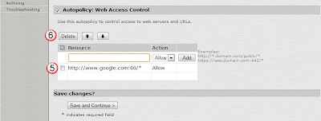

# Basic Resource Profile

- [Basic Resource Profile](#basic-resource-profile)
  - [Overview:](#overview)
  - [Create a Web Access resource Profile:](#create-a-web-access-resource-profile)
    - [Create the Web Profile:](#create-the-web-profile)
    - [Define the Profile:](#define-the-profile)
    - [Block access to Google:](#block-access-to-google)
    - [Attach this profile to tempRole:](#attach-this-profile-to-temprole)

## Overview:
The MAGs can do a lot more then simply opening up a IPSec tunnel between a remote user and an office or datacenter.  When a user does not have a tunnel established, they can connect to internal web servers, mount internal file shares, ssh to internal servers, or even open up remote desktop connections to internal computers.  All of these are called resources, and to  managing what resources groups can access, or what features of a resource they have access to is all part of the resource profile.  

Here we will look at different resources, and how to enable and modify them. 

## Create a Web Access resource Profile:
By default, users have access to all web sites, but in this example, we will create a filter to block access to just google, and allow traffic to everywhere else. 

### Create the Web Profile:
From the Users(1) section, select the Resource Profiles(2) and select the Web(3) profile.  

Then select the New Profile(1) button.

### Define the Profile:
To create the new profile, fill in the following:
1. Type = Custom
2. Name = `Test Web Access`
3. Base URL = http://www.google.com

Then remove the current entry by selecting the google link(5) and pressing the Delete(6) button. 

### Block access to Google:
Then fill in the Resource(7) field enter http://google.com, for the Action(8) set it to Deny, and press the Add(9) button.  Then select Save and Continue(10) to save the change. 

### Attach this profile to tempRole:
In the Test Web Access page, under the Roles(1) tab, select the testRole(2) role, and select the Add(3) button.  Then save the change with the Save Changes(4) button. 

