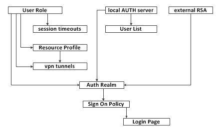

# Basic setup of a MAG

## Overview: 
This document describes all the different things you can define on the MAG, and what components need to be created first.  Or at least what components link to other components.  

The diagram below graphically reviews the hierarchy.  For example, if you want to define session timeouts, you will first need to create a User Role.  

## Step Descriptions: 
The following list outlines the steps you need to take, and the links to show you how.  

- First Step
    - [User Role](basic-user-role.md): Groups that are allowed access to resources like vpn tunneling, web links, or meetings.  
        - [Session Timeout](session-timeout.md): Controlling the time limits to a session
        - [Resource Profile](basic-resource-profile.md): Specifying the specific things that can be done with each resource (like vpn tunneling, web links, meetings, etc.)
            - [VPN Tunnels](how-to-setup-vpn-connect.md): The specific steps needed within user roles and resource profiles to get vpn tunneling working.  
    - [Local Auth Server](creating-an-internal-auth-server.md): How to use the MAG as the local LDAP server
        - User Lists: (part of the above section)
    - [External RSA Servers](linking-to-a-rsa-securid-server.md): How to link to a RSA SecurID server
- [Auth Realm](building-a-basic-auth-realm.md) (User Realm): Creating a realm that glues the user groups (user role), auth servers, and LDAP servers all together
    - [Sign On Policy](create-a-basic-sign-in-policy.md): Define what URLs to go to what realms
        - [Login Page](customize-the-login-page.md): Define how each login page will look