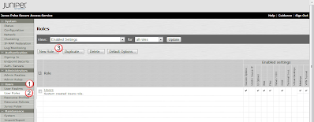
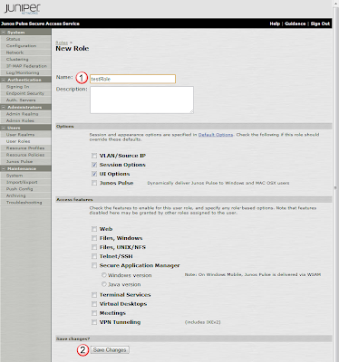
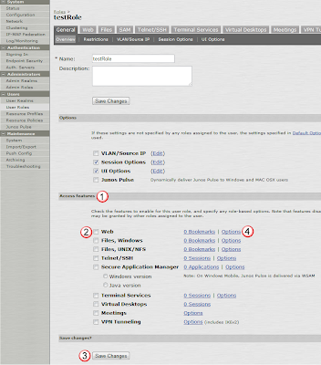
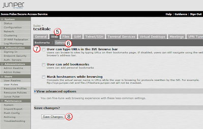

# Basic User Role

## Overview:
User Roles are like group roles.  They define what a collection of users are permitted to have access to.  This would include if they can use web links, vpn tunnels, or share desktops.  You can also modify the post login GUI view to different user roles. 

## Create Role:
In this basic overview, we will define a user role, and enable web browsing from the MAG itself. 

Under the Users(1) section, select User Roles(2) and then the New Role(3) button in the Roles window:

In the New Role window, for the Name(1), enter testRole, and then save the change with the Save Changes(2) button. 

The window will then become the testRole's configuration page.  From here, under the Access features(1) section, select Web(2) to enable web servicing from the MAG.  Then press the Save Changes(3) button to save. 

Next select the Web(2) features Option(4) link (noted above).  Then in the Web(5) tab, and the Options(6) sub-tab, select User can type URLs in the IVE browse bar(7) checkbox, and save the changes via the Save Change(8) button. 

