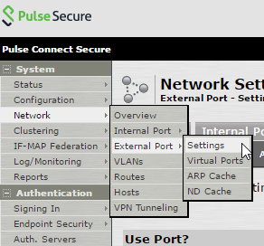
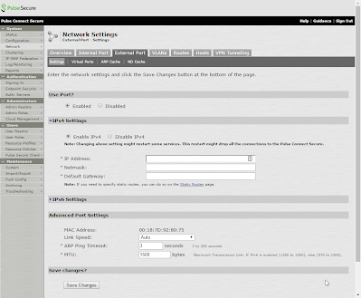

# Configuring the second interface

Connect to the mag via the url: 
```
https://{IP_of_mag}/admin
```

From the Mag, go to System :: Network :: External Port :: Setting



Then in the IPv4 Settings Section, enter in the IP, mask, and gateway for the external interface.  Make sure that Use Port? is Enabled. Then select Save Changes to save.  



