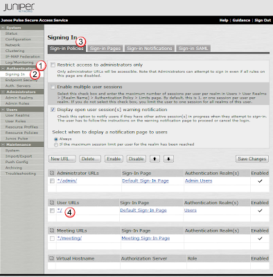
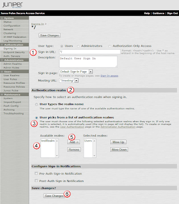
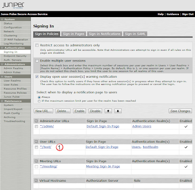

# Create a basic Sign In Policy

## Overview:
We can create different url paths for different user groups.  We can have default users connect to https://vpn.cmed.us/ and have them authenticate to the internal db, but also have super users connect to https://vpn.cmed.us/super/ and have those users use two factor authentication.  All of these can be accomplished though Sign In Policies. 

## Move default user sign in URI
In this example, we will be modifying the default uri (the part of the url after the host name).  Normaly to connect to the MAG you connect to https://{fqdn}/, but in this example we will change it to https://{fqdn}/test/.

### Select URI
In the Authentication(1) section, select Signing In(2), and then select the Sign-in Policies(3) tab.  From there, under the User URLs section, select the uri link */ (4) so that we can modify it, and create a new uri path for this sign-in policy.

### Modify URIs Path
Withing the settings for the uri path */, modify the Sign-in URL(1) to be */test,  and under the Authentication Realm(2) section, select the User picks from a list of authentication realms(3) radio button.  Then select the new auth realm we created: testReam(4) and press Add(5) to add it to the login possibilities.  Finally, select Save Changes(6) to write the changes.

This creates the user path of */test(1) as the uri to connect to to login to the MAG.

