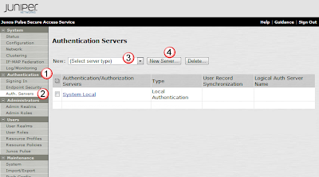
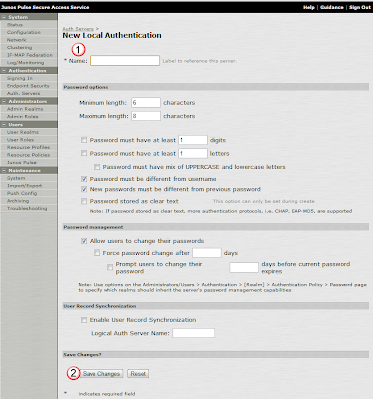
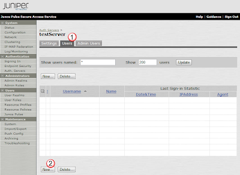
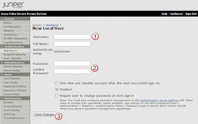

# Creating an Internal Auth server

Here we will add a basic database internal to the MAG that will track users, and their passwords.  The MAG can then use this database for its login authentication.

## Create a Local Authentication Service:
Under the Authentication(1) menu, select Auth. Servers(2).  Then for Server Type(3), select Local Authentication and press the New Server(4) button to create the service. 

In the New Local Authentication page, enter the new Name(1) as testServer, and press the Save Changes(2) button to create the DB. 

## Add a User to that Service:
Within the Configuration page of the new testServer, under the Users(1) tab, click the New(2) button to create a user. 

Enter in the users credentials in the New Local User page including the Username(1) testUser, and the Password(2) abc123!.  Select Save Changes(3) to add the user to the DB. 

