# Upgrade OS

- [Upgrade OS](#upgrade-os)
  - [Overview:](#overview)
  - [Login:](#login)
  - [Set Date/Time](#set-datetime)
  - [Installing Latest OS](#installing-latest-os)
    - [Find your Current Running Version](#find-your-current-running-version)
    - [Download Newer Version from Juniper](#download-newer-version-from-juniper)
    - [Install new OS:](#install-new-os)
      - [Instant Download:](#instant-download)
      - [Staged Download:](#staged-download)
  - [Get License Key](#get-license-key)
    - [What License Do you already have?](#what-license-do-you-already-have)
    - [Get your MAG's SN / License Hardware ID:](#get-your-mags-sn--license-hardware-id)
    - [Download your MAGs Key from Juniper:](#download-your-mags-key-from-juniper)
    - [Install the Key on the Mag:](#install-the-key-on-the-mag)

## Overview: 

## Login: 
Connect to the /admin url of the pulse.  
```
https://{ip_address}/admin
```

So in this example, the device's IP address is https://10.33.192.15/admin  

This brings up the admin login page: 

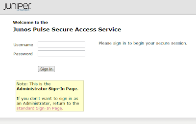

## Set Date/Time
Under the System(1) and Status(2) tabs, select the Edit(3) button next to System Date & Time.  

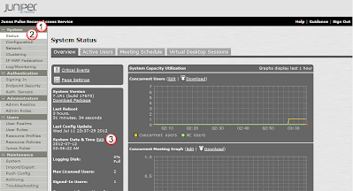

then in the Data and Time window, 
Set the following: 
1. Time Zone = GMT Coordinated Universal Time (one time to rule them all)
2. Use NTP Server = select this radio button
3. NTP Server = 1.north-america.pool.ntp.org (or see other public time clocks here)

Then select the Save Changes(4) button.  

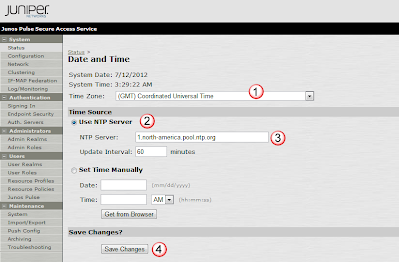

## Installing Latest OS
Here you will download the newest OS from the Juniper website, and copy it to your desktop.  From there you will connect to the Mag, and upload it from the web browser. 

### Find your Current Running Version
Under the Maintenance(1) and System(2) tabs, select Platform(3) and confirm the Current Version(4) running on your Pulse.  

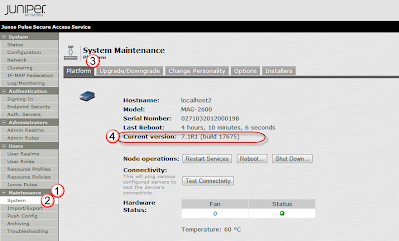

### Download Newer Version from Juniper
From the Juniper Support Page
http://www.juniper.net/customers/support/

Under the Support(1) section, select the Download Software(2) button, 

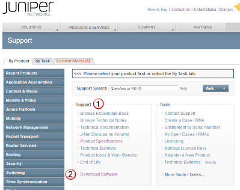

Then under Security(1), select MAG(2)

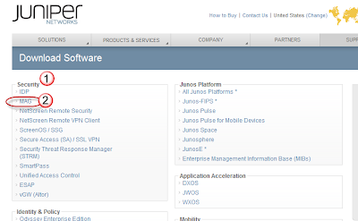

Then under the Software(1) select Junos Pulse Secure Access Service(2)

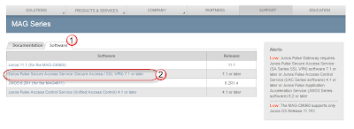

Then under Current Releases(1) select the os version you want to run on(2), 

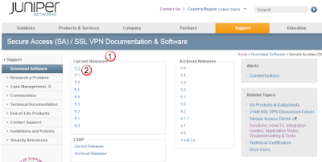

And then under the Software(1) tab, select the specific OS version you want (2).  

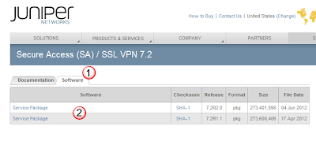

### Install new OS: 
After downloading the os from Juniper, under the Maintenance(1) and System(2) tabs, select the Upgrade/Downgrade(3) section.  Then under the Install Service Package(4) section select the kind of download you want to do.

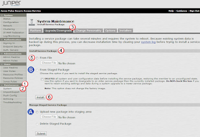

#### Instant Download: 
If you want to simply install the new OS right now, and not wait, then select the From File(5) radio button and choose the file on our PC via the Choose File button.  Then press the Install(6) button to start the install process. 

Then when the OS is installed, you'll get the following message

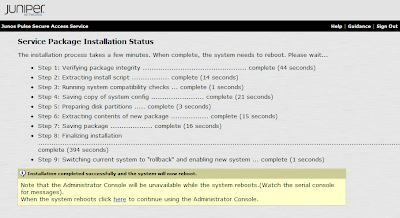

#### Staged Download: 
If you want to download the OS to many devices all at once, and then later do the upgrades, you can do this by "Staging the OS on the MAG's" (or uploading), and then later rebooting on the new OS.  To do this, under the Manage Staged Service Package section, select the Upload new package into staging area(A) and choose the file from your local PC.  

When the download is complete, you'll get a download ok notice.

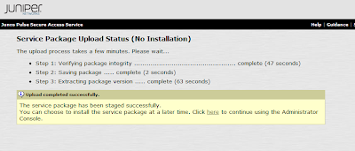

Then when you are ready to install the OS, under the Install Service Package(4) section, select the From Staged Package(B) radio button 

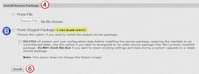

Then when the OS is installed, you'll get the following message


## Get License Key
There are different features that you can enable on the MAG including additional allowed current users.  The following outlines how to find out what is currently installed, and how to enable new licenses on the MAG. 

### What License Do you already have?
If this is a new install, probably nothing.  But to check from the System(1) menu, select Configuration(2).  In the Conf window, select the Licensing(3) tab, and the Licensing(4) subtab.  The current installed licenses will be listed in the Installed License Details(5) section. 

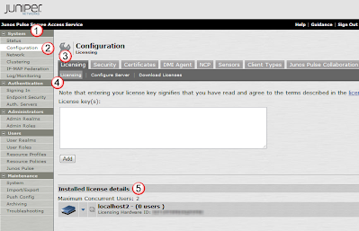

### Get your MAG's SN / License Hardware ID:
On the Juniper left menu bar, under Maintenance(1), select System(2).  Then select the Platform(3) tab to see the devices Serial Number(4).  The License Hardware ID(5) is always at the bottom of the MAGs webpage. 

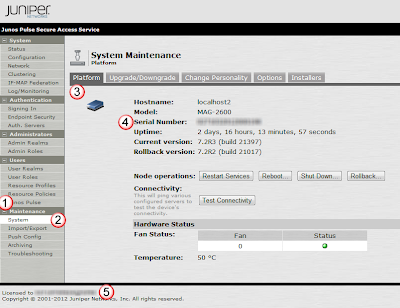

### Download your MAGs Key from Juniper:
Go to the Juniper License page, and login:
- http://www.juniper.net/generate_license

Then in the Manage Product Licenses window, under the Generate Licenses(1) tab, use the pulldown(2) and select the Secure Access(3) item, and press Go(4).

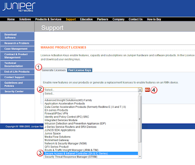

In the Generate Licenses window, enter in the MAGs Serial Number(1), its License Hardware ID(2), and the Authorization Code(3) that you received in the mail when purchased the license.

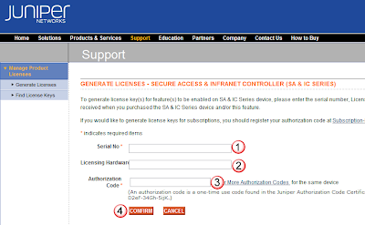
 
NOTE: The Authorization Code would have been received in a PDF in the mail after you purchased the license.  It would look like the following, and the Auth Code(A) would be listed on it.

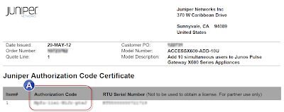

After selecting the Confirm(4) button (above), you are presented with the actual license.  To save it for future reference, choose the format as Text(1), and the delivery as Download to this computer(2) and press OK(3)

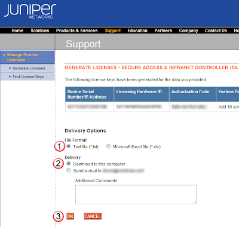

### Install the Key on the Mag:
From the System(1) menu, select Configuration(2).  In the Conf window, select the Licensing(3) tab, and the Licensing(4) subtab.  Enter in the license key that you got from the down load above into the License Key(5) field, and then press Add(6). 

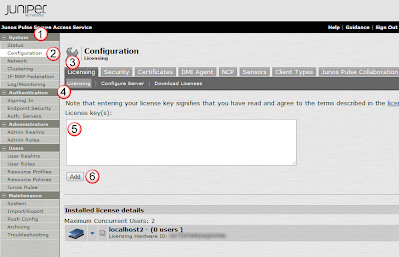
