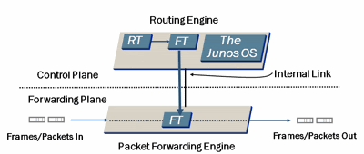

# tty-access

## Changes: 

### Firewall Filters
create firewall filter: 
```
! allow good traffic in: 
set firewall family inet filter tty-access term good from address 10.120.34.0/24
set firewall family inet filter tty-access term good from address 10.50.32.0/24
set firewall family inet filter tty-access term good from protocol tcp
set firewall family inet filter tty-access term good from port ssh
set firewall family inet filter tty-access term good then accept
! block everyone else from connecting: 
set firewall family inet filter tty-access term bad  from protocol tcp
set firewall family inet filter tty-access term bad  from port ssh
set firewall family inet filter tty-access term bad  from port telnet
set firewall family inet filter tty-access term bad  from port http
set firewall family inet filter tty-access term bad  from port https
set firewall family inet filter tty-access term bad  then log
set firewall family inet filter tty-access term bad  then reject
! allow other protocols like snmp, etc.
set firewall family inet filter tty-access term other then accept
```

in the example above, the "allow good traffic in uses the "address" command.  You can also do the above with lists, but not together. (either lists OR addresses, but not both)
```
! define list: 
set policy-options prefix-list vzn-locl-asn701 70.0.0.0/9
set policy-options prefix-list vzn-locl-asn701 71.96.0.0/11
set policy-options prefix-list vzn-locl-asn701 71.128.0.0/9
set policy-options prefix-list vzn-locl-asn701 72.32.0.0/11
! allow good traffic in: 
set firewall family inet filter tty-access term good from source-prefix-list vzn-locl-asn701
set firewall family inet filter tty-access term good from protocol tcp
set firewall family inet filter tty-access term good from port ssh
set firewall family inet filter tty-access term good then accept
```

### Bind filter to interfaces

create a "loopback" interface, and bind the filter to it: 
```
set interfaces lo0 unit 0 family inet filter input tty-access
```

### Allow SSH on interface

Make sure that your firewall interfaces allow ssh to them: 
```
! allow ping and ssh to the outside interface
set security zones security-zone untrust interfaces fe-0/0/2.0 host-inbound-traffic system-services ssh
set security zones security-zone untrust interfaces fe-0/0/2.0 host-inbound-traffic system-services ping
! allow ping and ssh to the inside interface
set security zones security-zone trust   interfaces fe-0/0/0.0 host-inbound-traffic system-services ping
set security zones security-zone trust   interfaces fe-0/0/0.0 host-inbound-traffic system-services ssh
```

## Debugging: 
to see connections being blocked by the filter, check the firewall logs: 
```
> show firewall log
```

Where "A" = accept, "D" = discard, and "R" = reject
```bash
user@host> show firewall log
Time     Filter     A Interface        Pro Source address  Destination address
23:09:09 -          A at-2/0/0.301     TCP 10.2.0.25       10.211.211.1:80
23:09:07 -          A at-2/0/0.301     TCP 10.2.0.25       10.211.211.1:56
23:09:07 -          A at-2/0/0.301     ICM 10.2.0.25       10.211.211.1:49552
23:02:27 -          A at-2/0/0.301     TCP 10.2.0.25       10.211.211.1:56
23:02:25 -          A at-2/0/0.301     TCP 10.2.0.25       10.211.211.1:80
23:01:22 -          A at-2/0/0.301     ICM 10.2.2.101      10.211.211.1:23251
```

## Why: 
This looks confusing, because you are sshing to the IPs on the interfaces, not to the "loopback" IP.  But the loopback interface is the only one with the ACL on it.  This works because the interface IPs are just proxing the traffic to the loopback, and all of that is up in the control plane where the ACL is bound to.  




# References: 
- [J-Series/SRX How to restrict management access to specific IP addresses in JUNos](http://kb.juniper.net/InfoCenter/index?page=content&id=KB21265): kb21265, Oct 11 2013
- [Example: Configuring a Filter to Block Telnet and SSH Access](http://www.juniper.net/techpubs/en_US/junos-qfx-fabric/topics/example/firewall-filter-stateless-example-trusted-source-block-telnet-and-ssh-access.html): Feb 21, 2013
- [SRX Getting Started - Configure Management Access](http://kb.juniper.net/InfoCenter/index?page=content&id=KB16647): kb16647, Apr 7, 2013
- [Control and Forwarding Planes in Separate Chassis](http://www.juniper.net/techpubs/en_US/junos9.3/topics/concept/psd-control-and-forwarding-plane-in-separate-chassis.html): 
- [Configuring Actions in Firewall Filter Terms](http://www.juniper.net/techpubs/en_US/junos11.1/topics/usage-guidelines/policy-configuring-actions-in-firewall-filter-terms.html): Feb 2, 2011