- [Overview:](#overview)
- [Modifying Themes](#modifying-themes)
  - [Confirm your Color Theme](#confirm-your-color-theme)
  - [Path of the Themes](#path-of-the-themes)
- [Text Scopes](#text-scopes)
  - [How is the Text Defined?](#how-is-the-text-defined)
  - [Find the scope def](#find-the-scope-def)
  - [Find undefined scopes](#find-undefined-scopes)
    - [Overview](#overview-1)
    - [Find defined scopes](#find-defined-scopes)
    - [Confirm which have scopes defined in your theme](#confirm-which-have-scopes-defined-in-your-theme)
    - [Create your own scope with its own color](#create-your-own-scope-with-its-own-color)
    - [Wanting to create a scope with it's own background color?](#wanting-to-create-a-scope-with-its-own-background-color)
- [References:](#references)

# Overview: 
We like the color coding that Code does to our text.  But sometimes we want to maybe change some of the specific texts color, while keeping the same color theme.  Or we don't want to make an entirely new color theme, we just want to make some modifications to a current one.  

In this doc we will go over how to modify your [theme](https://code.visualstudio.com/docs/getstarted/themes), and see what themes are loaded.  Show you where your themes are stored in your laptop.  Show you how the different parts of the text is defined in the editor, and how those definitions are defined in your themes, and then how to modify your theme or add to it. 

To confirm, when we refer to themes, we are talking about the [overall color theme in the editor](https://vscodethemes.com/).  This theme, or color palette, is used regardless of the type of files being viewed.  

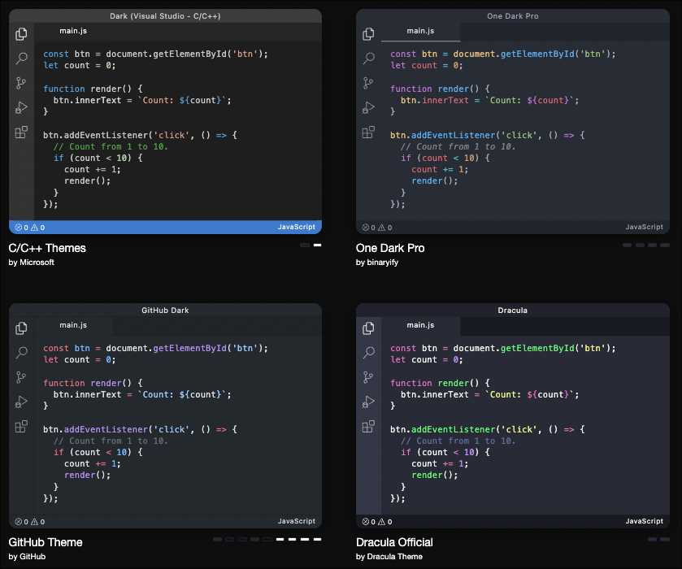

Text Scopes are text patterns that are assigned to specific color standards within a theme.  Each of these text patterns are defined per file extension of the file being edited.  Thus all perl scripts are color coded one way, and all python is coded a different way.  

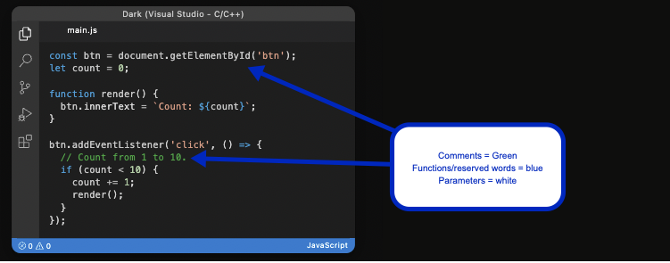

# Modifying Themes

Themes are color pallets that can be used to view all your text using specific for and background colors.  


## Confirm your Color Theme

In code, press `cmd`+`[shift]`+`p` to get to the Command Pallet (or Menu > View > Command Pallet).  Then type `Preferences: Color Theme`

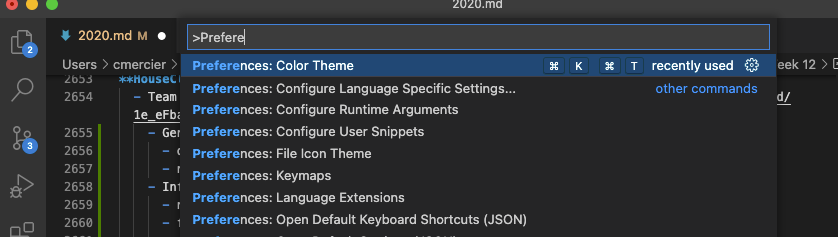

Then select the theme you want.  In this example, I'm using the standard dark theme `Dark (Visual Studio)`

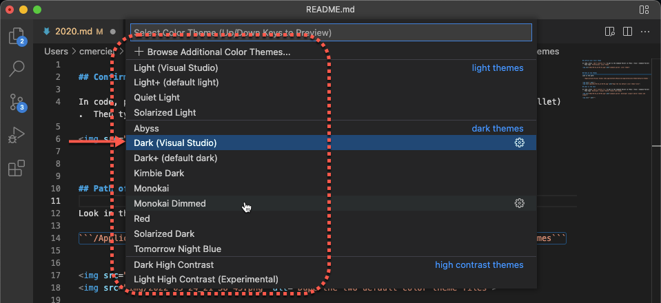

## Path of the Themes

For a mac, look in the path: 

```/Applications/Visual Studio Code.app/Contents/Resources/app/extensions/theme-defaults/themes```

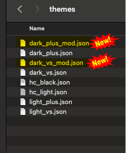

# Text Scopes

Text Scopes are text patterns based on file types (or the languages within the files), and tell the editor what colors (from the theme) should be used for all the different patterns.  


## How is the Text Defined?

In code, press `cmd`+`[shift]`+`p` to get to the Command Pallet (or Menu > View > Command Pallet).  Then type `Developer: Inspect Editor Tokens and Scopes`

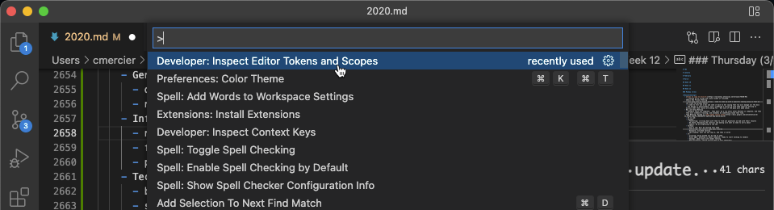

Then place the mouse on a part of the text that you want to inspect.  In this example, we clicked on a comment section. 

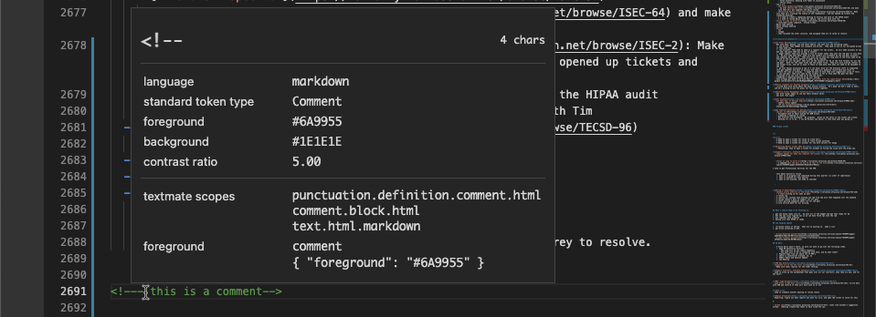

## Find the scope def

Then go to the themes folder again, and open up the `dark_plus.json` and `dark_vs.json` files, and do a search for the phrase `comment` in both the docs.  

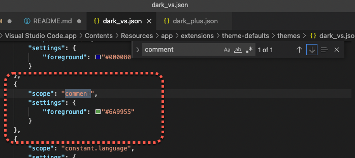

It will show you the settings for that, where you can modify the color codes for that style of text.

Once you make a change to the style, you will need to reload MS Code for the color changes to take affect.  

## Find undefined scopes

### Overview
Yea, these exist.  There are plenty of places that are defined in the code, but do not have a color definition (css scope).  

In this example, we have two different matches for markdown links.  When the link `[]()` is defined within a bold section `**[name](link)**` the link part is colored blue, and defined the foreground color `#569cd6`. 

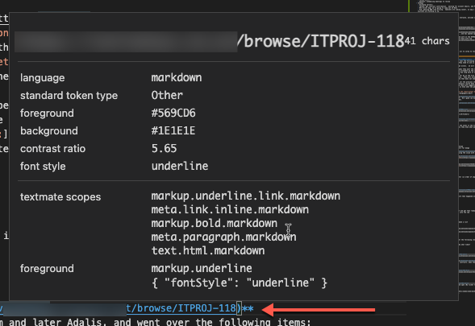

But if the link is within a numbered or unnumbered list `- [name](link)`, then the link is white with the foreground color `#d4d4d4`. 

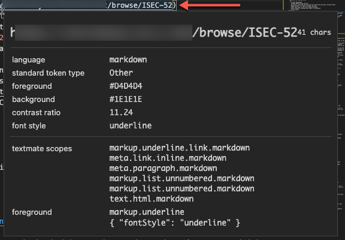

### Find defined scopes

So what causes the link to be blue?  We go back to the definition for the blue link, and we look at the "textmade scopes".  In this case there are a bunch, and the first match will define it's color. 

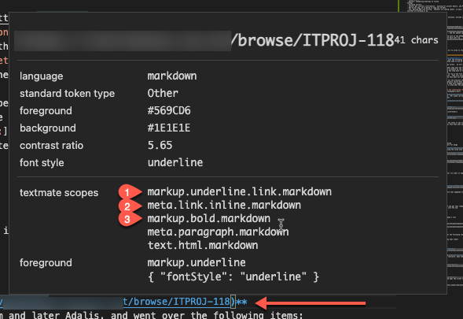

### Confirm which have scopes defined in your theme

So looking at the first scope line (1), we look back into the two theme files (`dark_vs.json` and `dark_plus.json`) and search for the phrase `markup.underline`.  This scope has no color definitions, so this is not what is making the link blue.  Also, the match is for `markup.underline`, not `markup.underline.link.markdown`.  If matches on the closest match, but there is no full match.  

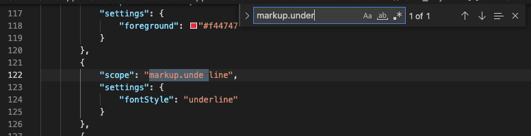

Then we look at the second scope line (2), and search for the phrase `meta.link`.  This comes up with **no** matches, so this is an example of an undefined scope.   

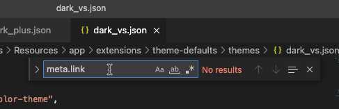

then we look at the third scope line (3), and search for the phrase `markup.bold`.  This comes up with the scope that defines the foreground color `#569cd6` which was the color that the text was displayed as.  

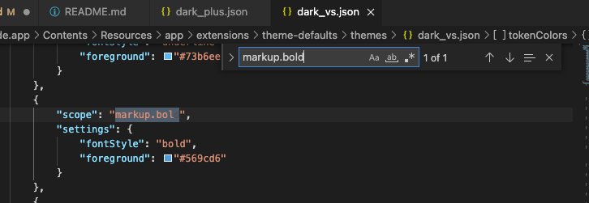

### Create your own scope with its own color

In this example, the blue link test was defined with color `#569cd6`, and was defined in the theme via the third choice scope `markup.bold`.  

I like the idea of using the `markup.underline` scope, but I dont want all underlines to be my new color, only link ones.  Thus, I create a new scope titled `markup.underline.link`, and define a color (`#73b6ee`) for it. - I just copied the `markup.underline` scope and renamed it, and added the `foreground` definition.


Then after restarting Code, when I look back at the link, I see that they are all color coded properly, with the new link color `#73b6ee`!

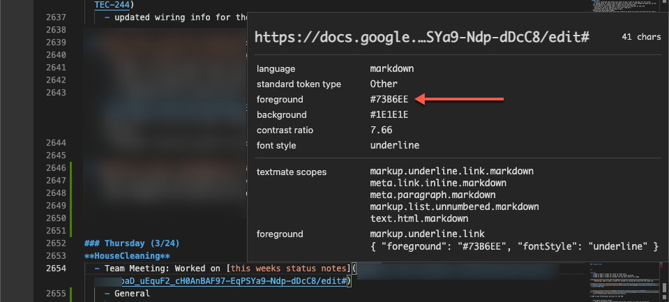

### Wanting to create a scope with it's own background color? 
If you want to create a scope that has a different background color (like highlighting), [your a bit out of luck](https://github.com/microsoft/vscode/issues/113478).  It seems that [this is a request that has been out there for a long while](https://github.com/microsoft/vscode/issues/3429), but Microsoft has yet to enable it.  

Currently, if you attempt this, you will get the following error. 

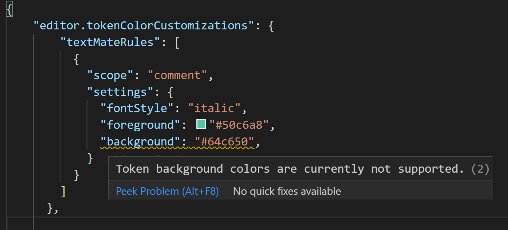

The best solution I have found is [Highlight by Fabio Spampinato](https://marketplace.visualstudio.com/items?itemName=fabiospampinato.vscode-highlight).  

To install, select the extensions icon (1),then search for highlight (2), and select the highlight extension (3), and install (4). 

<a href="img/2022-10-05_10-05-03.png">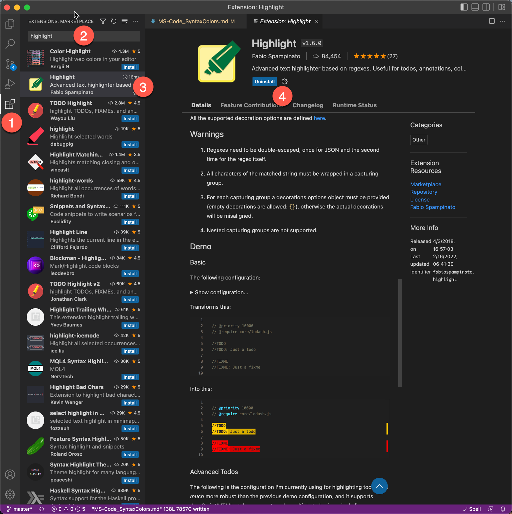</a>

Then you will need to [modify the settings](https://code.visualstudio.com/docs/getstarted/settings#:~:text=Where%20can%20I%20find%20extension,Open%20Settings%20(JSON)).) so that it will highlight the correct phrasing.  

- Main Menu: Code: Preferences: Settings: Extensions: Highlight: Edit in settings.json
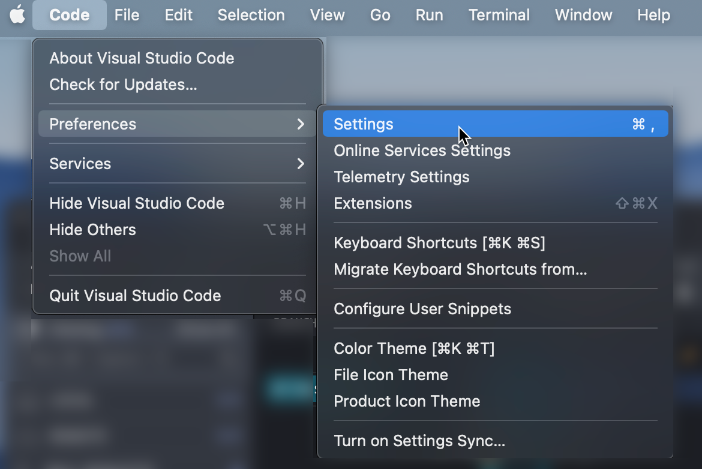
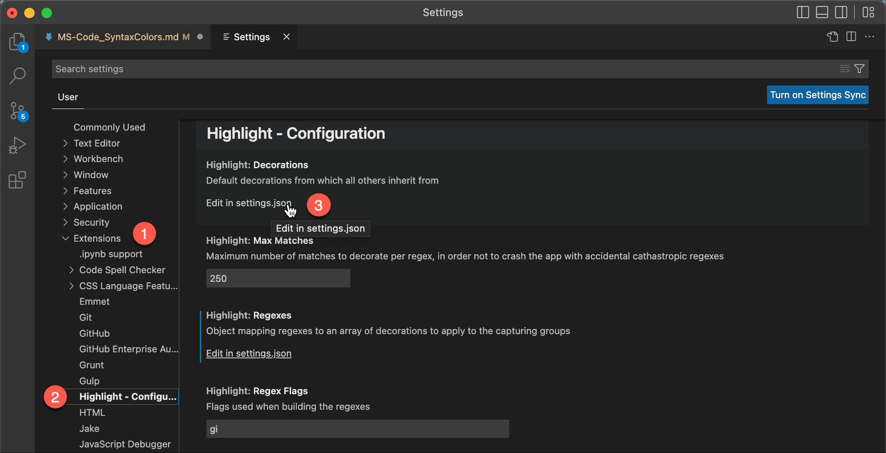

Then in the `settings.json` file, add the configs outlined in the [highlight settings and demo example](https://marketplace.visualstudio.com/items?itemName=fabiospampinato.vscode-highlight).  
```
{
        "highlight.decorations": { "rangeBehavior": 3 }, // Default decorations from which all others inherit from
        "highlight.regexFlags": "gi", // Default flags used when building the regexes
        "highlight.regexes": {}, // Object mapping regexes to options or an array of decorations to apply to the capturing groups
        "highlight.maxMatches": 250 // Maximum number of matches to decorate per regex, in order not to crash the app with accidental cathastropic regexes

        "highlight.regexes": {
            "(// ?TODO:?)(.*)": [
              {
                "overviewRulerColor": "#ffcc00",
                "backgroundColor": "#ffcc00",
                "color": "#1f1f1f",
                "fontWeight": "bold"
              },
              {
                "backgroundColor": "#d9ad00",
                "color": "#1f1f1f"
              }
            ],
            "(// ?FIXME:?)(.*)": [
              {
                "overviewRulerColor": "#ff0000",
                "backgroundColor": "#ff0000",
                "color": "#1f1f1f",
                "fontWeight": "bold"
              },
              {
                "backgroundColor": "#d90000",
                "color": "#1f1f1f"
              }
            ],
            "(// )(@\\w+)": [
              {},
              {
                "color": "#4de0ff"
              }
            ]
          }
    }
```
Then in your code terminal, everytime you enter `//TODO` it will highlight it and the following text yellow up until the carriage return. 


# References: 
- https://www.youtube.com/watch?v=Su-cNLe0dgw

