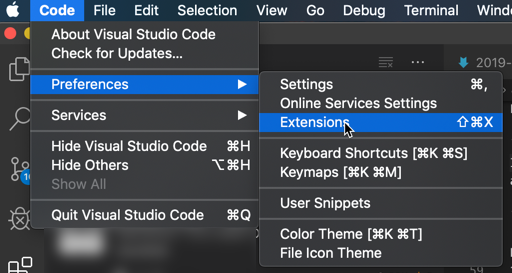
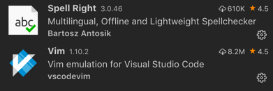
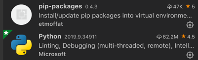

# What extensions to install: 
From the "Code" menu, select "Preferences" and "Extensions"  

## For Editing: 
I prefer a vim interface which you can do with Visual Code Studio.  These are the following extensions I like: 
- [Vim](https://marketplace.visualstudio.com/items?itemName=vscodevim.vim): most of your vim command interfaces
- [Spell Right](https://marketplace.visualstudio.com/items?itemName=ban.spellright): Gives you access to a spell checker

## For Markdown: 
There are three extensions that you might want to look at: 
- [Markdown All in One](https://marketplace.visualstudio.com/items?itemName=yzhang.markdown-all-in-one): makes markdown work
- [Markdown TOC](https://marketplace.visualstudio.com/items?itemName=AlanWalk.markdown-toc): Allows you to make a table of contents in your markdown doc
- [Paste Image](https://marketplace.visualstudio.com/items?itemName=mushan.vscode-paste-image): Allows you to paste images into your markdown doc

## For Python:
It kind of does this for you, so you might not need to do this on your own.  
- [Python](https://marketplace.visualstudio.com/items?itemName=ms-python.python): The actual interpreter  
- [pip-packages](https://marketplace.visualstudio.com/items?itemName=etmoffat.pip-packages): auto installs the required packages

