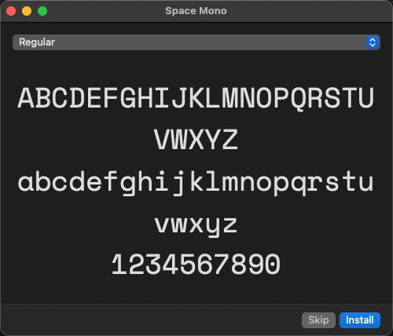
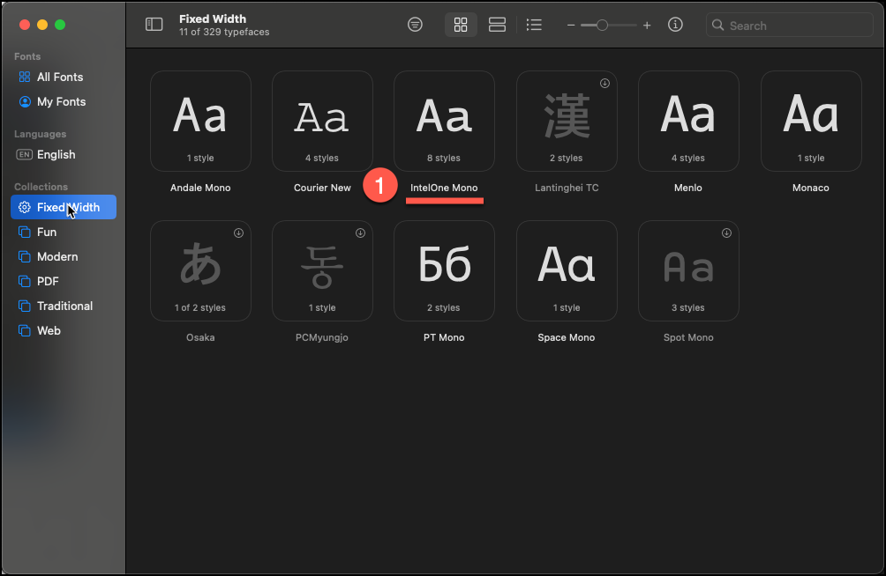
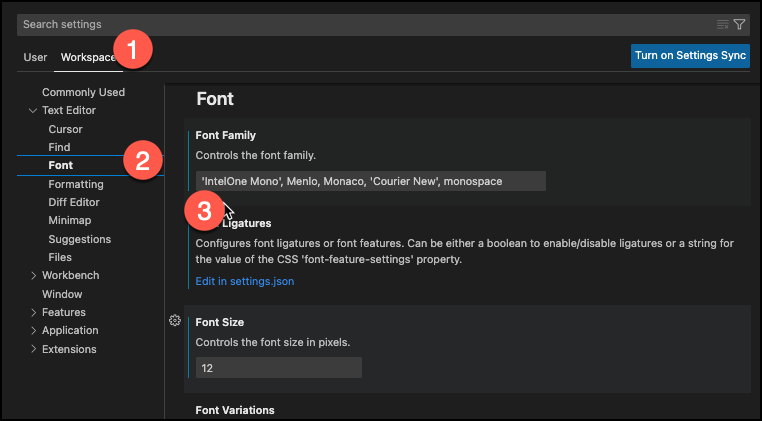

# Changing the Font type in MS Code

## Overview
This will go over everything from downloading a new font (to a mac) to then modifying the Code app to utilize it. 

## Download and Install
Find a font you want to use.  For example, go to the website https://github.com/intel/intel-one-mono/tree/main/fonts and download and unzip the [otf.zip](https://github.com/intel/intel-one-mono/blob/main/fonts/otf.zip) file. In the unzipped `otf` (the font file), select one of the fonts, like `intelone-mono-font-family-regular.otf`.  

The Mac app `Font Book` will open up and ask you if you want to install the fonts.  Select `Install`.  

Once the font is installed, look in the `Font Book` app to see the exact name of the font (1).  In this case it's `IntelOne Mono`.  

## Select Font in Code
In the Code application, under the `Code` menu, select `Settings...` and then `Settings` again.  

Then under `Workspace` (1), under `Test Editor`, select `Font` (2) and then under `Font Family`, enter in the font name exactly as it is shown above in the Apple Font Book.  In this case, the font name has two words, so you need to bracket within single quotes (3) `'IntelOne Mono'`.  

The change will take effect immediately, you don't need to save anything.  

## References: 
- [How to Change Your Code Font in VSCode](https://techstacker.com/change-vscode-code-font/): TechStacker: Dec 2020
- [Install or remove fonts on your Mac](https://support.apple.com/en-us/HT201749): How to install fonts on your mac