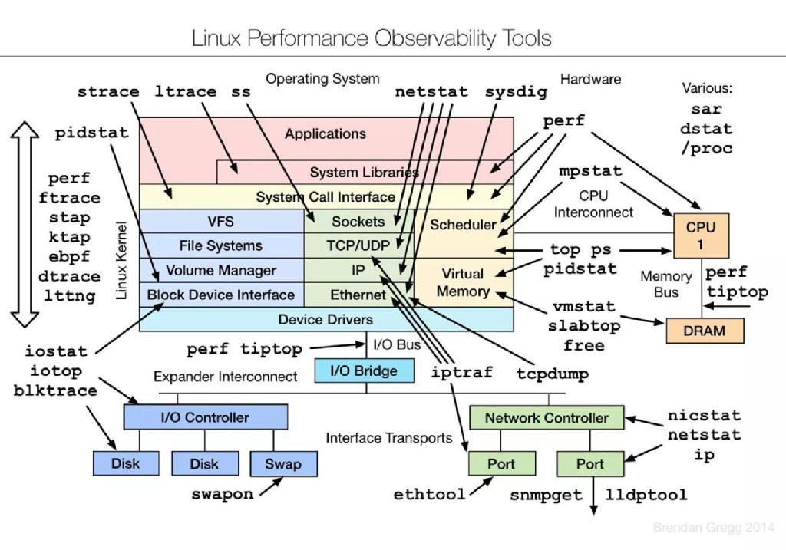

# Unix / Linux

- [Unix / Linux](#unix--linux)
  - [Tools](#tools)
    - [DNS](#dns)
    - [ICMP](#icmp)
    - [Site Analysis](#site-analysis)
    - [Shell Scripts:](#shell-scripts)
  - [System Deployments:](#system-deployments)
  - [VM Services:](#vm-services)
  - [Services](#services)
    - [Revision Control](#revision-control)
    - [File Transfers and Manipulation:](#file-transfers-and-manipulation)
    - [Shell level stuff:](#shell-level-stuff)
    - [Security:](#security)
    - [Other:](#other)
    - [Services:](#services-1)

## Tools 
### DNS
- [dns](dns/README.md): What it is and how to set it up.
- [dnstracer](dns/dnstracer.md): view the registar and what roots resolve
- [dig](dns/dig.md): like nslookup only better

### ICMP
- [fping](fping.md) is a pinging utility that will sweep ip ranges.
- [mtr](http://www.bitwizard.nl/mtr/): pinging and traceroute

### Site Analysis
- [nmap](nmap.md): Scan IP/Ports on a network
- [zmap](zmap.md): Scan IP/Ports on a network 
- ipcalc: compute network ranges around IP/Masks
- netperf: send traffic between two hosts, and review the behavior of the network
- [tcpdump](tcpdump.md): capture packets seen by your machine
- dummynet: WAN traffic emulation tool
- [watch](watch.md): View via cli interface traffic
- [ntopng](ntopng.md): IP Flow for your hosts

### Shell Scripts: 
- [Perl](../../perl/README.md): 
- [Python](../../python/README.md): 
- [Java](../../Java/README.md):
- [Ruby](../../Ruby/README.md): 
- [RegEx](../../Other/regexp.md): 
- [Bash](bash/README.md): 
- [sed/awk](sedawk.md): Auuughhh!!!
- [10 Tools To Add Some Spice To Your UNIX Shell Scripts](http://www.cyberciti.biz/tips/spice-up-your-unix-linux-shell-scripts.html).  by Vivek Git

## System Deployments:
- [Gentoo Systems](gentoo/README.md): a bare-bones linux distro that is really nice to work with
- [Centos Systems](centos/README.md): A free version of redhat
- [RedHat Systems](RH/README.md): The commercial linux distribution
- [Brew](brew.md): Mac Linux

## VM Services:
- [Oracle VM VirtualBox](VirtualBox/README.md): A vm server for windows or linux.
- [KVM](kvm/README.md): running under centos
- [HP Blade Management](hp-blade-management.md): Commands you can use to view status of blades/chassis

## Services

### Revision Control
- [git](../../App/Git/README.md): A good revision control system for code.  (does not deal with larger binaries very well.) 
- [subversion](../../App/Subversion/README.md): Not as good as git for some things, but holds binaries better. 

### File Transfers and Manipulation: 
- [rsync](rsync.md): A fantastic copy tool.
- [sshpass](sshpass.md): How to run ssh commands without getting prompted for a pass
- [tftp](tftp.md): The steps for setting up a TFTP daemon on your server.
- [wget](wget.md): Allows you to backup content from web or FTP sites
- [curl](curl.md): just like wget
- [tar+gz](targz.md): how to stuff a lot of files into one zipped up one.  
- [ztools](ztools.md): different commands for working with compressed (.gz) files
- [nfs](nfs.md): mounting remote volumes locally
- [using Tapes (LTO)](using-tapes-lto.md): how to get a tape storage device working

### Shell level stuff: 
- [bash](bash/README.md): Your shell and how to modify it. 
- [fancy shell commands](http://www.commandlinefu.com/commands/browse/sort-by-votes): Things you didn't know you could do.
- [screen](screen.md): multiple sessions on one window.  Also helps with disconnecting wan links.
- [grep](grep.md): few tricks to finding stuff
- [df and du](du-and-df.md): looking at disk and directory usage
- [Diffing tools](diffing-tools.md): A couple of them out there...
- [sudo](sudo.md): allowing folks to do rooty stuff

### Security: 
- [iptables](iptables.md): edge firewalling
- [SELinux](selinux.md): To the Death!  No! To the Pain!

### Other: 
- [snmp](snmp.md): polling and alerting tool
- [ntpd](ntpd.md): Setting up your box to host or query the correct time.  
- [nload](nload.md): view network interface traffic
- [UNetbootin](http://unetbootin.sourceforge.net/) allows you to create bootable Live USB drives for Ubuntu, Fedora, and other Linux distributions without burning a CD. It runs on both Windows and Linux.

### Services: 
- [cron](cron.md): running scripts at specific times
- [syslog](syslog.md): local and remote logging
- [syslog-ng](syslog-ng.md): How to setup a syslog service
- [Apache](../../App/apache/README.md): how to setup and debug
- [ansible](../../App/ansible/README.md): central management of everything!
- [rsnapshot](https://rsnapshot.org/): never tarball your backups again!
- [tftp server](tftp.md)
- [cacti install](../../App/cacti/cacti-install.md) on Centos, and [how to fully deploy cacti](../../App/cacti/README.md):
- [git repo](../../App/Git/README.md): so you can backup your files
- [PXE/Jumpstart server](pxejumpstart-server.md): get all your other boxes booted easily
- [BIND9](dns/bind-on-centos7.md), or [BIND9-Chrooted](dns/bind9-chrooted-on-centos7.md): dns

