# Centos7 Minimal Install

- [Centos7 Minimal Install](#centos7-minimal-install)
  - [Download ISO, and boot server](#download-iso-and-boot-server)
    - [Download ISO](#download-iso)
    - [Build USB boot drive](#build-usb-boot-drive)
  - [Setup from GUI](#setup-from-gui)
    - [Select normal install](#select-normal-install)
    - [Define Language](#define-language)
    - [Installation Summary](#installation-summary)
      - [Installation Source](#installation-source)
      - [Network and Hostname](#network-and-hostname)
      - [Date and Time](#date-and-time)
    - [Configuration](#configuration)
    - [Reboot](#reboot)
  - [Complete the Minimal install](#complete-the-minimal-install)
    - [SSH to the new host](#ssh-to-the-new-host)
    - [update the OS](#update-the-os)
  - [References](#references)

## Download ISO, and boot server
You will first need to get the ISO to boot from and then format it in such a way that you can install it into the computer to have it boot from.  

### Download ISO
First get the ISO and put it on your laptop.  
you can download it from the web here: 
- https://www.centos.org/download/

In this example, I would us the minimal iso.   

### Build USB boot drive
There are a bunch of different ways to do this.  


## Setup from GUI

### Select normal install 
(missing image)

### Define Language

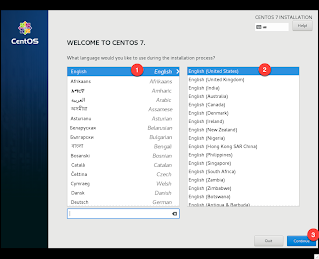

### Installation Summary
You will next get to the main install page.  You will need to 
1. set the installation source: point to the iso that you booted from
2. the installation destination: the hard disk to install the os on
3. Network Settings: define if the host will have a static IP, or get an IP from DHCP
4. configure the time, if you want to change the default setting

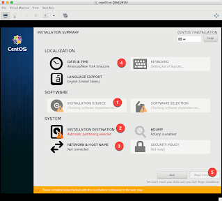

#### Installation Source
Set the "Installation Source" (1).  Normally, the source (6) is already selected properly as the ISO that you booted from.  Then select done(7).  

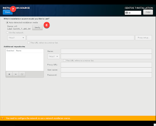

From the "Installation Summary" page, select "Installation Destination"(2) to get the following page.  it should automatically select the available drive (8), and then select done (9)

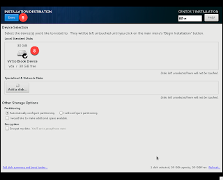

#### Network and Hostname
Then from the "Installation Summary" page, select Network and Hostname(3), and then enable the ethernet interface (10), enter in the hostname and domain (11) and enable the hostname change by selecting Apply (12), and then enter in more details about the ethernet interface by selecting Configure (13)

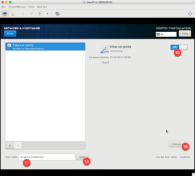


then select IPv4(14) from the menu bar, and under method (15), select Manual (16)

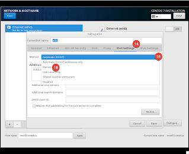

Next select the Add (17) button, and enter the hosts IP address (18), the mask (19), and the default gateway (20).  Then enter in multiple DNS servers (21) separated by commas, and enter in the DNS search domain (22).  When complete enter Save (23)

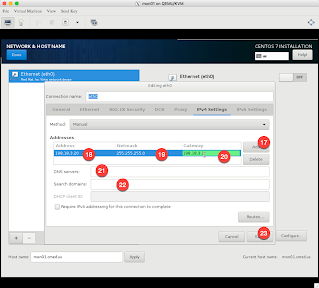


Confirm that the interface is still enabled (24), and that the settings are correct (25), and then if everything for the network looks good, select done (26)

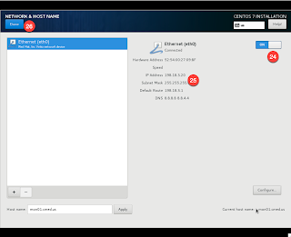

#### Date and Time
Again from the "Installation Summary" page, select Date and Time(4), then define what region to use (27), and make sure that NTP is enabled (28) before selecting done (29)

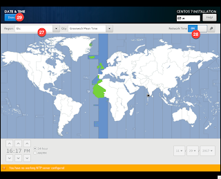

### Configuration
Finally, from the "Installation Summary" page, select Begin Installation(5) to get to the Configuration window, and then select Root Password (30) to set the root users password

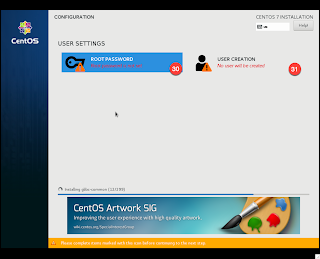

Enter in the root users password twice (32) and then select done (33)

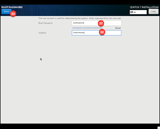

Then back at the Configuration window, select User Creation (31) to create at least one user.  In the Create User window, enter in their name (34) and the username (35) that you want them to have, and then enter in the user's password twice (36) and save by selecting done (37).  

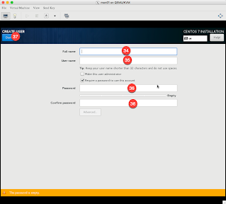

### Reboot
When the installation is complete, select the reboot button (38) to reboot the installation

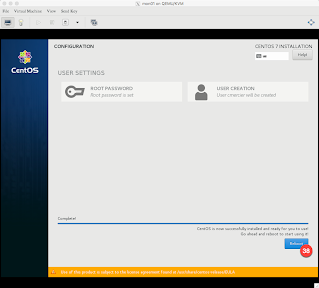

You will be prompted by the grub boot message which you can ignore and wait for the host to boot up, and then the box will have the basic install complete!

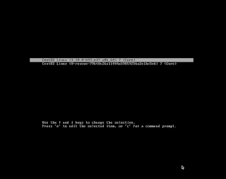


## Complete the Minimal install

### SSH to the new host
At this point the new host should be pingable
```bash 
$ ping 198.18.3.20
PING 198.18.3.20 (198.18.3.20): 56 data bytes
64 bytes from 198.18.3.20: icmp_seq=0 ttl=63 time=1.886 ms
64 bytes from 198.18.3.20: icmp_seq=1 ttl=63 time=1.979 ms
64 bytes from 198.18.3.20: icmp_seq=2 ttl=63 time=2.016 ms
^C
--- 198.18.3.20 ping statistics ---
3 packets transmitted, 3 packets received, 0.0% packet loss
round-trip min/avg/max/stddev = 1.886/1.960/2.016/0.055 ms
```

and you should be able to ssh directly to it. 
```bash
$ ssh 198.18.3.20
The authenticity of host '198.18.3.20 (198.18.3.20)' can't be established.
ECDSA key fingerprint is SHA256:0u1r1OGyeB0D39c39fE6dd+FwnP8/aSOeqhkMLcmJlQ.
Are you sure you want to continue connecting (yes/no)? yes
Warning: Permanently added '198.18.3.20' (ECDSA) to the list of known hosts.
cmercier@198.18.3.20's password:
[cmercier@mon01 ~]$
```

### update the OS
From the root account do the following: 

Update the host with all the latest patches 
```bash
yum -y update
```

Throw on a couple of apps to make the box easier to work with
```bash
yum install net-tools ntp vim net-snmp-utils curl screen bind-utils rsync
```


## References
- [Centos Basic Install](centos-basicserver.md): details on other things you can do to install the OS
- [Centos Main Page](https://www.centos.org/): The main webpage for Centos