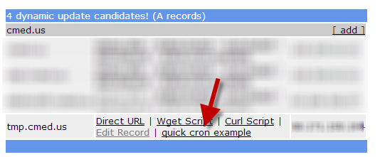
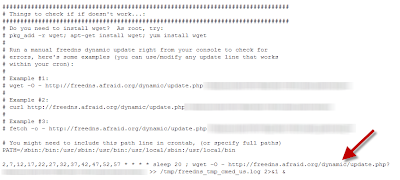

# Setting up DNS for home webserver

## Overview: 
This page explains how to provide a DNS name to a webserver running at your home, when you have *not* paid for a static IP.   

## Getting a domain name
Your first step is to register a domain name for yourself (a domain would be something like cmed.us, or gwu.edu, or google.com, but you need to pick one that is not used).  This is very simple to do, and can cost very little ($10 a year or less).  

There are [many different places](https://www.google.com/?gws_rd=ssl#q=registering+a+domain+name) you can go to for getting a domain name.  

If you go with my suggestion below, and use [freedns.afraid.org](http://freedns.afraid.org/), then the DNS servers that the register will want from you will be: 
```
ns1.afraid.org
ns2.afraid.org
ns3.afraid.org
ns4.afraid.org
```

## Signing up with a free DNS service
If you don't host your own DNS service, then I would suggest your register with freedns.afraid.org.  They will provide you free DNS services so that you can point any hostname (like net.cmed.us) to any server IP.  

 
## Updating your DNS service with your homes ever changing IP address
If you have a computer at home that you want to get to from out on the web, and you have a dynamic IP address provided to you by your cable company, then you need some way of automatically updating your DNS servers (freedns.afraid.org) every time your cable company changes your IP address. 

To do this with freedns.afraid.org, create an A record and then use [their dynamic page](http://freedns.afraid.org/dynamic/) to see a list of all the records in your domain. Then find the new page you just created, and select the "quick cron example" link.  



The page that comes up will provide you with a simple cron command to run that will automatically update DNS with the external IP address of the server that ran the command.  



