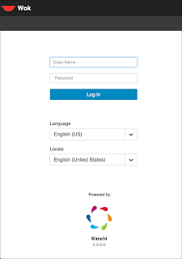

# install Wok

## Installation 
Install the following YUM applications
```bash
yum -y install qemu-kvm libvirt virt-install bridge-utils bind-utils virt-manager wget net-tools virt-viewer genisoimage epel-release gcc make autoconf automake gettext-devel git rpm-build libxslt python-ordereddict python-cherrypy python-cheetah PyPAM m2crypto python-jsonschema python-psutil python-ldap python-lxml nginx openssl python-websockify logrotate policycoreutils-python
```

From the /tmp directory, download Kimchi and Wok
```bash
cd /tmp/
wget https://github.com/kimchi-project/kimchi/releases/download/2.5.0/kimchi-2.5.0-0.el7.centos.noarch.rpm 
wget https://github.com/kimchi-project/kimchi/releases/download/2.5.0/wok-2.5.0-0.el7.centos.noarch.rpm 
```

Then install Kimchi and Wok
```bash
yum -y install wok-2.5.0-0.el7.centos.noarch.rpm
yum -y install kimchi-2.5.0-0.el7.centos.noarch.rpm
sed -i 's/^#session_timeout = .*/session_timeout = 1440/g' /etc/wok/wok.conf
```

Set SELinux to "permissive" and restart nginx
```bash
semanage permissive -a httpd_t
systemctl restart nginx
```

Open firewalld ports and restart/enable service
```bash
systemctl enable wokd
systemctl start wokd
firewall-cmd --add-port=8000/tcp --permanent
firewall-cmd --add-port=8001/tcp --permanent
firewall-cmd --reload
systemctl start libvirtd
systemctl enable libvirtd
```

Accessing the Web GUI
- Point your browser to "https://<ip-addr>:8001"

The username/password combination is the root password for the actual system.

