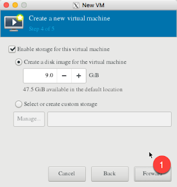

# KVM on CentOS 7

## Install CentOS 7
- [Basic Server Install](): 

## Pre Install
### Hardware Check

Confirm the CPU can handle hardware virtualization.  The output of the command should include "vmx" or "svm" in the output
```bash
[cmercier@kvm ~]$ grep -E '(vmx|svm)' /proc/cpuinfo
flags : fpu vme de pse tsc msr pae mce cx8 apic sep mtrr pge mca cmov pat pse36 clflush dts acpi mmx fxsr sse sse2 ss ht tm pbe syscall nx rdtscp lm constant_tsc arch_perfmon pebs bts rep_good nopl xtopology nonstop_tsc aperfmperf pni dtes64 monitor ds_cpl vmx est tm2 ssse3 cx16 xtpr pdcm dca sse4_1 sse4_2 popcnt lahf_lm tpr_shadow vnmi flexpriority ept vpid dtherm ida
flags : fpu vme de pse tsc msr pae mce cx8 apic sep mtrr pge mca cmov pat pse36 clflush dts acpi mmx fxsr sse sse2 ss ht tm pbe syscall nx rdtscp lm constant_tsc arch_perfmon pebs bts rep_good nopl xtopology nonstop_tsc aperfmperf pni dtes64 monitor ds_cpl vmx est tm2 ssse3 cx16 xtpr pdcm dca sse4_1 sse4_2 popcnt lahf_lm tpr_shadow vnmi flexpriority ept vpid dtherm ida
flags : fpu vme de pse tsc msr pae mce cx8 apic sep mtrr pge mca cmov pat pse36 clflush dts acpi mmx fxsr sse sse2 ss ht tm pbe syscall nx rdtscp lm constant_tsc arch_perfmon pebs bts rep_good nopl xtopology nonstop_tsc aperfmperf pni dtes64 monitor ds_cpl vmx est tm2 ssse3 cx16 xtpr pdcm dca sse4_1 sse4_2 popcnt lahf_lm tpr_shadow vnmi flexpriority ept vpid dtherm ida
flags : fpu vme de pse tsc msr pae mce cx8 apic sep mtrr pge mca cmov pat pse36 clflush dts acpi mmx fxsr sse sse2 ss ht tm pbe syscall nx rdtscp lm constant_tsc arch_perfmon pebs bts rep_good nopl xtopology nonstop_tsc aperfmperf pni dtes64 monitor ds_cpl vmx est tm2 ssse3 cx16 xtpr pdcm dca sse4_1 sse4_2 popcnt lahf_lm tpr_shadow vnmi flexpriority ept vpid dtherm ida
flags : fpu vme de pse tsc msr pae mce cx8 apic sep mtrr pge mca cmov pat pse36 clflush dts acpi mmx fxsr sse sse2 ss ht tm pbe syscall nx rdtscp lm constant_tsc arch_perfmon pebs bts rep_good nopl xtopology nonstop_tsc aperfmperf pni dtes64 monitor ds_cpl vmx est tm2 ssse3 cx16 xtpr pdcm dca sse4_1 sse4_2 popcnt lahf_lm tpr_shadow vnmi flexpriority ept vpid dtherm ida
flags : fpu vme de pse tsc msr pae mce cx8 apic sep mtrr pge mca cmov pat pse36 clflush dts acpi mmx fxsr sse sse2 ss ht tm pbe syscall nx rdtscp lm constant_tsc arch_perfmon pebs bts rep_good nopl xtopology nonstop_tsc aperfmperf pni dtes64 monitor ds_cpl vmx est tm2 ssse3 cx16 xtpr pdcm dca sse4_1 sse4_2 popcnt lahf_lm tpr_shadow vnmi flexpriority ept vpid dtherm ida
flags : fpu vme de pse tsc msr pae mce cx8 apic sep mtrr pge mca cmov pat pse36 clflush dts acpi mmx fxsr sse sse2 ss ht tm pbe syscall nx rdtscp lm constant_tsc arch_perfmon pebs bts rep_good nopl xtopology nonstop_tsc aperfmperf pni dtes64 monitor ds_cpl vmx est tm2 ssse3 cx16 xtpr pdcm dca sse4_1 sse4_2 popcnt lahf_lm tpr_shadow vnmi flexpriority ept vpid dtherm ida
flags : fpu vme de pse tsc msr pae mce cx8 apic sep mtrr pge mca cmov pat pse36 clflush dts acpi mmx fxsr sse sse2 ss ht tm pbe syscall nx rdtscp lm constant_tsc arch_perfmon pebs bts rep_good nopl xtopology nonstop_tsc aperfmperf pni dtes64 monitor ds_cpl vmx est tm2 ssse3 cx16 xtpr pdcm dca sse4_1 sse4_2 popcnt lahf_lm tpr_shadow vnmi flexpriority ept vpid dtherm ida
[cmercier@kvm ~]$
```

## Install KVM
### Add Packages
Get all the needed packages installed on the host. 
```bash
yum install qemu-kvm qemu-img virt-manager libvirt libvirt-python libvirt-client virt-install virt-viewer bridge-utils
```

Also make sure that x-windows is installed
```bash
yum install "@X Window System" xorg-x11-xauth xorg-x11-fonts-* xorg-x11-utils -y
```

### Enable the services
Enable the libvirtd service
```bash
[root@kvm ~]# systemctl start libvirtd
[root@kvm ~]# systemctl enable libvirtd
```

and then confim if the kcm module is loaded
```bash
[root@kvm ~]# lsmod | grep kvm
kvm_intel             170086  0
kvm                   566340  1 kvm_intel
irqbypass              13503  1 kvm
[root@kvm ~]#
```

### Create Bridge Interfaces
To have the VM's connect to the network/internet, you need to setup bridging.

Find the primary network interface, and copy its settings to the new "bridged interface". 
```bash
[root@kvm ~]# cd /etc/sysconfig/network-scripts/
[root@kvm network-scripts]# ll ifcfg-*
-rw-r--r--. 1 root root 404 Nov 20 18:01 ifcfg-enp3s4f0
-rw-r--r--. 1 root root 285 Nov 20 18:01 ifcfg-enp3s4f1
-rw-r--r--. 1 root root 254 May  3  2017 ifcfg-lo
[root@kvm network-scripts]#
[root@kvm network-scripts]# cp ifcfg-enp3s4f0 ifcfg-br0
```

then modify the new bridged interface
```bash
[root@kvm network-scripts]# vim ifcfg-br0
```

and modify the settings with the following changes (yellow). The IP settings should be the same as what the original interface was.  
```
TYPE=Bridge
BOOTPROTO=static
DEVICE=br0

IPADDR=198.18.3.11
PREFIX=24
GATEWAY=198.18.3.1
DNS1=8.8.8.8
DEFROUTE=yes
DOMAIN=cmed.us

ONBOOT=yes
```

Now, go into the original interface, 
```bash
[root@kvm network-scripts]# vim ifcfg-br0
```

and mark out all of the network settings so that it only includes the following (where "enp3s4f0" is my servers "eth0"....  hopefully yours is simply eth0 or something like that..)
```
TYPE=Ethernet
BOOTPROTO=static
DEVICE=enp3s4f0
ONBOOT=yes
BRIDGE=br0
```

restart the network to enable the changes, and review the settings for br0.  Since the new br0 interface has the same IP as what the physical network had (and the physical network does not have an IP anymore), your network will not drop when you reset everything.  
```bash
[root@kvm network-scripts]# systemctl restart network
[root@kvm network-scripts]#
[root@kvm network-scripts]# ip addr show br0
6: br0: <NO-CARRIER,BROADCAST,MULTICAST,UP> mtu 1500 qdisc noqueue state DOWN qlen 1000
    link/ether f6:90:ed:55:a5:8b brd ff:ff:ff:ff:ff:ff
    inet 198.18.3.12/24 brd 198.18.3.255 scope global br0
       valid_lft forever preferred_lft forever
[root@kvm network-scripts]#
```

## Create VMs via GUI

### Copy ISO's to vm server
You'll need some ISO's to boot your vm's from.  you can grab them 
```bash
[root@kvm ~]# mkdir /var/isos
[root@kvm ~]# cd /var/isos/
[root@kvm isos]# curl -O http://mirror.cogentco.com/pub/linux/centos/7/isos/x86_64/CentOS-7-x86_64-Minimal-1708.iso
  % Total    % Received % Xferd  Average Speed   Time    Time     Time  Current
                                 Dload  Upload   Total   Spent    Left  Speed
100  792M  100  792M    0     0  6973k      0  0:01:56  0:01:56 --:--:-- 6959k
[root@kvm isos]# chmod -R a+rx /var/isos/
```

### Start vert-manager
If you are on a remote host, run xterm and login to the kvm host with the "-Y" flag.  (see references below for how to get xterm running on your laptop (for a mac))
```bash
ssh -Y root@198.18.3.11
```

then run vert-manager.  (if you are running this directly, then skip the previous step). 
```bash
[root@kvm ~]# virt-manager
```


then under File (1) select New Virtual Machine (2)


Then select to boot from an ISO, and select where the ISO image is located.  
 


once you've found the iso, define the servers CPU's and Memory
 


And then its diskspace and hostname.  
  



You will then get a console window where you can properly boot up the image and configure it like normal.  


## Create VMs via Command Line

### Create a new VM
Use the virt-install command to spin up new VMs: 
```bash
virt-install --name=Ubuntu-16-04 --file=/var/lib/libvirt/images/ubuntu16-04.dsk --file-size=20 --nonsparse --graphics spice --vcpus=2 --ram=2048 --cdrom=ubuntu-16.04-server-amd64.iso --network bridge=br0 --os-type=linux --os-variant=generic
```

As a reference, here are some flags to note: 
- `--name` = <Name of the Virtual Machine>
- `--file` = <Location where our virtual machine disk file will be stored >
- `--file-size` = < Size of the Virtual Machine, in my case it is 20GB >
- `--nonsparse` = < Allocate the whole storage while creating>
- `--graphics` = < Specify the graphical tool for interactive installation, in above example I am using spice >
- `--vcpu` = < Number of virtual CPU for the Machine >
- `--ram` = < RAM size for the virtual Machine >
- `--cdrom` = < Virtual CD ROM which specify the installation media like ISO file >
- `--network` = < it is used to specify which network we will use for the virtual machine, in this example I am bridge interface>
- `--os-type` = < Operating system type like linux and window>
- `--os-variant`= <KVM maintains the OS variants like ‘fedora18′, ‘rhel6’ and ‘winxp’ , this option is optional and if you not sure about OS variant you can mentioned it as generic>

### View Console of VM
your still going to need to use vert-manager for that, so you'll need to get xwindows working 
```bash
[root@kvm ~]# virt-manager
```


## References
- [Install KVM Hypervisor on CentOS 7.x and RHEL 7.x](https://www.linuxtechi.com/install-kvm-hypervisor-on-centos-7-and-rhel-7/):  Pradeep Kumar, June 2016
- [XQuartz](https://www.xquartz.org/): open-source X.Org X Window System that runs on OS X
- [How do I run graphical programs remotely from a Linux server?](https://uisapp2.iu.edu/confluence-prd/pages/viewpage.action?pageId=280461906): Rob Henderson, Sep 2017
- [KVM and CentOS-6](https://wiki.centos.org/HowTos/KVM): Centos Wiki, Sep 2015
- [Notes on XQuartz, and how to run Xterm on a mac](): 