# excel

- [excel](#excel)
  - [Keyboard Shortcuts:](#keyboard-shortcuts)
  - [Highlighting rows per one cells value](#highlighting-rows-per-one-cells-value)
  - [Using SUMIFS](#using-sumifs)
  - [Hide Page Breaks:](#hide-page-breaks)
  - [Fixing Cells that show Formulas rather then values:](#fixing-cells-that-show-formulas-rather-then-values)
  - [Repeating "Format Painter"](#repeating-format-painter)
  - [Adding leading zeros using the TEXT formula](#adding-leading-zeros-using-the-text-formula)

## Keyboard Shortcuts:
- [For full list, see here](http://office.microsoft.com/en-us/excel-help/keyboard-shortcuts-in-excel-2010-HP010342494.aspx)
    - Select left or right tabs: [Ctrl]+[PgeUp] || [PgeDown]

## Highlighting rows per one cells value
You can have excel format an entire row based on the value of a single cell. 

For this example, lets say that you have a row of text that you want to change color based on the phrase on the left most column.  We will match the color listed with what the text color will become. 

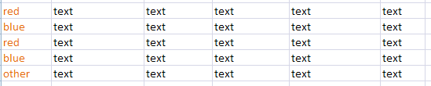

When the first column says "red" we want everything to the right of it to turn red.  If is says "blue" then we want all the text to the right of it to turn blue, and if it's something else, to simply ignore it.

1. Select all the columns that you want affected by this conditional formatting rule
2. Under Conditional Formatting, select New.   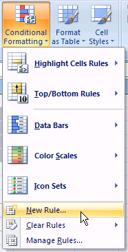
3. Select "Use a formula to determine which cells to format".  then, since we will want to color a row red if the the first column (column "A") contains "red", then we enter in the field "Format values where this formula is true:"  `=($A1="red")`   and then select "Format" to modify the selected rows to a new format.  (Note: even though the formula says "A1", it really starts at A1 (since the highlighted area starts at row 1.)  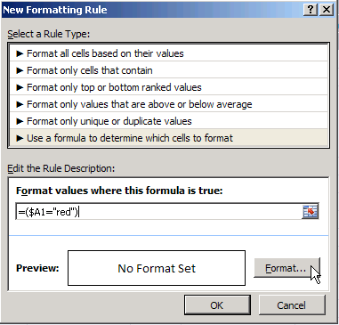
4. Set the formatting pattern you want for this match.  In this case, we want the color of the font to be red.  Then ok out of everything and replete this process for the "blue" text.   

The result of the red change will create the following:

## Using SUMIFS
Say you want to only sum totals in a column, if the numbers are part of a specific group.  In this example, we want to sum al the different servers based on what tier they are in.  So for column "D", sum rows 3-4 for tier1, rows 5-6 for tier2, etc...

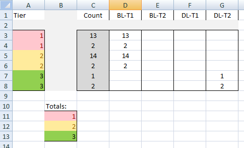

This gets really easy with the "SUMIF" formula.  The sum_range is row "D", the row you want to sum, the criteria_range1 is the row you want to compute some logic on (needs to be the exact same size as sum range), and the criteria1 is what you want the criteria_range to equal to sum that range.

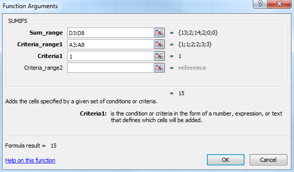

## Hide Page Breaks:
Your spreadsheet might get ugly as excel adds dashes in the sheet to show where the pagebreaks are located.  If you want to hide this, under "File", "Options", select the "Advanced" tab, and navigate down to the "show page breaks" check box.  Un-checking it will clear up your page. 

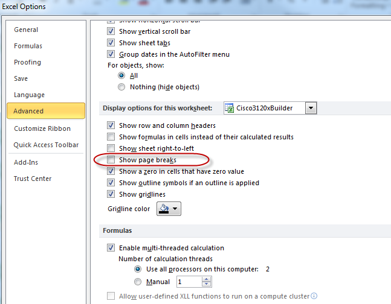

## Fixing Cells that show Formulas rather then values:
Sometimes cells in your spreadsheet get goofed up, and rather then showing the value of the cell, they show the formula.  

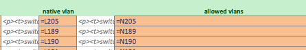

To fix this, simply do the following:
1. set the cell format to general (not text)
2. select the cell, press [F2] and [enter] or (click inside the formula bar and press [enter])

## Repeating "Format Painter" 
You can simply copy styles from once cell(1), and make a new cell(2) use the same formatting.  cell

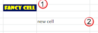

To do this, select the cell you like(1), then select the format printer icon(2), and then select the new cell that you would like to format(3)

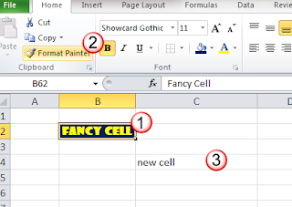

If you want to format multiple cells, when you select the format printer icon(2), click it twice. 

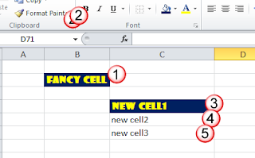

## Adding leading zeros using the TEXT formula
If you need to add leading zero's to a normal cell, you can easily do this with the "custom" cell format option. 

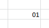

In the "Home" ribbon, select "More Number Formats..."

Then select "Custom" and in the Type field enter zero's for each significant digit you want to denote.  

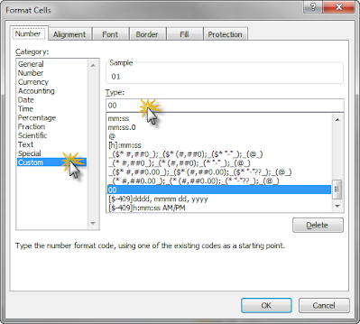

But this will not work if you need to concatenate some letters and numbers together.  

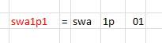 
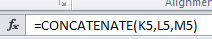 

In the example above, we use the concatenate function to combine the three cells, but since the last cell (M5) has a leading zero added by the custom number format, it will not add it to the output of the formula.  

To solve this, we use the TEXT() function within the Concatenate function.

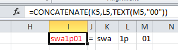

The TEXT function help window looks as such: 

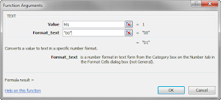