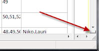
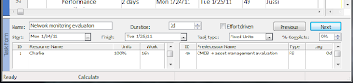
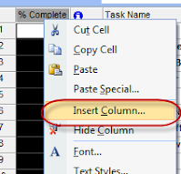
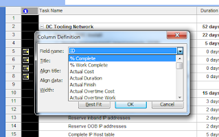

# MSProject

## Viewing the Task Form:
At the bottom of the project window is the Task Form.  Its a quickie window that shows you the details of the task that you have highlighted. 

To view it, simply click on the page divider at the bottom right of the page.

This will pull up the window.   Clicking on the page divider again, will hide the task form.

## Add % Complete Column:
Right click a column, and select "Insert Column"

Then in the Column Definition window, select the "% Complete" field.

