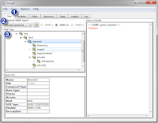

# snmpB

snmpB is a "windowed" snmp browser.  Its open sourced, and will run on BOTH windows and Unix. 


## Download and Install: 
The application can be downloaded here: 
http://sourceforge.net/projects/snmpb/

## SNMP Walk an object
Go to the (1) Discovery tab, and then select the (2) toolbar button


Then in the left most window, right click and select New Agent Profile. Then to the left, in the new properties page, enter the name and IP address of the new device you would like to check. 


Once the new object has been created, select the triangle beside its title in the left window.  Then select the snmpv1/v2c properties page and enter in the Read Community string (the snmp password).  Finally, select the OK button to save your work.  


Then again from the Discovery tab, make sure that (1) the item you want to monitor is selected, and then press the (2) Discover button.  


To view the content of the tree, select the (1) Tree tab, (2) make sure your item is selected, and and scroll down the (3) MIB Tree: 




## Add SNMP MIBs for other vendors
Each vendor has it's own section of the snmp tree. It has the OID name/number: 
- `iso.org.dod.internet.private.enterprises.{companyname}`
- `1.3.6.1.4.1.{companynumber}`

If you want to understand what your products [OID numbers](http://en.wikipedia.org/wiki/Object_identifier) are, you will need to download their [MIB file](http://en.wikipedia.org/wiki/Management_information_base) (which define what each value is).  You will need to first figure out where to get the MIB files from the vendors.  Once you have them, you simply copy them to the correct directory in snmpB, and then add them within the app.  Then they will will show up whenever you do an snmp discovery.  Remember, all the vendor specific SNMP MIB information will be within the "enterprise" section of the OID (listed above).

## Add MIB file to snmpB
Once you grab the MIBs from the vendor, you will need to copy/move those files into the "mibs" directory within snmpB.  

For example, in windows, I installed SnmpB within the following path: 
```
C:\Program Files (x86)\SnmpB
```
and the mibs directory is: 
```
C:\Program Files (x86)\SnmpB\mibs
```
Take all the MIB files and put them there.  

## Enable MIB file
To reduce the needed memory, and to make things look a lot cleaner, not all the MIBs in the mibs directory are shown when you do a system discovery.  You need to enable them within SnmpB.  

To do this, under the (1) Modules tab, select the MIBs you want to walk in the (2) Available MIB modules section, and then select the (3) arrow button to enable them


## References: 
- [snmp](http://net.cmed.us/Home/unixlinux/snmp) - Unix: Using snmpwalk and snmpget
