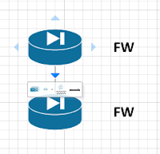
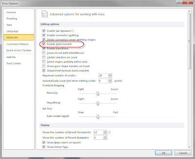
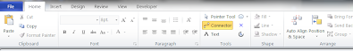
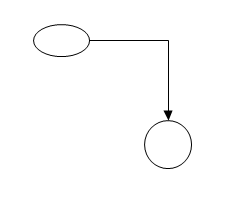
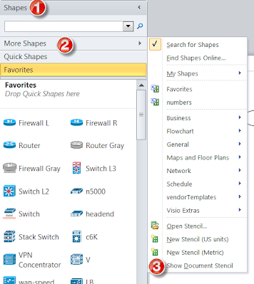
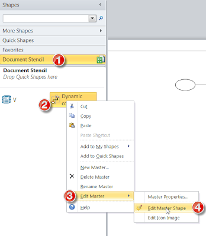
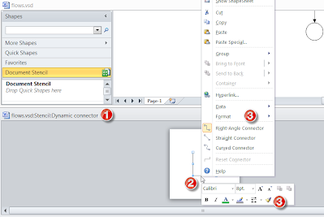
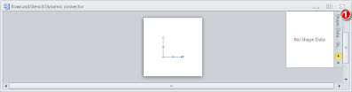
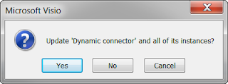
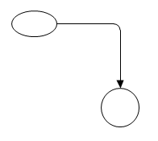

# visio2010

## Auto-connect:

You can easily disable this annoyance by going to Visio :: File :: Option :: Advanced :: Enable AutoConnect

## Modifying Connector Styles: 
You want to change the default format for the connector tool: 

once you have already used the connector in a drawing, 

Then under your shapes window, select "more shapes" and then "show document stencil" 

Then under the new "Document Stencil" section that shows up, right click on the "dynamic connector" icon, select "edit master" and then "edit Master Shape".  

In the new editor that appears, right click on the object, and modify it as you would any other object in visio. 

When you have finished, close the "dynamic connector" window by clicking on the "X" in the upper right corner, 

Then save the change

And you will see the drawing updated.  

