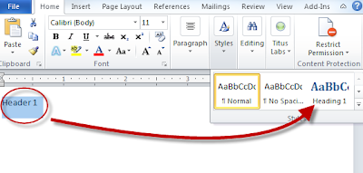
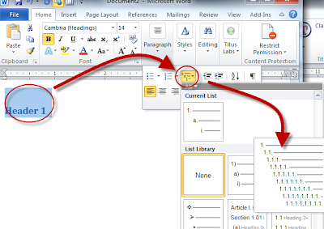
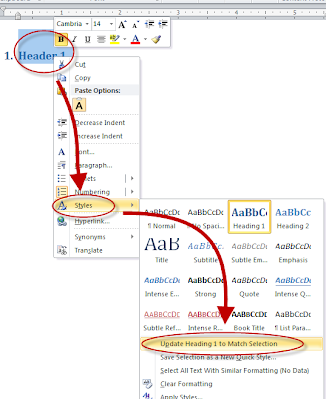
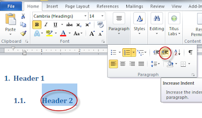
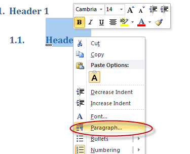
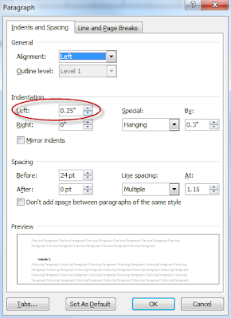
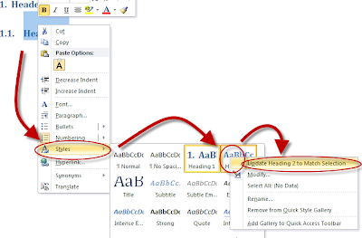

# Word

Adding Numbers to Headings:
Select the header you want, and change the style to "Heading 1"

Then change the selected text to nested, numbered bullets.

Then save the modified style as the new format for the "Heading 1" style.

Create your second level header, but apply the "h1" setting to it. 

Then increase the indent to it.  This will create "1.1" numbering scheme. 

To remove the indent, right click on the selected text, and select the "paragraph.." option. 

And then modify the "left" field to "0.0"

You can also make other formatting changes, like change the font size, color, etc.

Then save the changes as the new "Heading 2" by right clicking on the text, selecting Styles, then right clicking on Heading 2, and selecting "update heading 2 to match selection".

