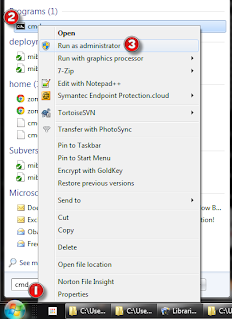

# File Ownership Issues
Three step process for getting ownership back from the migration/Cygwin mess...

(1) 
Open up a windows shell with "administrator" privileges by searching for the cmd prompt(1) then right clicking on the cmd prompt(2) and then selecting Run as administrator(3)




(2) 
From the shell take ownership of the directories with the `takeown command takeown /F {dir} /R`:
```
c:\Users\chuck>takeown /F Pictures /R
SUCCESS: The file (or folder): "c:\Users\chuck\Pictures\Videos\2011-01\20110130_001.mp4" now owned by user "CORP-AD\chuck".

SUCCESS: The file (or folder): "c:\Users\chuck\Pictures\Videos\2011-02\20110211_005.mp4" now owned by user "CORP-AD\chuck".
```

(3)
It will leave all the files with no user rights, so you need to fix this with the command `Icacls {dir} /T /inheritance:e`

```
c:\Users\chuck>Icacls * /T /inheritance:e
processed file: cisco1.vss
processed file: cisco2.vss
processed file: cisco3.vss
processed file: cisco4.vss
processed file: cisco5.vss
```
