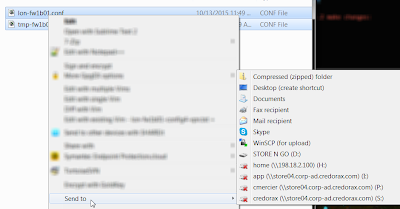
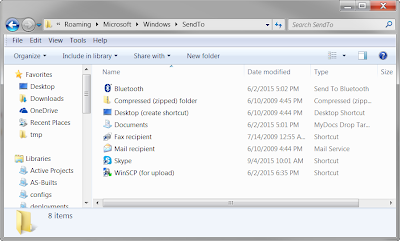

# Send To

## Overview: 
You might want to add items into your send-to directory.  



## How To
To do this, all you need to do is open up a explorer window, and enter in the following: 
```
shell:sendto
```

That will bring up the folder that contains everything that will be in the sendto pull-down.  




Simply add or remove what you want and it will show up there.  