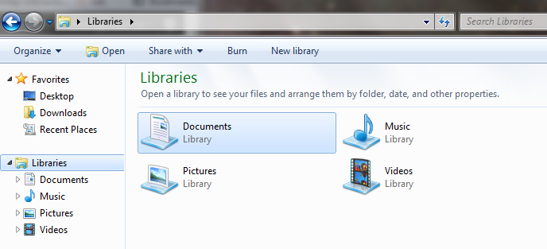
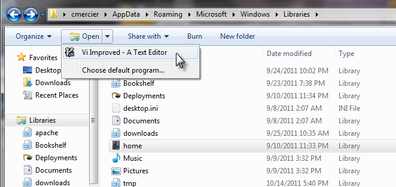

# Win7-Libraries

## Overview:
The following shows how to change the icons for Windows 7 Library items.



## Making a Change:

Go to the following directory:
```
C:\Users\(User Name)\AppData\Roaming\Microsoft\Windows\Libraries
```

Edit the library file in a text editor



Add/modify the xml tag with the path and filename to the new icon
```
<?xml version="1.0" encoding="UTF-8"?>
<libraryDescription xmlns="http://schemas.microsoft.com/windows/2009/library">
  <iconReference>C:\Users\cmercier\Documents\fun\icon\Cycle.ico</iconReference>
```

