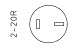
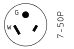
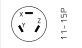
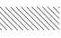
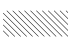
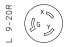
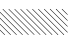
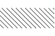
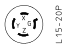

<h2>NEMA Configurations for Straight Blade Plugs and Receptacles</h2>

<table border="1" cellpadding="0" cellspacing="0">
<tbody>
<tr>
<td align="center" colspan="2" rowspan="2"><b>Description</b></td>
<td align="center" rowspan="2"><b>NEMA #</b></td>
<td align="center" colspan="2"><b>15 Ampere</b></td>
<td align="center" colspan="2"><b>20 Ampere</b></td>
<td align="center" colspan="2"><b>30 Ampere</b></td>
<td align="center" colspan="2"><b>50 Ampere</b></td>
<td align="center" colspan="2"><b>60 Ampere</b></td>
</tr>

<tr>
<td align="center"><b>Receptacle</b></td>
<td align="center"><b>Plug</b></td>
<td align="center"><b>Receptacle</b></td>
<td align="center"><b>Plug</b></td>
<td align="center"><b>Receptacle</b></td>
<td align="center"><b>Plug</b></td>
<td align="center"><b>Receptacle</b></td>
<td align="center"><b>Plug</b></td>
<td align="center"><b>Receptacle</b></td>
<td align="center"><b>Plug</b></td>
</tr>

<tr>
<td rowspan="4">2-pole 2-wire</td>
<td>125V</td>
<td><a name="1">1</a></td>
<td></td>
<td></td>
<td></td>
<td></td>
<td></td>
<td></td>
<td></td>
<td></td>
<td></td>
<td></td>
</tr>

<tr>
<td>250V</td>
<td><a name="2">2</a></td>
<td></td>
<td></td>
<td></td>
<td></td>
<td></td>
<td></td>
<td></td>
<td></td>
<td></td>
<td></td>
</tr>

<tr>
<td>277V AC</td>
<td><a name="3">3</a></td>
<td></td>
<td></td>
<td></td>
<td></td>
<td></td>
<td></td>
<td></td>
<td></td>
<td></td>
<td></td>
</tr>

<tr>
<td>600V</td>
<td><a name="4">4</a></td>
<td></td>
<td></td>
<td></td>
<td></td>
<td></td>
<td></td>
<td></td>
<td></td>
<td></td>
<td></td>
</tr>

<tr>
<td rowspan="8">2-pole 3-wire grounding</td>
<td>125V</td>
<td><a name="5">5</a></td>
<td></td>
<td></td>
<td></td>
<td></td>
<td></td>
<td></td>
<td></td>
<td></td>
<td></td>
<td></td>
</tr>

<tr>
<td>125V</td>
<td><a name="5alt">5alt</a></td>
<td></td>
<td></td>
<td></td>
<td></td>
<td></td>
<td></td>
<td></td>
<td></td>
<td></td>
<td></td>
</tr>

<tr>
<td>250V</td>
<td><a name="6">6</a></td>
<td></td>
<td></td>
<td></td>
<td></td>
<td></td>
<td></td>
<td></td>
<td></td>
<td></td>
<td></td>
</tr>

<tr>
<td>250V</td>
<td><a name="6alt">6alt</a></td>
<td></td>
<td></td>
<td></td>
<td></td>
<td></td>
<td></td>
<td></td>
<td></td>
<td></td>
<td></td>
</tr>

<tr>
<td>277V AC</td>
<td><a name="7">7</a></td>
<td></td>
<td></td>
<td></td>
<td></td>
<td></td>
<td></td>
<td></td>
<td></td>
<td></td>
<td></td>
</tr>

<tr>
<td>347V AC</td>
<td><a name="24">24</a></td>
<td></td>
<td></td>
<td></td>
<td></td>
<td></td>
<td></td>
<td></td>
<td></td>
<td></td>
<td></td>
</tr>

<tr>
<td>480V AC</td>
<td><a name="8">8</a></td>
<td></td>
<td></td>
<td></td>
<td></td>
<td></td>
<td></td>
<td></td>
<td></td>
<td></td>
<td></td>
</tr>

<tr>
<td>600V AC</td>
<td><a name="9">9</a></td>
<td></td>
<td></td>
<td></td>
<td></td>
<td></td>
<td></td>
<td></td>
<td></td>
<td></td>
<td></td>
</tr>

<tr>
<td rowspan="4">3-pole 3-wire</td>
<td>125 / 250V</td>
<td><a name="10">10</a></td>
<td></td>
<td></td>
<td></td>
<td></td>
<td></td>
<td></td>
<td></td>
<td></td>
<td></td>
<td></td>
</tr>

<tr>
<td>3 Ø 250V</td>
<td><a name="11">11</a></td>
<td></td>
<td></td>
<td></td>
<td></td>
<td></td>
<td></td>
<td></td>
<td></td>
<td></td>
<td></td>
</tr>

<tr>
<td>3 Ø 480V</td>
<td><a name="12">12</a></td>
<td></td>
<td></td>
<td></td>
<td></td>
<td></td>
<td></td>
<td></td>
<td></td>
<td></td>
<td></td>
</tr>

<tr>
<td>3 Ø 600V</td>
<td><a name="13">13</a></td>
<td></td>
<td></td>
<td></td>
<td></td>
<td></td>
<td></td>
<td></td>
<td></td>
<td></td>
<td></td>
</tr>

<tr>
<td rowspan="4">3-pole 4-wire grounding</td>
<td>125 / 250V</td>
<td><a name="14">14</a></td>
<td></td>
<td></td>
<td></td>
<td></td>
<td></td>
<td></td>
<td></td>
<td></td>
<td></td>
<td></td>
</tr>

<tr>
<td>3 Ø 250V</td>
<td><a name="15">15</a></td>
<td></td>
<td></td>
<td></td>
<td></td>
<td></td>
<td></td>
<td></td>
<td></td>
<td></td>
<td></td>
</tr>

<tr>
<td>3 Ø 480V</td>
<td><a name="16">16</a></td>
<td></td>
<td></td>
<td></td>
<td></td>
<td></td>
<td></td>
<td></td>
<td></td>
<td></td>
<td></td>
</tr>

<tr>
<td>3 Ø 600V</td>
<td><a name="17">17</a></td>
<td></td>
<td></td>
<td></td>
<td></td>
<td></td>
<td></td>
<td></td>
<td></td>
<td></td>
<td></td>
</tr>

<tr>
<td rowspan="3">4-pole 4-wire</td>
<td>3 Ø Y 120 / 208V</td>
<td><a name="18">18</a></td>
<td></td>
<td></td>
<td></td>
<td></td>
<td></td>
<td></td>
<td></td>
<td></td>
<td></td>
<td></td>
</tr>

<tr>
<td>3 Ø Y 277 / 480V</td>
<td><a name="19">19</a></td>
<td></td>
<td></td>
<td></td>
<td></td>
<td></td>
<td></td>
<td></td>
<td></td>
<td></td>
<td></td>
</tr>

<tr>
<td>3 Ø Y 347 / 600V</td>
<td><a name="20">20</a></td>
<td></td>
<td></td>
<td></td>
<td></td>
<td></td>
<td></td>
<td></td>
<td></td>
<td></td>
<td></td>
</tr>

<tr>
<td rowspan="3">4-pole 4-wire grounding</td>
<td>3 Ø Y 120 / 208V</td>
<td><a name="21">21</a></td>
<td></td>
<td></td>
<td></td>
<td></td>
<td></td>
<td></td>
<td></td>
<td></td>
<td></td>
<td></td>
</tr>

<tr>
<td>3 Ø Y 277 / 480V</td>
<td><a name="22">22</a></td>
<td></td>
<td></td>
<td></td>
<td></td>
<td></td>
<td></td>
<td></td>
<td></td>
<td></td>
<td></td>
</tr>

<tr>
<td>3 Ø Y 347 / 600V</td>
<td><a name="23">23</a></td>
<td></td>
<td></td>
<td></td>
<td></td>
<td></td>
<td></td>
<td></td>
<td></td>
<td></td>
<td></td>
</tr>

<tr>
<td align="center" colspan="2" rowspan="2"><b>Description</b></td>
<td align="center" rowspan="2"><b>NEMA #</b></td>
<td align="center"><b>Receptacle</b></td>
<td align="center"><b>Plug</b></td>
<td align="center"><b>Receptacle</b></td>
<td align="center"><b>Plug</b></td>
<td align="center"><b>Receptacle</b></td>
<td align="center"><b>Plug</b></td>
<td align="center"><b>Receptacle</b></td>
<td align="center"><b>Plug</b></td>
<td align="center"><b>Receptacle</b></td>
<td align="center"><b>Plug</b></td>
</tr>

<tr>
<td align="center" colspan="2"><b>15 Ampere</b></td>
<td align="center" colspan="2"><b>20 Ampere</b></td>
<td align="center" colspan="2"><b>30 Ampere</b></td>
<td align="center" colspan="2"><b>50 Ampere</b></td>
<td align="center" colspan="2"><b>60 Ampere</b></td>
</tr>

</tbody>
</table>

</blockquote>

 

<h2>NEMA Configuration for Locking Plugs and Receptacles</h2>
<blockquote>

<table border="1" cellpadding="0" cellspacing="0">

<tbody>
<tr>
<td align="center" colspan="2" rowspan="2"><b>Description</b></td>
<td align="center" rowspan="2"><b>NEMA #</b></td>
<td align="center" colspan="2"><b>15 Ampere</b></td>
<td align="center" colspan="2"><b>20 Ampere</b></td>
<td align="center" colspan="2"><b>30 Ampere</b></td>
<td align="center" colspan="2"><b>50 Ampere</b></td>
<td align="center" colspan="2"><b>60 Ampere</b></td>
</tr>

<tr>
<td align="center"><b>Receptacle</b></td>
<td align="center"><b>Plug</b></td>
<td align="center"><b>Receptacle</b></td>
<td align="center"><b>Plug</b></td>
<td align="center"><b>Receptacle</b></td>
<td align="center"><b>Plug</b></td>
<td align="center"><b>Receptacle</b></td>
<td align="center"><b>Plug</b></td>
<td align="center"><b>Receptacle</b></td>
<td align="center"><b>Plug</b></td>
</tr>

<tr>
<td rowspan="4">2-pole 2-wire</td>
<td>125V</td>
<td><a name="L1">L1</a></td>
<td></td>
<td></td>
<td></td>
<td></td>
<td></td>
<td></td>
<td></td>
<td></td>
<td></td>
<td></td>
</tr>

<tr>
<td>250V</td>
<td><a name="L2">L2</a></td>
<td></td>
<td></td>
<td></td>
<td></td>
<td></td>
<td></td>
<td></td>
<td></td>
<td></td>
<td></td>
</tr>

<tr>
<td>277V AC</td>
<td><a name="L3">L3</a></td>
<td></td>
<td></td>
<td></td>
<td></td>
<td></td>
<td></td>
<td></td>
<td></td>
<td></td>
<td></td>
</tr>

<tr>
<td>600V</td>
<td><a name="L4">L4</a></td>
<td></td>
<td></td>
<td></td>
<td></td>
<td></td>
<td></td>
<td></td>
<td></td>
<td></td>
<td></td>
</tr>

<tr>
<td rowspan="6">2-pole 3-wire grounded</td>
<td>125V</td>
<td><a name="L5">L5</a></td>
<td></td>
<td></td>
<td></td>
<td></td>
<td></td>
<td></td>
<td></td>
<td></td>
<td></td>
<td></td>
</tr>

<tr>
<td>250V</td>
<td><a name="L6">L6</a></td>
<td></td>
<td></td>
<td></td>
<td></td>
<td></td>
<td></td>
<td></td>
<td></td>
<td></td>
<td></td>
</tr>

<tr>
<td>277V AC</td>
<td><a name="L7">L7</a></td>
<td></td>
<td></td>
<td></td>
<td></td>
<td></td>
<td></td>
<td></td>
<td></td>
<td></td>
<td></td>
</tr>

<tr>
<td>347V AC</td>
<td><a name="L24">L24</a></td>
<td></td>
<td></td>
<td></td>
<td></td>
<td></td>
<td></td>
<td></td>
<td></td>
<td></td>
<td></td>
</tr>

<tr>
<td>480V AC</td>
<td><a name="L8">L8</a></td>
<td></td>
<td></td>
<td></td>
<td></td>
<td></td>
<td></td>
<td></td>
<td></td>
<td></td>
<td></td>
</tr>

<tr>
<td>600V AC</td>
<td><a name="L9">L9</a></td>
<td></td>
<td></td>
<td></td>
<td></td>
<td></td>
<td></td>
<td></td>
<td></td>
<td></td>
<td></td>
</tr>

<tr>
<td rowspan="4">3-pole 3-wire</td>
<td>125 / 250V</td>
<td><a name="L10">L10</a></td>
<td></td>
<td></td>
<td></td>
<td></td>
<td></td>
<td></td>
<td></td>
<td></td>
<td></td>
<td></td>
</tr>

<tr>
<td>3 Ø 250V</td>
<td><a name="L11">L11</a></td>
<td></td>
<td></td>
<td></td>
<td></td>
<td></td>
<td></td>
<td></td>
<td></td>
<td></td>
<td></td>
</tr>

<tr>
<td>3 Ø 480V</td>
<td><a name="L12">L12</a></td>
<td></td>
<td></td>
<td></td>
<td></td>
<td></td>
<td></td>
<td></td>
<td></td>
<td></td>
<td></td>
</tr>

<tr>
<td>3 Ø 600V</td>
<td><a name="L13">L13</a></td>
<td></td>
<td></td>
<td></td>
<td></td>
<td></td>
<td></td>
<td></td>
<td></td>
<td></td>
<td></td>
</tr>

<tr>
<td rowspan="4">3-pole 4-wrie grounding</td>
<td>125 / 250V</td>
<td><a name="L14">L14</a></td>
<td></td>
<td></td>
<td></td>
<td></td>
<td></td>
<td></td>
<td></td>
<td></td>
<td></td>
<td></td>
</tr>

<tr>
<td>3 Ø 250V</td>
<td><a name="L15">L15</a></td>
<td></td>
<td></td>
<td></td>
<td></td>
<td></td>
<td></td>
<td></td>
<td></td>
<td></td>
<td></td>
</tr>

<tr>
<td>3 Ø 480V</td>
<td><a name="L16">L16</a></td>
<td></td>
<td></td>
<td></td>
<td></td>
<td></td>
<td></td>
<td></td>
<td></td>
<td></td>
<td></td>
</tr>

<tr>
<td>3 Ø 600V</td>
<td><a name="L17">L17</a></td>
<td></td>
<td></td>
<td></td>
<td></td>
<td></td>
<td></td>
<td></td>
<td></td>
<td></td>
<td></td>
</tr>

<tr>
<td rowspan="3">4-pole 4-wire</td>
<td>3 Ø Y 120 / 208V</td>
<td><a name="L18">L18</a></td>
<td></td>
<td></td>
<td></td>
<td></td>
<td></td>
<td></td>
<td></td>
<td></td>
<td></td>
<td></td>
</tr>

<tr>
<td>3 Ø Y 277 / 480V</td>
<td><a name="L19">L19</a></td>
<td></td>
<td></td>
<td></td>
<td></td>
<td></td>
<td></td>
<td></td>
<td></td>
<td></td>
<td></td>
</tr>

<tr>
<td>3 Ø Y 347 / 600V</td>
<td><a name="L20">L20</a></td>
<td></td>
<td></td>
<td></td>
<td></td>
<td></td>
<td></td>
<td></td>
<td></td>
<td></td>
<td></td>
</tr>

<tr>
<td rowspan="3">4-pole 4-wire grounding</td>
<td>3 Ø Y 120 / 208V</td>
<td><a name="L21">L21</a></td>
<td></td>
<td></td>
<td></td>
<td></td>
<td></td>
<td></td>
<td></td>
<td></td>
<td></td>
<td></td>
</tr>

<tr>
<td>3 Ø Y 277 / 480V</td>
<td><a name="L22">L22</a></td>
<td></td>
<td></td>
<td></td>
<td></td>
<td></td>
<td></td>
<td></td>
<td></td>
<td></td>
<td></td>
</tr>

<tr>
<td>3 Ø Y 347 / 600V</td>
<td><a name="L23">L23</a></td>
<td></td>
<td></td>
<td></td>
<td></td>
<td></td>
<td></td>
<td></td>
<td></td>
<td></td>
<td></td>
</tr>

<tr>
<td align="center" colspan="2" rowspan="2"><b>Description</b></td>
<td align="center" rowspan="2"><b>NEMA #</b></td>
<td align="center"><b>Receptacle</b></td>
<td align="center"><b>Plug</b></td>
<td align="center"><b>Receptacle</b></td>
<td align="center"><b>Plug</b></td>
<td align="center"><b>Receptacle</b></td>
<td align="center"><b>Plug</b></td>
<td align="center"><b>Receptacle</b></td>
<td align="center"><b>Plug</b></td>
<td align="center"><b>Receptacle</b></td>
<td align="center"><b>Plug</b></td>
</tr>

<tr>
<td align="center" colspan="2"><b>15 Ampere</b></td>
<td align="center" colspan="2"><b>20 Ampere</b></td>
<td align="center" colspan="2"><b>30 Ampere</b></td>
<td align="center" colspan="2"><b>50 Ampere</b></td>
<td align="center" colspan="2"><b>60 Ampere</b></td>
</tr>
</tbody>
</table>

</blockquote>

<h2>NEMA Configurations for Specific Purpose Plugs and Receptacles</h2>
<blockquote>

<table border="1" cellpadding="0" cellspacing="0">

<tbody>
<tr>
<td align="center" colspan="2" rowspan="2"><b>Description</b></td>
<td align="center" rowspan="2"><b>NEMA #</b></td>
<td align="center" colspan="2"><b>15 Ampere</b></td>
<td align="center" colspan="2"><b>20 Ampere</b></td>
<td align="center" colspan="2"><b>30 Ampere</b></td>
<td align="center" colspan="2"><b>50 Ampere</b></td>
<td align="center" colspan="2"><b>60 Ampere</b></td>
</tr>

<tr>
<td align="center"><b>Receptacle</b></td>
<td align="center"><b>Plug</b></td>
<td align="center"><b>Receptacle</b></td>
<td align="center"><b>Plug</b></td>
<td align="center"><b>Receptacle</b></td>
<td align="center"><b>Plug</b></td>
<td align="center"><b>Receptacle</b></td>
<td align="center"><b>Plug</b></td>
<td align="center"><b>Receptacle</b></td>
<td align="center"><b>Plug</b></td>
</tr>

<tr>
<td rowspan="3">Midget Locking</td>
<td>125V, 2 Pole, 2 Wire</td>
<td><a name="ML1">ML1</a></td>
<td></td>
<td></td>
<td></td>
<td></td>
<td></td>
<td></td>
<td></td>
<td></td>
<td></td>
<td></td>
</tr>

<tr>
<td>125V, 2 Pole, 3 Wire grounding</td>
<td><a name="ML2">ML2</a></td>
<td></td>
<td></td>
<td></td>
<td></td>
<td></td>
<td></td>
<td></td>
<td></td>
<td></td>
<td></td>
</tr>

<tr>
<td>125 / 250V, 3 Pole, 3 Wire</td>
<td><a name="ML3">ML3</a></td>
<td></td>
<td></td>
<td></td>
<td></td>
<td></td>
<td></td>
<td></td>
<td></td>
<td></td>
<td></td>
</tr>

<tr>
<td rowspan="4">FSL Configuration</td>
<td>28V DC, 2 Pole, 3 Wire Grounding</td>
<td><a name="FSL1">FSL1</a></td>
<td></td>
<td></td>
<td></td>
<td></td>
<td></td>
<td></td>
<td></td>
<td></td>
<td></td>
<td></td>
</tr>

<tr>
<td>120V, 400HZ, 2 Pole, 3 Wire Grounding</td>
<td><a name="FSL2">FSL2</a></td>
<td></td>
<td></td>
<td></td>
<td></td>
<td></td>
<td></td>
<td></td>
<td></td>
<td></td>
<td></td>
</tr>

<tr>
<td>120V, 400HZ, 3-Phase, 3 Pole, 4 Wire Grounding</td>
<td><a name="FSL3">FSL3</a></td>
<td></td>
<td></td>
<td></td>
<td></td>
<td></td>
<td></td>
<td></td>
<td></td>
<td></td>
<td></td>
</tr>

<tr>
<td>120 / 208V, 3 Ø Y, 4 Pole, 5 Wire Grounding</td>
<td><a name="FSL4">FSL4</a></td>
<td></td>
<td></td>
<td></td>
<td></td>
<td></td>
<td></td>
<td></td>
<td></td>
<td></td>
<td></td>
</tr>

<tr>
<td rowspan="2">Marine Ship-To-Shore</td>
<td>125V, 2 Pole, 3 Wire Grounding</td>
<td><a name="SS1">SS1</a></td>
<td></td>
<td></td>
<td></td>
<td></td>
<td></td>
<td></td>
<td></td>
<td></td>
<td></td>
<td></td>
</tr>

<tr>
<td>125 / 250V, 2 Pole, 4 Wire Grounding</td>
<td><a name="SS2">SS2</a></td>
<td></td>
<td></td>
<td></td>
<td></td>
<td></td>
<td></td>
<td></td>
<td></td>
<td></td>
<td></td>
</tr>

<tr>
<td rowspan="1">Travel Trailer</td>
<td>120V AC, 2 Pole, 3 Wire Grounding</td>
<td><a name="TT">TT</a></td>
<td></td>
<td></td>
<td></td>
<td></td>
<td></td>
<td></td>
<td></td>
<td></td>
<td></td>
<td></td>
</tr>

<tr>
<td align="center" colspan="2" rowspan="2"><b>Description</b></td>
<td align="center" rowspan="2"><b>NEMA #</b></td>
<td align="center"><b>Receptacle</b></td>
<td align="center"><b>Plug</b></td>
<td align="center"><b>Receptacle</b></td>
<td align="center"><b>Plug</b></td>
<td align="center"><b>Receptacle</b></td>
<td align="center"><b>Plug</b></td>
<td align="center"><b>Receptacle</b></td>
<td align="center"><b>Plug</b></td>
<td align="center"><b>Receptacle</b></td>
<td align="center"><b>Plug</b></td>
</tr>

<tr>
<td align="center" colspan="2"><b>15 Ampere</b></td>
<td align="center" colspan="2"><b>20 Ampere</b></td>
<td align="center" colspan="2"><b>30 Ampere</b></td>
<td align="center" colspan="2"><b>50 Ampere</b></td>
<td align="center" colspan="2"><b>60 Ampere</b></td>
</tr>
</tbody>
</table>
</blockquote>
