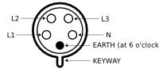

# Commando (IEC 60309)

## Code: 
- P = power, 
- N = neutral, 
- E = earth or ground

So a P+N+E cable would have one pin with power (1 phase), one with neutral, and a ground.
and a 3P+N+E cable would have three powered pins (3 phase) with a neutral and ground.  

## Color Coding Based on Voltage (not power)
The color code is based on the voltage and possibly the frequency (Hz) of the power going over the cable.  The diameter of the plug is for the amps running over the plug.  

<table border="1" style="margin-top:1em;margin-bottom:1em;background-color:rgb(249,249,249);border:1px solid rgb(170,170,170);border-collapse:collapse;font-family:sans-serif;line-height:19.1875px">
<tbody>
<tr>
<th style="border:1px solid rgb(170,170,170);padding:0.2em;background-color:rgb(242,242,242);text-align:center">Voltage range</th>
<th style="border:1px solid rgb(170,170,170);padding:0.2em;background-color:rgb(242,242,242);text-align:center">Frequency range</th>
<th style="border:1px solid rgb(170,170,170);padding:0.2em;background-color:rgb(242,242,242);text-align:center">Colour code</th>
</tr>
<tr>
<td style="border:1px solid rgb(170,170,170);padding:0.2em;text-align:center">20–25 V</td>
<td style="border:1px solid rgb(170,170,170);padding:0.2em;text-align:center">50/60&nbsp;Hz</td>
<td style="border:1px solid rgb(170,170,170);padding:0px 2em;background-color:purple;color:white;background-repeat:initial initial">Purple</td>
</tr>
<tr>
<td style="border:1px solid rgb(170,170,170);padding:0.2em;text-align:center">40–50 V</td>
<td style="border:1px solid rgb(170,170,170);padding:0.2em;text-align:center">50/60&nbsp;Hz</td>
<td style="border:1px solid rgb(170,170,170);padding:0px 2em;background-color:white">White</td>
</tr>
<tr>
<td style="border:1px solid rgb(170,170,170);padding:0.2em;text-align:center"><b>100–130 V</b></td>
<td style="border:1px solid rgb(170,170,170);padding:0.2em;text-align:center"><b>50/60&nbsp;Hz</b></td>
<td style="border:1px solid rgb(170,170,170);padding:0px 2em;background-color:yellow"><b>Yellow</b></td>
</tr>
<tr>
<td style="border:1px solid rgb(170,170,170);padding:0.2em;text-align:center"><b>200–250 V</b></td>
<td style="border:1px solid rgb(170,170,170);padding:0.2em;text-align:center"><b>50/60&nbsp;Hz</b></td>
<td style="border:1px solid rgb(170,170,170);padding:0px 2em;background-color:blue;color:white;background-repeat:initial initial"><b>Blue</b></td>
</tr>
<tr>
<td style="border:1px solid rgb(170,170,170);padding:0.2em;text-align:center"><b>380–480 V</b></td>
<td style="border:1px solid rgb(170,170,170);padding:0.2em;text-align:center"><b>50/60&nbsp;Hz</b></td>
<td style="border:1px solid rgb(170,170,170);padding:0px 2em;background-color:red;color:white;background-repeat:initial initial"><b>Red</b></td>
</tr>
<tr>
<td style="border:1px solid rgb(170,170,170);padding:0.2em;text-align:center">500–690 V</td>
<td style="border:1px solid rgb(170,170,170);padding:0.2em;text-align:center">50/60&nbsp;Hz</td>
<td style="border:1px solid rgb(170,170,170);padding:0px 2em;background-color:black;color:white;background-repeat:initial initial">Black</td>
</tr>
<tr>
<td style="border:1px solid rgb(170,170,170);padding:0.2em;text-align:center">-</td>
<td style="border:1px solid rgb(170,170,170);padding:0.2em;text-align:center">&gt;60–500 Hz</td>
<td style="border:1px solid rgb(170,170,170);padding:0px 2em;background-color:green;color:white;background-repeat:initial initial">Green</td>
</tr>
<tr>
<td colspan="2" style="border:1px solid rgb(170,170,170);padding:0.2em;text-align:center">None of the above</td>
<td style="border:1px solid rgb(170,170,170);padding:0px 2em;background-color:rgb(128,128,128);color:white;background-repeat:initial initial">Grey</td>
</tr>
</tbody>
</table>

## Pin Out Logic: 
The location of the ground pin to the "key-way" helps set what kind of VA's the plug can handle.  

| Image | Pin Locations | Power |
|--|--|--|
 |2P+E (4 o'clock)	|100-130 VAC
 |2P+E (6 o'clock)	|200-250 VAC
 |3P+E (6 o'clock)	|380-415 VAC
 |3P+N+E (6 o'clock)	|347/600 

<table style="margin-top:1em;margin-bottom:1em;background-color:rgb(249,249,249);border:1px solid rgb(170,170,170);border-collapse:collapse;font-family:sans-serif;line-height:19.1875px">
<tbody>
<tr>
<th rowspan="2" style="border:1px solid rgb(170,170,170);padding:0.2em;background-color:rgb(242,242,242);text-align:center">Ground pin 
location</th>
<th colspan="3" style="border:1px solid rgb(170,170,170);padding:0.2em;background-color:rgb(242,242,242);text-align:center">Pin configuration (P: power, N: neutral, E: earth or ground)</th>
</tr>
<tr>
<th style="border:1px solid rgb(170,170,170);padding:0.2em;background-color:rgb(242,242,242);text-align:center">P+N+E, 2P+E</th>
<th style="border:1px solid rgb(170,170,170);padding:0.2em;background-color:rgb(242,242,242);text-align:center">3P+E</th>
<th style="border:1px solid rgb(170,170,170);padding:0.2em;background-color:rgb(242,242,242);text-align:center">3P+N+E</th>
</tr>
<tr>
<th style="border:1px solid rgb(170,170,170);padding:0.2em;background-color:rgb(242,242,242);text-align:center">60° / 2h (2 o'clock)</th>
<td style="border:1px solid rgb(170,170,170);padding:0.2em;background-color:rgb(0,100,0);color:white;background-repeat:initial initial">&gt;50&nbsp;V 300–500&nbsp;Hz green housing</td>
<td style="border:1px solid rgb(170,170,170);padding:0.2em;background-color:rgb(0,100,0);color:white;background-repeat:initial initial">&gt;50 V 300–500&nbsp;Hz green housing</td>
<td style="border:1px solid rgb(170,170,170);padding:0.2em;background-color:rgb(0,100,0);color:white;background-repeat:initial initial">&gt;50 V 300–500&nbsp;Hz green housing</td>
</tr>
<tr>
<th style="border:1px solid rgb(170,170,170);padding:0.2em;background-color:rgb(242,242,242);text-align:center">90° / 3h (3 o'clock)</th>
<td style="border:1px solid rgb(170,170,170);padding:0.2em">50–250&nbsp;V DC</td>
<td style="border:1px solid rgb(170,170,170);padding:0.2em">380&nbsp;V 50&nbsp;Hz 
440&nbsp;V 60&nbsp;Hz</td>
<td style="border:1px solid rgb(170,170,170);padding:0.2em">220/380&nbsp;V 50&nbsp;Hz 
250/440&nbsp;V 60&nbsp;Hz</td>
</tr>
<tr>
<th style="border:1px solid rgb(170,170,170);padding:0.2em;background-color:rgb(242,242,242);text-align:center">120° / 4h (4&nbsp;o'clock)</th>
<td style="border:1px solid rgb(170,170,170);padding:0.2em;background-color:yellow">100–130&nbsp;V AC yellow housing</td>
<td style="border:1px solid rgb(170,170,170);padding:0.2em;background-color:yellow">100–130&nbsp;V AC yellow housing</td>
<td style="border:1px solid rgb(170,170,170);padding:0.2em;background-color:yellow">57–75/100–130&nbsp;V AC yellow housing</td>
</tr>
<tr>
<th style="border:1px solid rgb(170,170,170);padding:0.2em;background-color:rgb(242,242,242);text-align:center">150° / 5h (5&nbsp;o'clock)</th>
<td style="border:1px solid rgb(170,170,170);padding:0.2em">277&nbsp;V 60&nbsp;Hz</td>
<td style="border:1px solid rgb(170,170,170);padding:0.2em;background-color:black;color:white;background-repeat:initial initial">600–690&nbsp;V AC black housing</td>
<td style="border:1px solid rgb(170,170,170);padding:0.2em;background-color:black;color:white;background-repeat:initial initial">347–400/600–690&nbsp;V AC black housing</td>
</tr>
<tr>
<th style="border:1px solid rgb(170,170,170);padding:0.2em;background-color:rgb(242,242,242);text-align:center">180° / 6h (6 o'clock)</th>
<td style="border:1px solid rgb(170,170,170);padding:0.2em;background-color:blue;color:white;background-repeat:initial initial"><b>200–250&nbsp;V AC blue housing</b></td>
<td style="border:1px solid rgb(170,170,170);padding:0.2em;background-color:red;color:white;background-repeat:initial initial">380–415&nbsp;V AC red housing</td>
<td style="border:1px solid rgb(170,170,170);padding:0.2em;background-color:red;color:white;background-repeat:initial initial"><b>200–240/346–415&nbsp;V AC red housing</b></td>
</tr>
<tr>
<th style="border:1px solid rgb(170,170,170);padding:0.2em;background-color:rgb(242,242,242);text-align:center">210° / 7h (7&nbsp;o'clock)</th>
<td style="border:1px solid rgb(170,170,170);padding:0.2em;background-color:black;color:white;background-repeat:initial initial">480–500&nbsp;V AC black housing</td>
<td style="border:1px solid rgb(170,170,170);padding:0.2em;background-color:black;color:white;background-repeat:initial initial">480–500&nbsp;V AC black housing</td>
<td style="border:1px solid rgb(170,170,170);padding:0.2em;background-color:black;color:white;background-repeat:initial initial">277–288/480–500&nbsp;V AC black housing</td>
</tr>
<tr>
<th style="border:1px solid rgb(170,170,170);padding:0.2em;background-color:rgb(242,242,242);text-align:center">240° / 8h (8&nbsp;o'clock)</th>
<td style="border:1px solid rgb(170,170,170);padding:0.2em">250&nbsp;V DC</td>
<td style="border:1px solid rgb(170,170,170);padding:0.2em"></td>
<td style="border:1px solid rgb(170,170,170);padding:0.2em"></td>
</tr>
<tr>
<th style="border:1px solid rgb(170,170,170);padding:0.2em;background-color:rgb(242,242,242);text-align:center">270° / 9h (9&nbsp;o'clock)</th>
<td style="border:1px solid rgb(170,170,170);padding:0.2em;background-color:red;color:white;background-repeat:initial initial">380–415&nbsp;V AC red housing</td>
<td style="border:1px solid rgb(170,170,170);padding:0.2em;background-color:blue;color:white;background-repeat:initial initial">200–250&nbsp;V AC blue housing</td>
<td style="border:1px solid rgb(170,170,170);padding:0.2em;background-color:blue;color:white;background-repeat:initial initial">120–144/208–250&nbsp;V AC blue housing</td>
</tr>
<tr>
<th style="border:1px solid rgb(170,170,170);padding:0.2em;background-color:rgb(242,242,242);text-align:center">300° / 10h (10&nbsp;o'clock)</th>
<td style="border:1px solid rgb(170,170,170);padding:0.2em"></td>
<td style="border:1px solid rgb(170,170,170);padding:0.2em;background-color:rgb(0,100,0);color:white;background-repeat:initial initial">&gt;50&nbsp;V, 100–300&nbsp;Hz green housing</td>
<td style="border:1px solid rgb(170,170,170);padding:0.2em"></td>
</tr>
<tr>
<th style="border:1px solid rgb(170,170,170);padding:0.2em;background-color:rgb(242,242,242);text-align:center">330° / 11h (11&nbsp;o'clock)</th>
<td style="border:1px solid rgb(170,170,170);padding:0.2em"></td>
<td style="border:1px solid rgb(170,170,170);padding:0.2em;background-color:red;color:white;background-repeat:initial initial">440–460&nbsp;V 60&nbsp;Hz red housing</td>
<td style="border:1px solid rgb(170,170,170);padding:0.2em;background-color:red;color:white;background-repeat:initial initial">250–265/440—460&nbsp;V 60&nbsp;Hz, red housing</td>
</tr>
</tbody>
</table>

You could also look at this in a clock view, where the 1h-12h (1 o'clock to 12 o'clock) location of the ground cable provides the following power outputs:  

## References: 
- [IEC_60309](http://en.wikipedia.org/wiki/IEC_60309): Wikipedia
