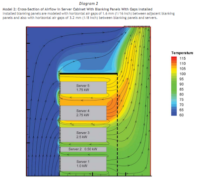
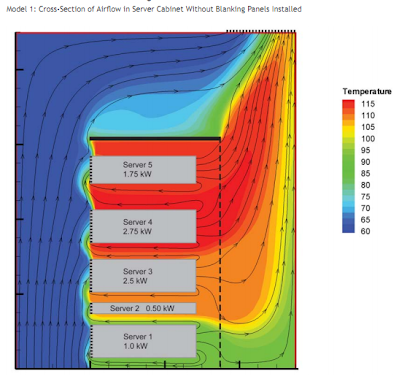
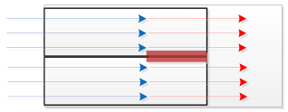
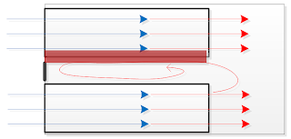

# Spacing servers in racks

## Server Spacing and Blanking Panels: 
DO NOT LEAVE SPACE BETWEEN SERVERS FOR "AIRFLOW"!!

Assuming you block front airflow, the argument over space between servers is really a convection / conduction issue, and is very minor, so lets hold on that for a second.  

The most important issue is to use front blanking panels on all your racks to block recirculating air.  You want to prevent hot air from the back of one server from blowing into the intake of the server above it.  If you have blanking panels, great!  Use them!  If not MAKE SURE YOU DO NOT LEAVE SPACES BETWEEN SERVERS!.  

The following diagrams illustrate how blanking panels can be used to reduce the overall heat in a cabinet by forcing more cold air into the servers.  They should also demonstrate how back drafts are caused when spaces are left between servers, increasing the temperature of air entering the servers.  

| Spaced servers with blanking panels | Spaced servers without blanking panels | 
|--|--|
|  |  |

If you DO have blanking panels, then the question is if there is ANY value in spacing the servers out.  There might or might not, and either way the bigger issue is the wasted cost in rack space if you space them out.  

If you stack servers, then the lower server heats the upper one with conduction which is a good method of transferring heat.   But the part of the server that is hot will be the back side, so you will only heat the bottom part of the back of the top server.  This should not change the temperature of air going over the more sensitive equipment at the front of the server.  

If you leave gaps between the servers, and you are good enough to use blanks, then you create a dead air space of very hot air directly below your upper server.  Here, heat is transferred via convection, which is a less effective method of energy transfer, but it also distributes the heat more evenly across the upper server.  The even distribution would heat more of the front of the upper server, causing its fans to run faster to pull in more cold air.  

The end result is that you would _probably_ save more money in energy if you stacked the servers rather then gaped them, but you would _definitely_ save money on your rack space costs.  

# Ref:
- [Rack Blanking Panels—To Fill or Not to Fill](http://www.dell.com/downloads/global/products/pedge/en/dell-white-paper-en.pdf):   David L. Moss, Joyce F. Ruff.  Dell Computers, 2011
- [Improving Rack Cooling  Performance Using Airflow  Management™ Blanking Panels](http://www.apcmedia.com/salestools/SADE-5TPLKQ/SADE-5TPLKQ_R4_EN.pdf): Neil Rasmussen, APC, 2011
