# con-G-RJ45(m) - RJ45(f) (Panduit Mini-Com Tx)

- [con-G-RJ45(m) - RJ45(f) (Panduit Mini-Com Tx)](#con-g-rj45m---rj45f-panduit-mini-com-tx)
  - [Overview:](#overview)
  - [What you will need:](#what-you-will-need)
  - [Cut the cable:](#cut-the-cable)
  - [Wire the Jack:](#wire-the-jack)
  - [Crimp the Cables:](#crimp-the-cables)
  - [Assemble the Jack:](#assemble-the-jack)
  - [References:](#references)

## Overview: 
These instructions will show you how to make roll over dongles with panduit mini-com jacks

## What you will need: 
- Panduit MiniCom Jack #CJ5E88TGAW
- Panduit TG termination tool #TGJT  
- Standard 1' white patch cable
- Pair of wire cutters

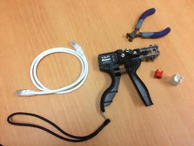

## Cut the cable: 
1.1 Take the wire cutters, and cut the white [568B patch cable](https://en.wikipedia.org/wiki/ANSI/TIA-568) in half.  Then take the wire (or possibly an internal string) and pull it such that it rips though the side of the plastic sheathing.  This will ensure that any nicks on the cable made by cutting the cable are far from the connectors on the socket that you attach later on. 

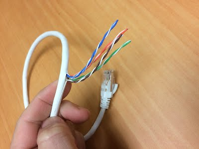

1.2 Cut away the excess sheathing on the wire.

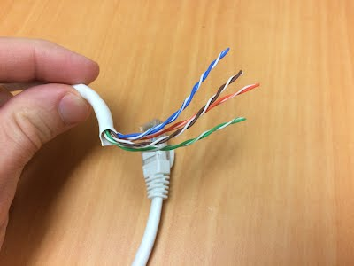

## Wire the Jack:
2.1 Since we are wiring a roll-over RS-232 dongle, ignore the labels on the side of the jack, and use the following guide for where the colored cables go.  

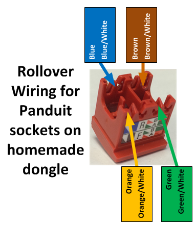

2.2 DON'T unravel the wrapped color, instead push the four colored pairs of wires into one of the four quadrants of the jack. 

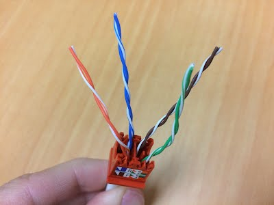

2.3 Push the cable as far in to the jack as you can, and then fasten the lock (or anchor)  down to secure the cable.  

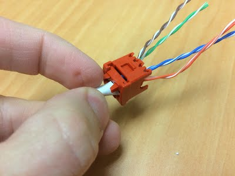

2.4 Slightly untwist the bottom of the cables enough so that you can separate the pairs enough to both fit in their own groves in the jacks.  

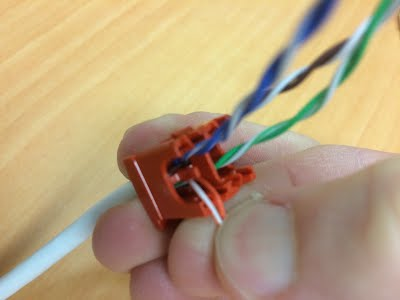

Note that the white-most wire goes to the left slot, if the jacks tab and label is facing you.

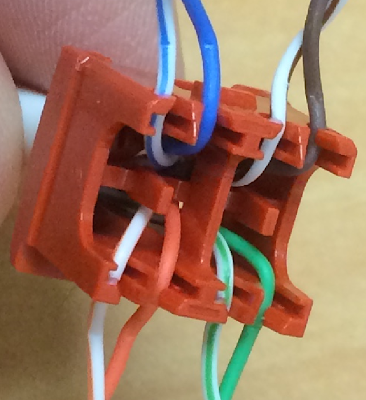

2.5 Do this for all the cables.  Notice how only the bottom of the wires were untwisted, but the rest is still wrapped up.  

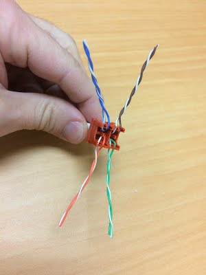

## Crimp the Cables: 

3.1 Put the jack into the termination tool,

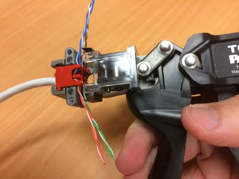

3.2 And then cut off the extra cables.  

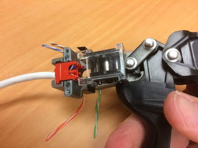

3.3 Be careful when taking the jack out of the tool.  The cables are gently held into place, and can be dislodged if you are rough with it.  

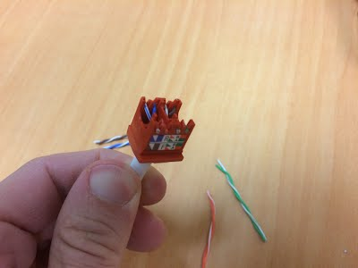

## Assemble the Jack: 

4.1 Put the receptacle side of the jack together with the component you were working with, such that the tab fits in with the locking divot.  

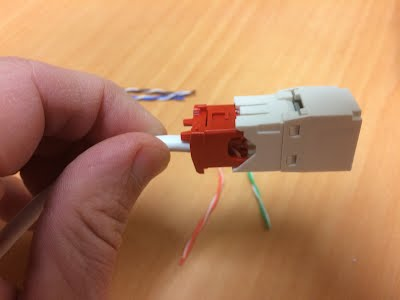

4.2 Make sure that the stopper on the termination tool is set such that the longer end is toward the front of the gun.

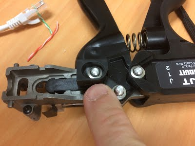

4.3 Then put the two parts of the jack in the front of the gun and lock the components together.  

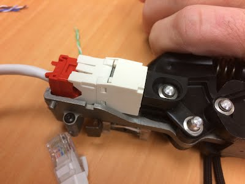

4.4 Make sure that you get the two components together tightly.  

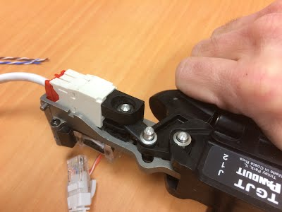

4.5 Finally, mark the jack so that you know that it is a roll-over adapter.  The circular arrow (that kind of looks like a G) is what I use to denote this.   

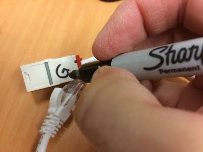

## References: 
- [Installation Document](INSTALLATIONINSTRUCTIONS.pdf): Mini-Com TX6 PLUS and TX5e UTP Jack Modules: PN403L    
- [Specification Sheet](SPECIFICATIONSHEET.pdf): Mini-Com TX5e UTP Jack Modules: COSP316--WW-ENG    