# Fiber Jacks/Plugs
- [Fiber Jacks/Plugs](#fiber-jacksplugs)
  - [Head Types](#head-types)
  - [Fiber Junction Types:](#fiber-junction-types)
  - [Fiber Diameter:](#fiber-diameter)
  - [Modes: (Wave Paths)](#modes-wave-paths)

## Head Types

<table>
<tbody>
<tr>
    <td>Avio (Avim) 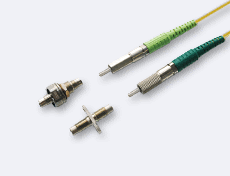</td>
    <td>ADT-UNI  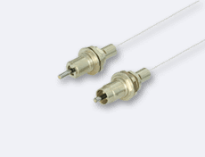</td>
    <td>Biconic 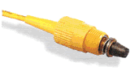</td>
    <td>D4 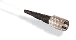</td>
    <td>Deutsch 1000 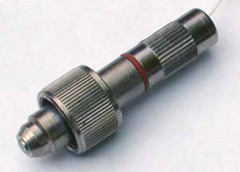</td>
</tr>
<tr>
    <td>DIN </td>
    <td>DMI </td>
    <td>E-2000 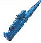</td>
    <td>E-2000-APC 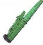</td>
    <td>EC </td>
</tr>
<tr>
    <td>ESCON </td>
    <td>F07 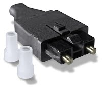</td>
    <td>F-3000 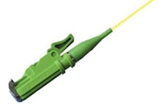</td>
    <td>FC/PC 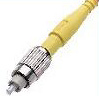</td>
    <td>FC/APC 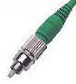</td>
</tr>
<tr>
    <td>Fibergate 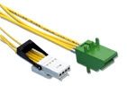</td>
    <td>FSMA 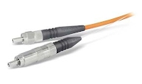</td>
    <td>LC 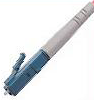</td>
    <td>LC-Duplex 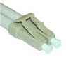</td>
    <td>ELIO 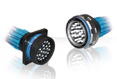</td>
</tr>
<tr>
    <td>Lucxis </td>
    <td>LX-5 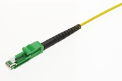</td>
    <td>MIC </td>
    <td>MTP 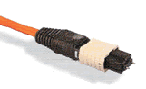</td>
    <td>MT 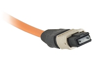</td>
</tr>
<tr>
    <td>MT-RJ 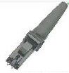</td>
    <td>MU 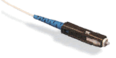</td>
    <td>Opti-Jack 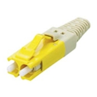</td>
    <td>SC 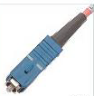</td>
    <td>SC-Duplex 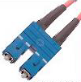</td>
</tr>
<tr>
    <td>SC/APC-8/9 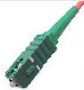</td>
    <td>SMA 905 </td>
    <td>SMA 906 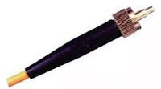</td>
    <td>SMC 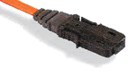</td>
    <td>ST 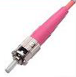</td>
</tr>
<tr>
    <td>TOSLINK 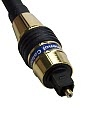</td>
    <td>VF45 </td>
    <td>1053 HDTV 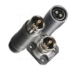</td>
    <td>V-PIN 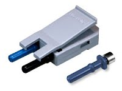</td>
    <td>FDDI/MIC 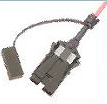</td>
</tr>
</tbody>
</table>

## Fiber Junction Types: 

Air Gap 
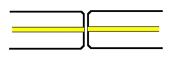

Flat PC 
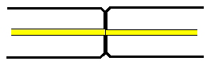

PC 
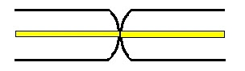

APC 
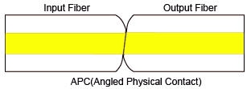

## Fiber Diameter: 

| 50/125 Multimode |  62.5/125 Multimode |  Singlemode | 
|--|--|--|
| 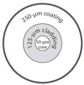 | 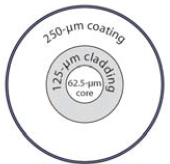 | 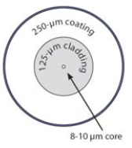 |

## Modes: (Wave Paths)
Multimode, Step-Index 
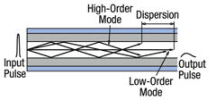

 Multimode, Graded-Index 
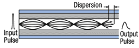

Single Mode, Step-Index 
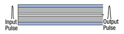
 

