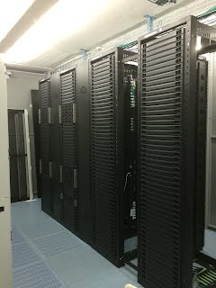
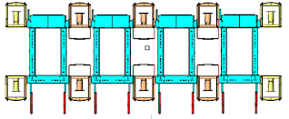

# CPI Open Frame Cabinets with Rear only wire management

## Overview

The CPI open frame rack solution includes very tall (51u) cabinets, and very complete wire management control between the cabinets (10"-12"). The examples spec'ed out below come in two flavors, one that only needs wire management on one side of the racks (for normal servers with wiring only in the rear), and with racks with wire management in the front and rear. The examples also include 4 racks ganged together, rather then one cabinet by itself.
The measurements for a system with both front and rear cable management is shown in the diagram below.

## Rear-only Wire Management

   
   
   

This has 10" wire managers on the ends, and 12" wire managers in between the cabinets as well, and wire managers on one side, and blanking panels on the other to provide a flush plane between the racks.

#### Four CPI Open Frame Cabinets with Rear only wire management
|line | Vendor | Qty | Pt Numb | Description | $ ea | $ total |
|--|--|--|--|--|--|--|
1|	Chatsworth	|4	|15254-715|	Adjustable8' Rail Server Rack square holes	|ea	 $ 750.00	| $ 3,000.00
2	|Chatsworth	|2	|35513-715	|Evolution G3 10" single sided vertical cable manager	|ea	 $ 605.00	| $ 1,210.00
3	|Chatsworth	|3	|35514-715	|Evolution G3 12" single sided vertical manager|	ea	 $ 682.00	| $ 2,046.00
4	|Chatsworth	|3	|35501-712	|solid rear panel kit 12"	|ea	 $    58.00	| $     174.00
5	|Chatsworth	|2	|35501-709|	solid rear panel kit 10"	|ea	 $    51.50	| $     103.00
6	|Chatsworth	|3	|TS1023482|	Vertical Filler Panel compatible with 51U Adjustable Rail Quadrarack. Black	|ea	 $  270.00	| $     810.00

## PDU Mounts
The PDUs snap into brackets we hang from the sides of the racks, in between the cabinets.

|manufacturer	|part number|	description	Unit|	Unit Price|
|--|--|--|--|
CHATSWORTH|	TS1024517	|EVOLUTION DS VERT MANAGER RETRO DUAL PDU KIT	|EA	 $       155.00
CHATSWORTH	 |	|top and bottom mounting brackets|	 	 |

The brackets we have will hold two, not four PDU's, but they look just like the following red PDU trays.

Rather than mounting on the back of the wire managers, we use the following two blue mounting brackets to mount the PDU trays to the sides of the cabinets, so that adding additional PDUs is easier. Note that you need at least 12" wide wire managers to be able to have PDUs' facing each other and still have wiring room.

## Accessories
A few additional things you can order for your racks:

#### Cabinet Accessories

|line | Vendor | Qty | Pt Numb | Description | $ ea | $ total |
|--|--|--|--|--|--|--|
1	|Chatsworth	|1|	13082-x19	|2U Drawer	ea	| $     250.00	 |$     250.00
2	|Chatsworth	|16	|12639-001	|cage nuts/screws 12-24 25pk	25pk	| $        27.50	| $     880.00
3	|Chatsworth	|1	|34537-002|	1 RU snap in filler panels	50pk	| $     115.00	 |$     230.00
4	|Chatsworth	|1	|34538-002|	2 RU snap in filler panels	50pk	 |$     150.00	 |$     450.00

## Office Deployment
This is for only one rack with two wire managers.

|line | Vendor |  Pt Numb | Description | $ ea | $ total |
|--|--|--|--|--|--|
1	|CHATSWORTH	|15254-715	|ADJUSTABLE 8' RAIL SERVER RACK SQUARE HOLES	EA	 |$       750.00	| $       750.00
2	|CHATSWORTH	|35514-715|	EVOLUTION G3 12" SINGLE SIDED VERTICAL MANAGER	EA	 |$       682.00	| $    1,364.00
2	|CHATSWORTH	|TS1024517	|EVOLUTION DS VERT MANAGER RETRO DUAL PDU KIT	EA	 |$       170.00	 |$       340.00
 	 	 	 	 	 	 
## Overall Rack Measurements
Pt # 15254-X15 (X=color: 1=Gray, 2=ComputerBeige, 7=Black, E=White)

- Height (a): 96" (2400mm)
- Width: 26.6" (600mm)
- Depth (b): 35.43" (900mm)
- Max Rail Depth (c): 41.33" (1050mm)
- U density: 51U, square punched

## Wire Manager Measurements:

### 35514-715 12" Wide Managers:
- Height: 96" (2438mm)
- Width: 12" (300mm)
- Depth: 13.2" (335mm)
 
### 35513-715 10" Wide Managers:
- Height: 96" (2438mm)
- Width: 10" (250mm)
- Depth: 13.2" (335mm)

