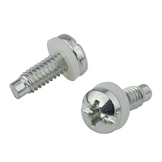
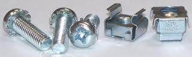

# Screw Types

## Telco Racks:

Telco racks normally have thick metal beam that equipment is bolted directly to, and those beams themselves are threaded.  

### 12-24 Pilot Point Screw.  
24 threads per inch, #12 size.  Dia (maj/min) .21"/.17"

## Server Cabinets: 

M6 Screws and Cage Nuts

