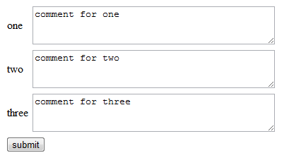
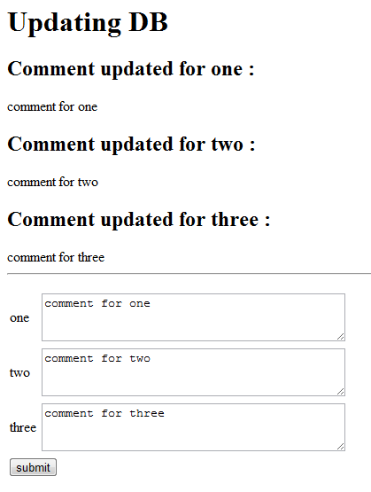

# FormSubmit

## The Code
```
#!/bin/perl
#

use strict;
use CGI;

sub main {
    # create the HTML header: 
    my $q = CGI->new; #create new CGI object
    print $q->header;
    print $q->start_html('form example');

    # define the two different kinds of actions: 
    my $action = CGI::param("action");
    my $comment = CGI::param("comment");

    # if the action is update (ie: has values)
    if ( $action eq "update" ) {
        print $q->h1('Updating DB'), "\n"; 
        # update text file here
    
        my @acls = ("one", "two", "three");     # load your acls from the master config
        foreach my $acl (@acls) {
            my $comment = CGI::param($acl);
        # update the data base with new $comment

        print $q->h2('Comment updated for ', $acl, ": "), "\n";
                print "$comment<br>\n";
    }
        print $q->hr,p;
    }
    
    # Normal start: (not an update)
    print start_form(-method=>'post');
    print hidden(-name=>'action', -value=>'update'), "\n\n";
    
    # load comments into %commentHash
    print "<table>\n";    
    my @acls = ("one", "two", "three");     # load your acls from the master config
    foreach my $acl (@acls) {
        # get comment for $acl and put in $comment
        #my $comment = $commentHash{"$acl"};
        my $comment = "comment for $acl";
        
        print "<tr><td>$acl</td><td>";
    print qq(<textarea cols="40" rows="3" name="$acl">$comment</textarea>);
    print "<td></tr>\n";
    }
    print "</table>\n";

    # create submit button, and have it set action
    print submit(-name=>'action', -value=>'submit'), "\n\n";
    print $q->end_html; 
}


main();
```

## The initial Output:
### What the page looks like:



### What the code is:
```
<!DOCTYPE html
    PUBLIC "-//W3C//DTD XHTML 1.0 Transitional//EN"
     "http://www.w3.org/TR/xhtml1/DTD/xhtml1-transitional.dtd"> 
<html xmlns="http://www.w3.org/1999/xhtml" lang="en-US" xml:lang="en-US"> 
<head> 
<title>form example</title> 
<meta http-equiv="Content-Type" content="text/html; charset=iso-8859-1" /> 
</head> 
<body> 
<form method="post" action="/mod-perl/test.pl" enctype="multipart/form-data"> 
<input type="hidden" name="action" value="update"  /> 
 
<table> 
<tr><td>one</td><td><textarea cols="40" rows="3" name="one">comment for one</textarea><td></tr> 
<tr><td>two</td><td><textarea cols="40" rows="3" name="two">comment for two</textarea><td></tr> 
<tr><td>three</td><td><textarea cols="40" rows="3" name="three">comment for three</textarea><td></tr> 
</table> 
<input type="submit" name="action" value="submit" /> 
 
 
</body> 
</html>
```

## After the submit:
### What the page looks like:



### What the code is:

```
<!DOCTYPE html
    PUBLIC "-//W3C//DTD XHTML 1.0 Transitional//EN"
     "http://www.w3.org/TR/xhtml1/DTD/xhtml1-transitional.dtd"> 
<html xmlns="http://www.w3.org/1999/xhtml" lang="en-US" xml:lang="en-US"> 
<head> 
<title>form example</title> 
<meta http-equiv="Content-Type" content="text/html; charset=iso-8859-1" /> 
</head> 
<body> 
<h1>Updating DB</h1> 
<h2>Comment updated for  one : </h2> 
comment for one<br> 
<h2>Comment updated for  two : </h2> 
comment for two<br> 
<h2>Comment updated for  three : </h2> 
comment for three<br> 
<hr /><p /><form method="post" action="/mod-perl/test.pl" enctype="multipart/form-data"> 
<input type="hidden" name="action" value="update"  /><input type="hidden" name="action" value="submit"  /> 
 
<table> 
<tr><td>one</td><td><textarea cols="40" rows="3" name="one">comment for one</textarea><td></tr> 
<tr><td>two</td><td><textarea cols="40" rows="3" name="two">comment for two</textarea><td></tr> 
<tr><td>three</td><td><textarea cols="40" rows="3" name="three">comment for three</textarea><td></tr> 
</table> 
<input type="submit" name="action" value="submit" /> 
 
 
</body> 
</html>
```
