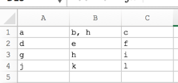

# read/write to csv


for the script: 
```
#!/usr/bin/env python
import csv

line1 = ["a", "b, h", "c"]
line2 = ["d", "e", "f"]
line3 = ["g", "h", "i"]
line4 = ["j", "k", "l"]

book = []
book.append(line1)
book.append(line2)
book.append(line3)
book.append(line4)

outfile = "/Users/chuck/tmp/test.csv"

wr = csv.writer(open(outfile, 'w'))
for line in book:
    print(line)
    wr.writerow(line)
```
you would get the output: 
```
a,"b, h",c
d,e,f
g,h,i
j,k,l
```

and viewing that in excel would be: 

